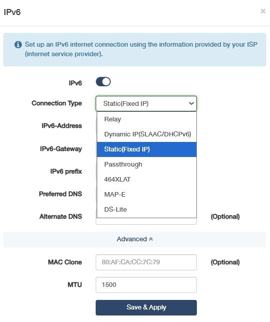
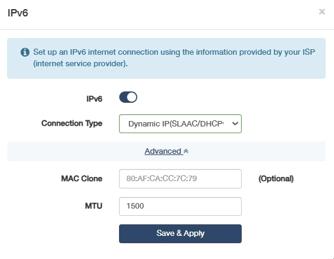
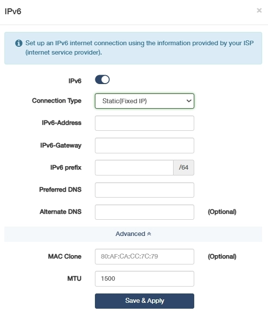
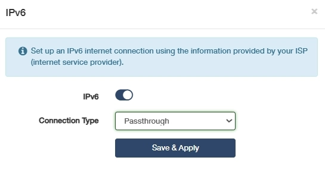
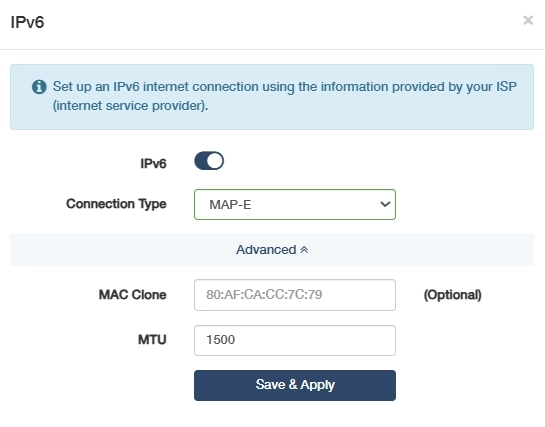
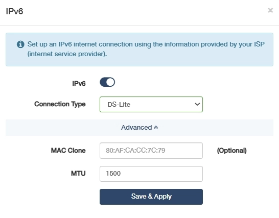

# IPv6
AP controller supports 7 types of IPv6 Internet connection, including Relay, Dynamic IP(SLAAC/DHCPv6), Static (Fixed lP), Passthrough, 464XLAT, MAP-E, and DS-Lite. Enable the IPv6 Internet connection, select a connection type accordingly and configure the required parameters provided by the ISP.

 
 
- If the current version of the firewall (or VPN, block list, and etc.) does not support IPv6, you may enable and configure the IPv6 function on this page.
- If you use VPN and IPv6 functions at the same time, it's likely to cause IPv6 data leakage.

## Relay
Typically used for IPv6 transition mechanisms. The router will act as a relay between your local IPv6 network and an IPv4-based upstream network provided by your ISP. 

Select *Relay* and just click *Save & Apply* without any additional configuration.

---
## Dynamic IP(SLAAC/DHCPv6)
Automatically assigns IPv6 addresses via router advertisements (SLAAC) or DHCPv6 servers, ideal for plug-and-play deployments with changing network topologies.

Select *Dynamic IP(SLAAC/DHCPv6)*, and configure MAC Clone and MTU as needed.Then click *Save & Apply*.

- MAC Clone: (Optional) Enter the MAC address of the device that is allowed by your ISP. You can usually find this in the device's network settings or on a label on the device.
- MTU: Enter the appropriate MTU size (commonly 1500 bytes for compatibility with IPv4). 

---
## Static(Fixed lP)
Manually configured IPv6 addresses for critical devices (e.g., PLCs), ensuring stable remote access and firewall rule consistency.

Select *Static (Fixed IP)* and enter the fixed *IPv6 address*, *gateway*, *prefix* and *DNS* server address provided by your ISP. Configure MAC Clone and MTU as needed. Then click *Save & Apply*.

- IPv6-Address: The fixed IPv6 address assigned to the AP controller (e.g., 2001:db8::1).
- IPv6-Gateway: The default gateway for IPv6 traffic (e.g., 2001:db8::ff).
- IPv6 prefix: The network prefix length (e.g., /64) defining the subnet scope.
- Preferred DNS: Primary DNS server for IPv6 resolution (e.g., 2001:4860:4860::8888).
- Alternate DNS: Backup DNS server if the primary fails (e.g., 2001:4860:4860::8844).
- MAC Clone: (Optional) Enter the MAC address of the device if the ISP requires a specific MAC address for the static IP assignment. You can usually find this in the device's network settings or on a label on the device.
- MTU: Enter the appropriate MTU size based on the network's physical layer, typically 1500 bytes for Ethernet.

---
## Passthrough
Allows an IPv6-enabled device to manage its own IP settings directly from the ISP, bypassing the router's DHCP server. 

Select *Passthrough* and just click *Save & Apply* without any additional configuration.

---
## 464XLAT
A stateless translation mechanism that allows IPv4-only devices to communicate over an IPv6 network. 

Select *464XLAT*, and configure MAC Clone and MTU as needed. Then click *Save & Apply*.

- MAC Clone: (Optional) MAP-E usually does not involve MAC address restrictions, so MAC Clone is not typically necessary.
- MTU: Enter the appropriate MTU size according to the maximum IPv4 packet size, which is typically 1500 bytes minus the headers.

---
## MAP-E
Namely, Mapping of Address and Port with Encapsulation, is a method for translating IPv6 addresses to IPv4 addresses. 

Select *MAP-E*, and configure MAC Clone and MTU as needed. Then click *Save & Apply*.

- MAC Clone: (Optional) MAP-E usually does not involve MAC address restrictions, so MAC Clone is not typically necessary.
- MTU: Enter the appropriate MTU size according to the maximum IPv4 packet size, which is typically 1500 bytes minus the headers.

---
## DS-Lite
A technology that allows ISPs to provide IPv4 service over an IPv6 network. 

Select *DS-Lite*, and configure MAC Clone and MTU as needed. Then click *Save & Apply*.

- MAC Clone: (Optional) DS-Lite usually does not involve MAC address restrictions, so MAC Clone is not typically necessary.
- MTU: Enter the MTU value based on your network's requirements. The value should be within the range of 1280 to 1582 bytes. The MTU setting is important to ensure that the encapsulated IPv4 packets can be transmitted over the IPv6 network without fragmentation. 