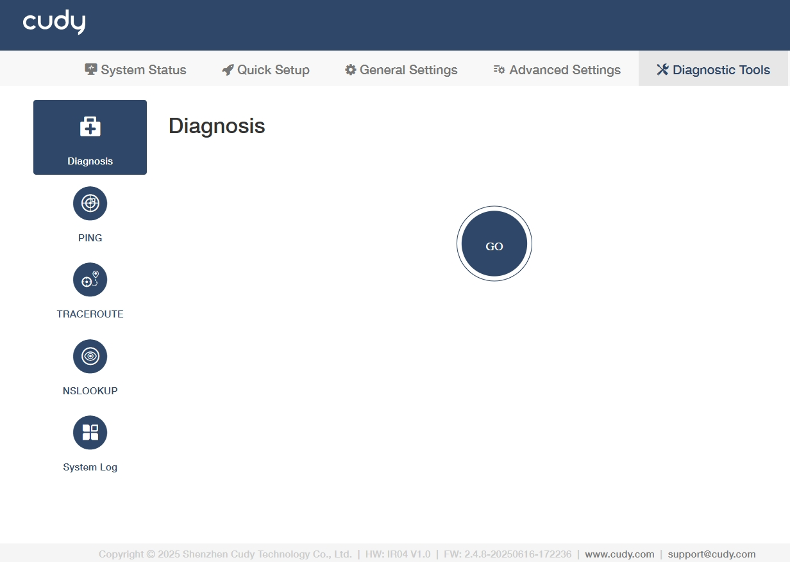
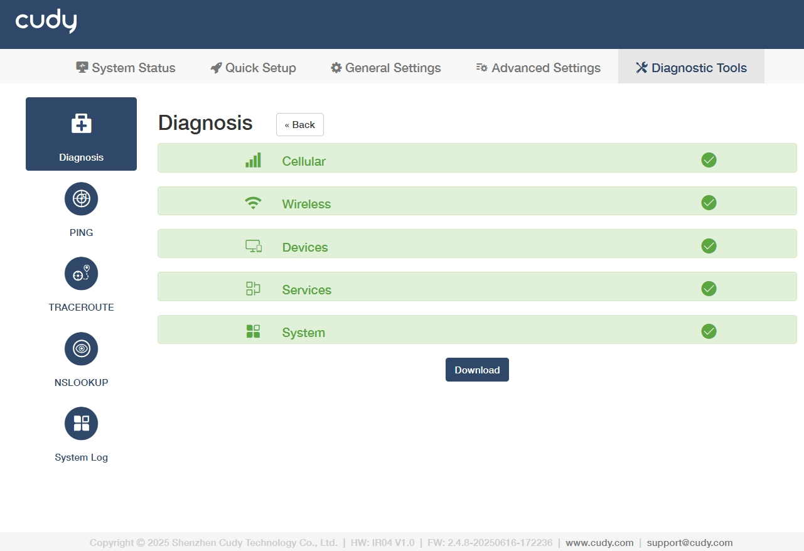
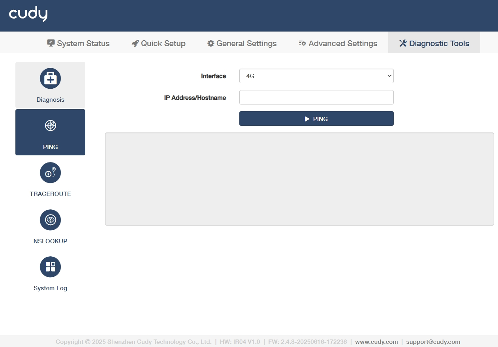
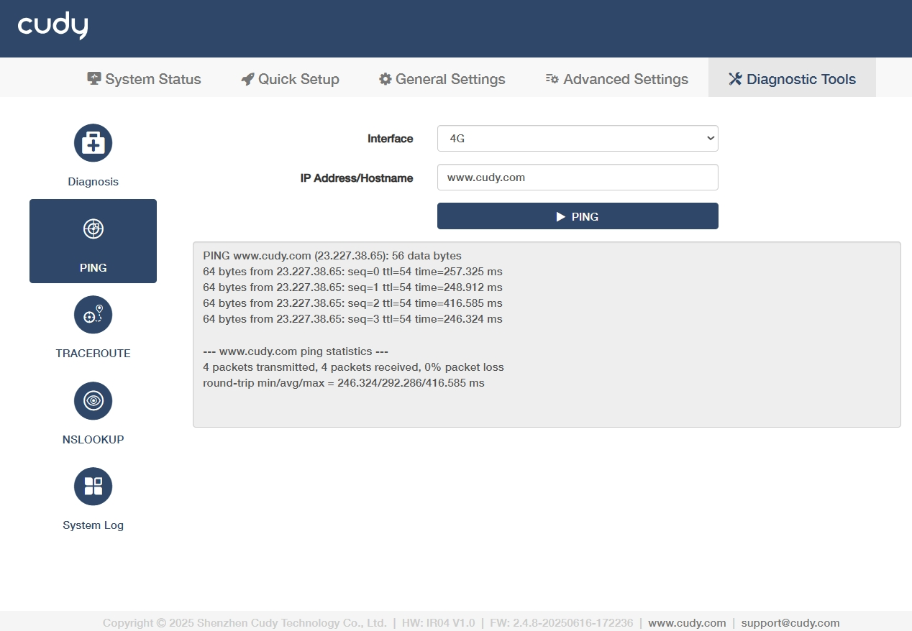
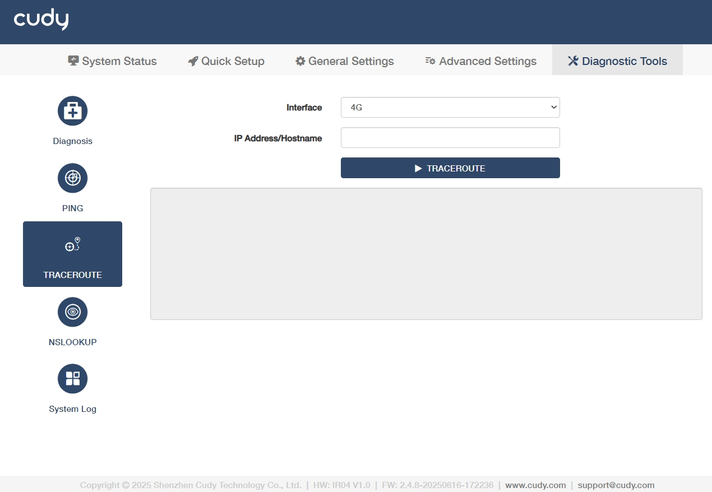
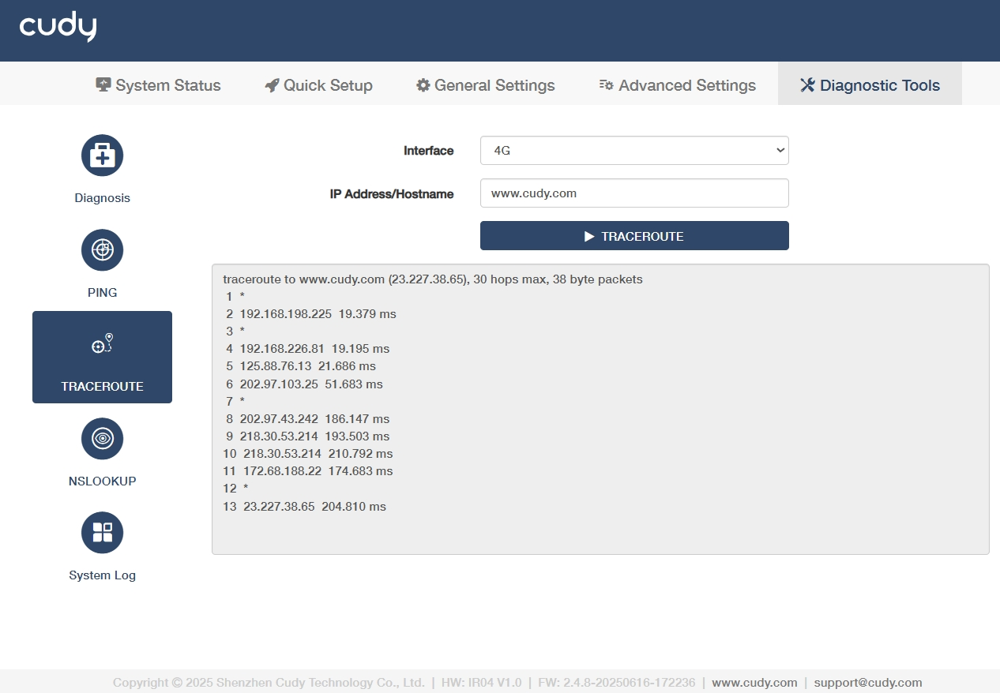
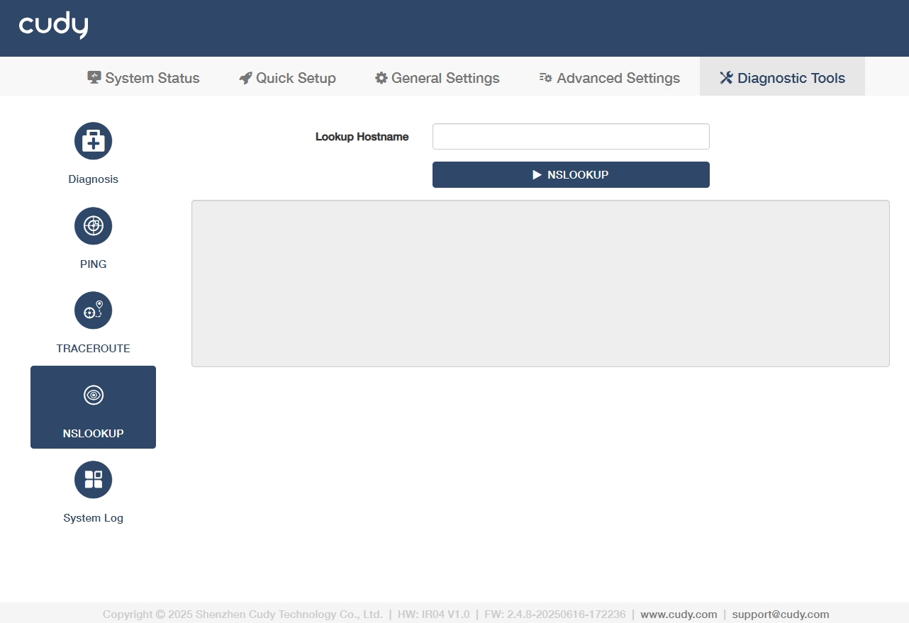
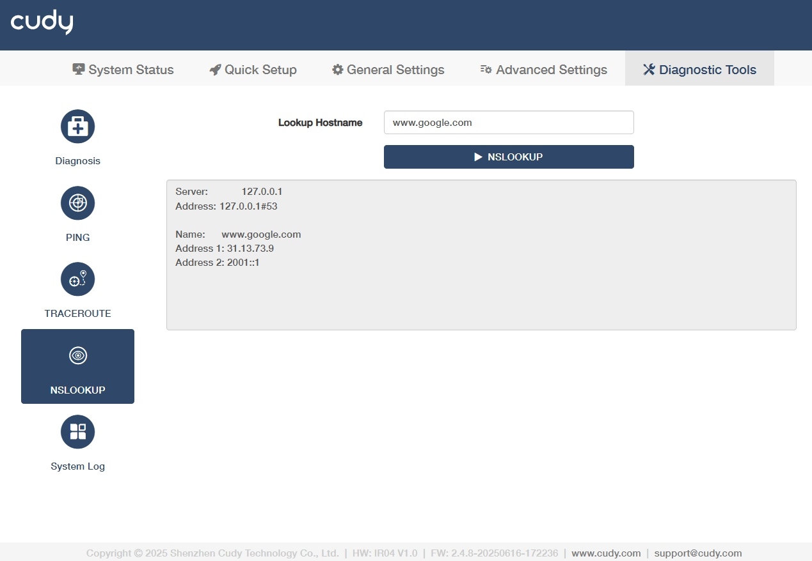
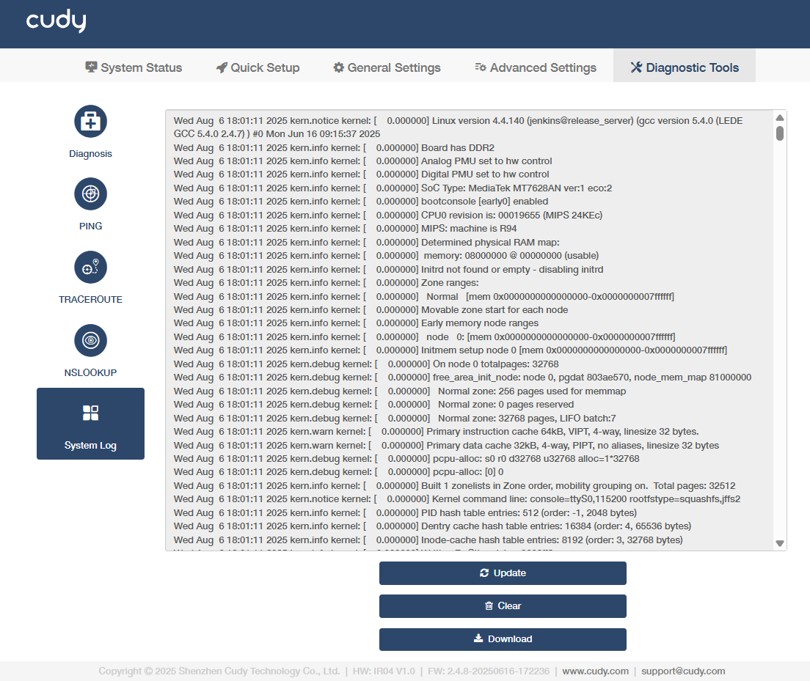

# Diagnostic Tools

## Diagnosis

Click *GO* to make a diagnosis. It may take some while to process. Please wait patiently. 

The diagnosis result will indicate the status of Cellular, Wireless, Devices, Services and System. You can click *Download* to reserve the diagnosis bin file.

----
## PING
is used to test the connectivity between the router and the tested host, and measure the round-trip time. 

**To use PING for diagnosis, please follow the steps below.**

1. Select the tested Interface, either 4G or LAN.

2. Enter the IP Address or Hostname of the tested host.

3. Click *PING* to start the diagnosis.

The figure below indicates the proper connection between the router and the Cudy server (www.cudy.com) tested through Ping.

-----
## TRACEROUTE
is used to test the route (path) your router has passed to reach the tested host, and measure transit delays of packets across an Internet Protocol network.

**To use TRACEROUTE for diagnosis, please follow the steps below.**

1. Select 4G as the tested Interface.

2. Enter the IP Address or Hostname of the tested host.

3. Click *TRACEROUTE* to start the diagnosis.

The figure below indicates the proper connection between the router and the Cudy server (www.cudy.com) tested through Traceroute.

-----
## NSLOOKUP
is to check if the DNS IP address of the 4G can work normally.

**To use NSLOOKUP for diagnosis, please follow the steps below.**

1. Enter the Lookup Hostname of tested host. 

2. Click *NSLOOKUP* to start the diagnosis. The result will show as below.

    

-----
## System Log
Tracks all the router behaviors. When the router does not work normally, download the system log and send it to our [Technical Support](mailto:support@cudy.com) for troubleshooting. 
    

- **Update**: Click to refresh the system log.
- **Clear**: Click to erase all the system log up till now.
- **Download**: Click to download the system log for technical support.