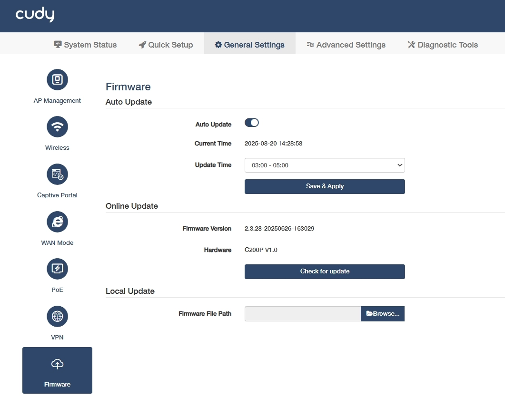

# Firmware
The latest firmware will be released at the Cudy official website <a href="http://www.cudy.com">www.cudy.com</a>, and you can download it from <a href="http://www.cudy.com/download">www.cudy.com/download</a>. Please choose an appropriate update method and follow the instructions.

## Auto Update
It allows the AP controller to automatically update firmware to the latest version at the specified time.

1. Enable *Auto Update*.
2. Specify the *Update Time*
3. Click *Save & Apply*.

 Backup your AP controller’s configurations before firmware update. Do NOT turn off the AP controller during the firmware update.

## Online Update
- If there is a new firmware available for the AP controller, a prompt will appear upon your login to the AP controller web management page. Click *Update Now* and then *Update* to upgrade the firmware to the latest version.
- If you miss the prompt, please go to *General Settings -> Firmware* to check for update. If there is one, click *Update* and wait a few minutes for the update and reboot to complete. 

## Local Update
Click *Browse...* to locate and upload the latest firmware file you’ve downloaded from <a href="http://www.cudy.com">www.cudy.com</a>. Wait a few minutes for the update and reboot to complete.

 If you fail to update the firmware for the AP controller, please contact our <a href="mailto:support@cudy.com">technical support</a>.