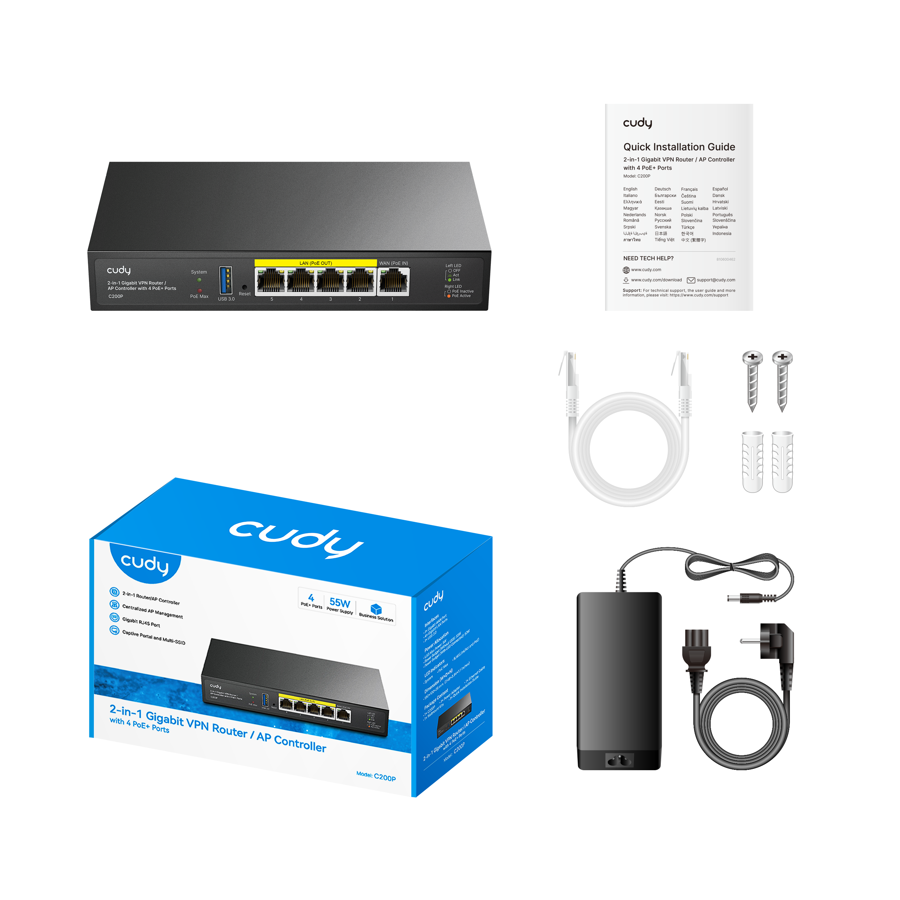
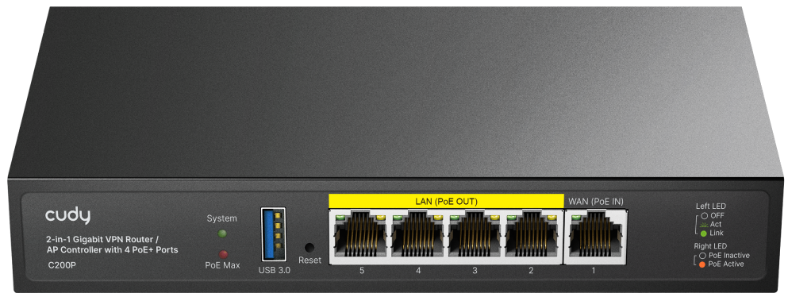

# Overview

## Package Content

## Appearance

----

## Interfaces
| Interface | Description |
|-----------------------|-------------|
| **USB 3.0 Button**    | Connect to a USB device for data storage. |
|<nobr>**LAN (PoE OUT) Port**</nobr>| Connect to LAN devices or supply power for devices.   Note: It cannot supply power for other devices via PoE OUT ports  when itself powered by PoE device via PoE IN port.|
|<nobr>**WAN (PoE IN) Port**</nobr>| Connect to the Internet or be powered by a PoE device. |
| **Reset Button**       | Press for 2 seconds to restore the factory defaults. |
| **K-Slot**            | Secure with a durable cable to a fixed object to prevent theft. |
| **DC Power Jack**      | Connect to a power adapter of 48V~57V for power supply. |
| **Ground Connector**   | Attach to the ground wire for safety and reliability. |

----
## LEDs
| LED | Description |
|-----------------------|-------------|
|**System**| Off: No power.  Flash: Initializing or upgrading.  On: System already started.|
|**PoE Max**| Off: PoE output < 90% of PoE budget  Flash: 90% of PoE budget ≤ PoE output ≤ 95% of PoE budget  On: PoE output > 95% of PoE budget |
|**Link/Act**   (left LEDs)| Off: No link.  Flash: Transmitting data.  On: Link but no activity|
|**PoE**   (right LEDs)| Off: Not supplying power.  On: Supplying power.|
