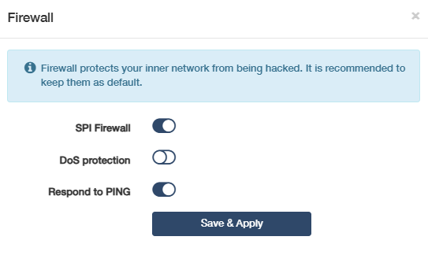
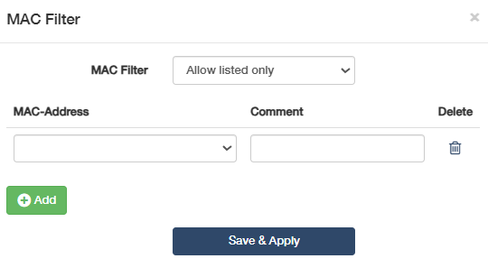
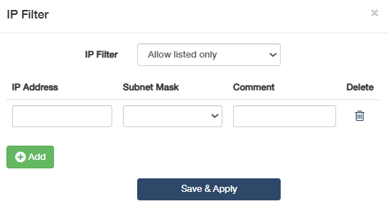
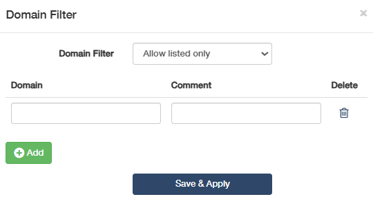
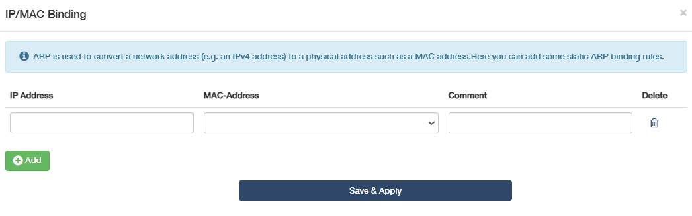
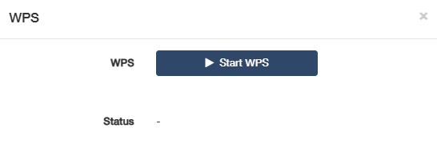
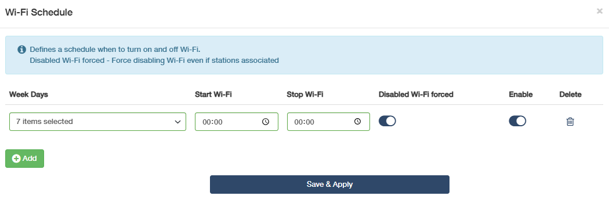
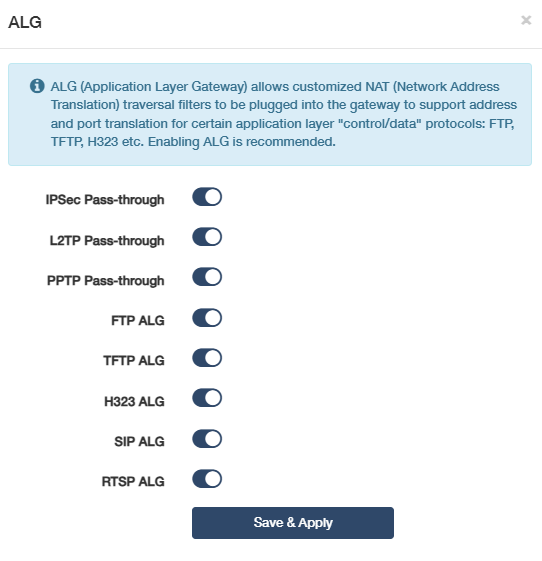

# Security
 To enhance your home network security with a kit of features built in Cudy router. In Wireless router mode, it includes Firewall, MAC filter, IP filter, Domain Filter, IP/MAC Binding, WPS, Wi-Fi Schedule, and ALG; while in Wireless Access Point mode, it consists of WPS and Wi-Fi Schedule.

---
## Firewall
is a security system that monitors and controls incoming and outgoing network traffic based on predetermined security rules. It serves as a barrier between a trusted internal network and untrusted external networks, such as the Internet. This function is enabled by default. It is highly recommended to keep the default settings.

- SPI Firewall: SPI (Stateful Packet Inspection) Firewall is a sophisticated network firewall that goes beyond basic packet filtering to provide deeper inspection and control over network traffic, offering better security and more intelligent traffic management.
- DoS Protection: DoS (Denial of Service) Protection is a security feature that defends your network or online services against DoS attacks. It works by identifying and mitigating traffic that is intended to overwhelm your network or online services, rendering them unavailable to legitimate users. 
- Respond to PING: It is the act of a network device acknowledging and replying to a PING request, which is a fundamental tool for testing network connectivity and performance.

---
## MAC Filter
is a technology used in wireless routers to prevent unauthorized access to networks. MAC address is a unique identifier assigned to each device on a network. A wireless router uses MAC address to identify the device and determine which network it should connect to. 

To configure the MAC filter, please follow the steps below.

1. Select a MAC Filter rules: Disable, or Allow all except listed, or Allow listed only.
    - Disable: To disable the MAC Filter function. No MAC Address will be filtered.
    - Allow all except listed: To block the device(s) with the listed MAC address from the Internet access.
    - Allow listed only: To allow only the device(s) with the listed MAC address to access the Internet.

2. Click *Add* to add entries. 

3. Select the *MAC-Address* and make a comment for the devices you want to filter.

4. Click *Save & Apply*.

---
## IP Filter
is a technique utilized in cyber security to control and protect a network or system from unauthorized or harmful access. IP stands for Internet Protocol, which includes the rules governing online data sent and received. Every device that connects to the Internet has an IP address, a unique numerical label just like a digital fingerprint. IP filtering acts by blocking or allowing traffic to your network or system based on these IP addresses. 

To configure the IP filter, please follow the steps below.

1. Select your IP Filter rules: Disable, or Allow all except listed, or Allow listed only.
    - Disable: To disable the IP Filter function. All devices are allowed to access the entire Internet.
    - Allow all except listed: To allow any other devices except for those with the listed IP address(es) to access the Internet; or allow the devices to access the Internet except for those website with the listed IP address.
    - Allow listed only: To allow only the device(s) with the listed IP address(es) to access the Internet; or allow the devices to access only the website with the listed IP address.

2. Click *Add* to add entries, and set the following parameters.
    - IP address: Enter the IP address you would like to filter. 
    - Subnet Mask: Select or customize the Subnet Mask as needed.
    - Comment: Make a comment for this entry.
    - Delete: To delete the entry easily as desired.

3. Click *Save & Apply*.

---
## Domain Filter
is a technique to control or limit access to specific websites or Internet services by filtering domain name requests. It intercepts and analyzes DNS requests and either allows or blocks access based on predefined rules or policies. 

To configure the domain filter, please follow the steps below.

1. Select your Domain Filter rules: Disable, or Allow all except listed, or Allow listed only.
    - Disable: To disable the Domain Filter function. No devices will be filtered.
    - Allow all except listed: To block the device(s) with the listed Domain from the Internet access.
    - Allow listed only: To allow only the device(s) with the listed Domain to access the Internet.

2. Click *Add* to add entries.

3. Enter the *Domain* and *comment* of the devices you want to filter. Delete as needed.

4. Click *Save & Apply*.

---
## IP/MAC Binding
namely, ARP (Address Resolution Protocol) Binding, is used to bind network device’s IP address to its MAC address. This will prevent ARP Spoofing and other ARP attacks by denying network access to an device with matching IP address in the Binding list, but unrecognized MAC address.

To configure the IP & MAC Binding, please follow the steps below.

1. Click *Add* to add entries.

2. Enter the *IP Address* and bind it with a *MAC-Address* (select from the list or enter manually), and make a comment. Delete as needed.

3. Click *Save & Apply*.

Done! Now you don’t need to worry about ARP spoofing and ARP attacks.

 The IP/MAC Binding also can work as an IP reservation. The device will get the IP address via DHCP.

---
## WPS
Wi-Fi Protected Setup (WPS) provides an easier approach to set up a security-protected Wi-Fi connection without selecting network name (SSID) and entering password on each device. 

You might want to use WPS to let someone else connect to your WiFi network without sharing your credentials, or if you want to connect a WiFi device like a printer or TV that is frustrating to enter credentials into. Not all WiFi devices support WPS connection. We recommend that you check your devices’ WiFi connection capabilities before proceeding.

You may click *Start WPS* on the web management page or directly press the *WPS* button on the router panel.

Within 2 minutes, enable WPS on your personal device. Success will appear on the screen, indicating successful WPS connection.

---
## WiFi Schedule
allows the router’s wireless network to turn on or off automatically at a specific time.

To configure the WiFi Schedule, please follow the steps below.

1. Click *Add* to add entries.

2. Specify the schedules, including *Week Days*, *Start Wi-Fi*, *Stop Wi-Fi*. 
    - Enable *Disabled wifi forced* to force WiFi to shut off even if stations are associated. 
    - Toggle *Enable* to easily enable or disable the entry;

3. Click *Save & Apply*.

 The effective time schedule is based on the time of the router. You can go to Advanced Settings -> System -> System Time to modify the time.

----
## ALG
ALG (Application Layer Gateway) allows customized NAT traversal filters to be plugged into the gateway to support address and port translation for certain application layer “control/data” protocols such as FTP, TFTP, H323 etc. All ALG is enabled by default and recommended.

You may need to disable SIP ALG when you are using voice and video applications to create and accept a call through the router, since some voice and video communication applications do not work well with SIP ALG.

---
