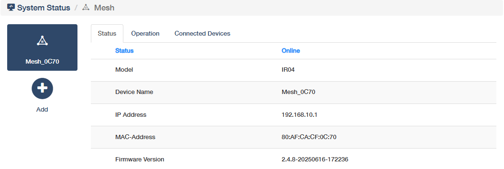
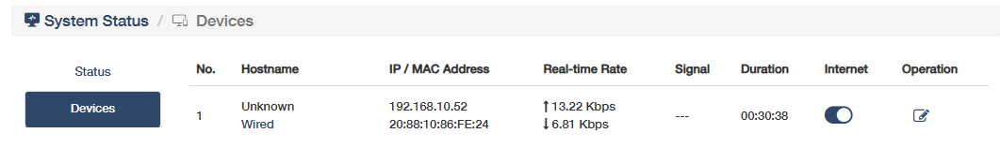
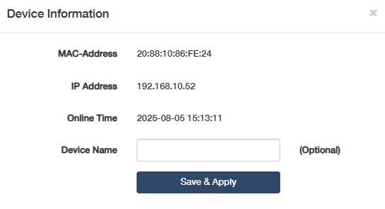
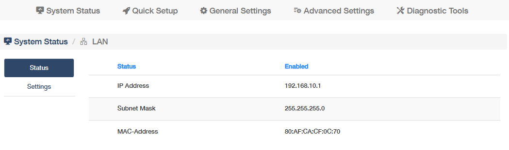
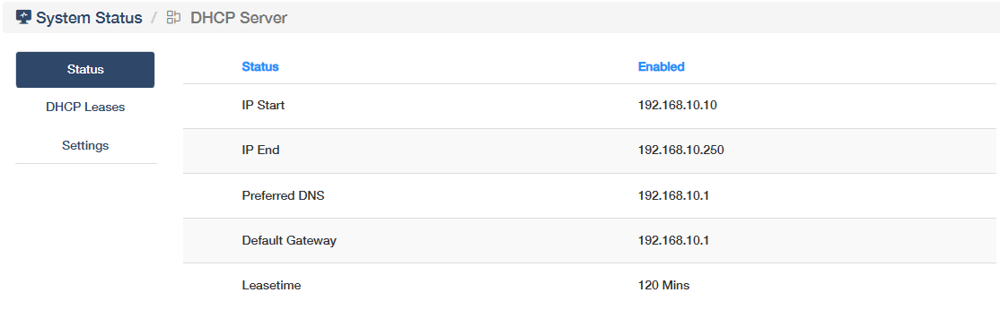
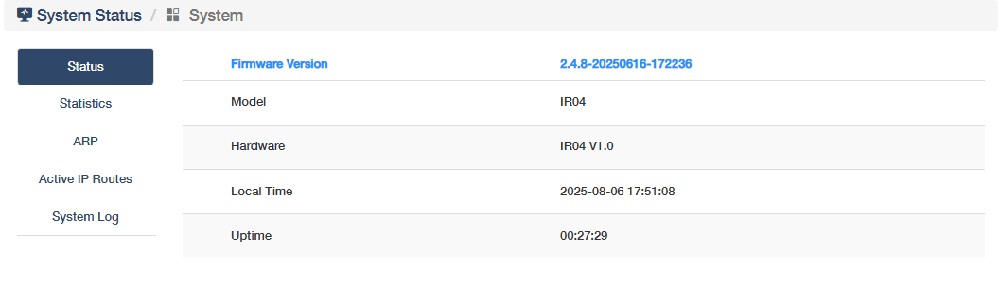

# System Status

- System Status in Main Router and AP Controller Mode

- System Status in AP Controller Mode

## Port Status
shows real-time port connection status, data speed, PoE power in/out, as well as dashboard for real-time CPU usage (%) and memory utilization (%) of the ports. 

AP Management: Displays AP online status, firmware, client count, and system load.
WAN: Monitors external network connectivity (IP, gateway, bandwidth usage).

## Status
shows whether the router has connected to the Internet or not, and its work mode and interface. Click *Quick Setup* to redirect to the [Quick Setup](quick_setup.md).

## AP Management
shows the router’s Mesh network status (SOLE or MESH), the mesh device name and the amount of mesh units. Click *More Details* to know more or configure some *settings* (refer to [Mesh](mesh.md)).

## Devices
shows the amount of devices connected to this router, and the connection method being 2.4G WiFi or Wired; while the Mesh device will be not be displayed here but on the *More Details -> Status* page.

- View the Device information about hostname, IP/MAC address, real-time rate, Signal and connection duration.
- Enable or disable the Internet connection.
- Edit the device name by clicking on the Operation.

## WAN
(Only for Main Router and AP Controller Mode)
shows whether the router's LAN network connection is enabled or not, its IP address and MAC address. Click *More Details* to know more information on the *Status* sub-page, or configure some *settings* (refer to [LAN](network.md#lan)).

## LAN
shows whether the router's LAN network connection is enabled or not, its IP address and MAC address. Click *More Details* to know more information on the *Status* sub-page, or configure some *settings* (refer to [LAN](network.md#lan)).

## DHCP Server
(Only for Main Router and AP Controller Mode)
shows whether the DHCP Server is enabled or not, and its starting/ending IP. Click *More Details* to know more information on the *Status* and *DHCP Leases* sub-pages, or configure some *settings* (refer to [DHCP Server](network.md#dhcp-server)).

- Status: Indicates whether the DHCP server is active or inactive for automatic IP assignment.
- IP Start/IP End: Defines the range of IP addresses the DHCP server can assign to connected devices.
- Preferred DNS: The primary DNS server address provided to clients for domain name resolution.
- Default Gateway: The router’s IP address used as the exit point for client devices to access external networks.
- Lease Time: Duration an assigned IP address remains valid before renewal is required. 

## System
shows the router's firmware version, current local time and uptime. Click *More Details* to know more information on the *Status*, *Statistics*, *ARP*, *Active IP Routes* and *[System Log](diagnostic_tools.md#system-log)* sub-pages.

**Status** displays real-time operational states to provide a snapshot of system health and configuration baseline for troubleshooting.

- Firmware Version: The current software version installed on the router, critical for updates and compatibility.
- Model: The router’s product model, used for identifying hardware specifications.
- Hardware: Physical components/revision, indicating the device’s internal build.
- Local Time: The router’s configured time, essential for time-based operations and logs.
- Uptime: Duration since the last reboot, reflecting system stability and reliability.

**Statistics** tracks network performance metrics per interface (WLAN/LAN/Cellular) to identify bandwidth bottlenecks, packet loss, or hardware faults.

- Interface: The network port or connection type being monitored.
- Tx Bytes: Total data transmitted.
- Tx Pkts: Number of packets sent.
- Tx Errs: Transmission errors.
- Tx Drop: Packets dropped due to congestion or faults.
- Rx Bytes: Total data received.
- Rx Pkts: Number of packets received.
- Rx Errs: Reception errors.
- Rx Drop: Packets dropped during reception.

**ARP** maps IP addresses to MAC addresses for local network communication to detect IP conflicts and monitors connected devices in the LAN.

- IP Address: The network-layer address assigned to a device in the local network.
- MAC-Address: The physical hardware address uniquely identifying a device at the data-link layer.
- Hostname: The human-readable name assigned to the device for easier identification.

**Active IP Routes** shows path selection rules for data forwarding to optimize traffic routing and diagnoses connectivity issues between networks.

- Network/Target: The destination network address that the route applies to.
- Gateway: The next-hop IP address used to reach the target network.
- Metric: A numerical value indicating route priority (lower=preferred), calculated from hop count/bandwidth.
- Table: The routing table type where this route is stored.
- Interface: The physical/virtual port used for this route's traffic.

**[System Log](diagnostic_tools.md#system-log)** records timestamped system events, errors, and operational messages for diagnostics and auditing.

