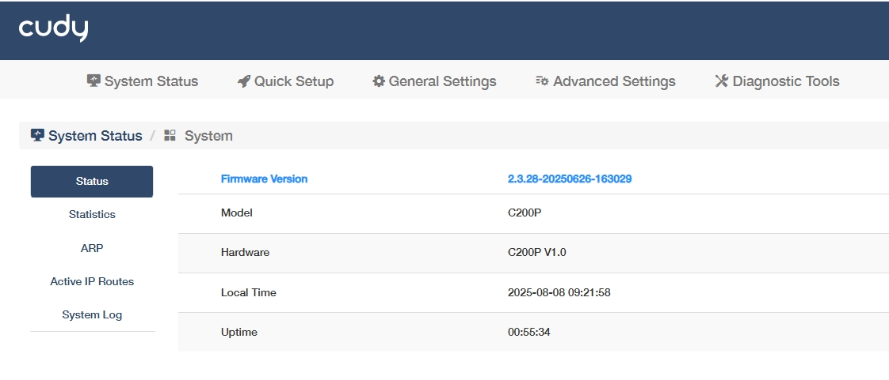
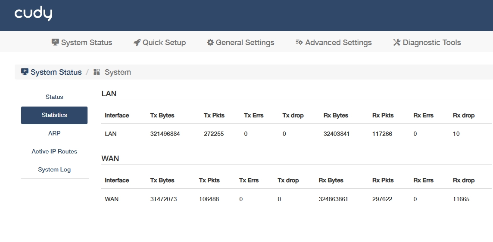
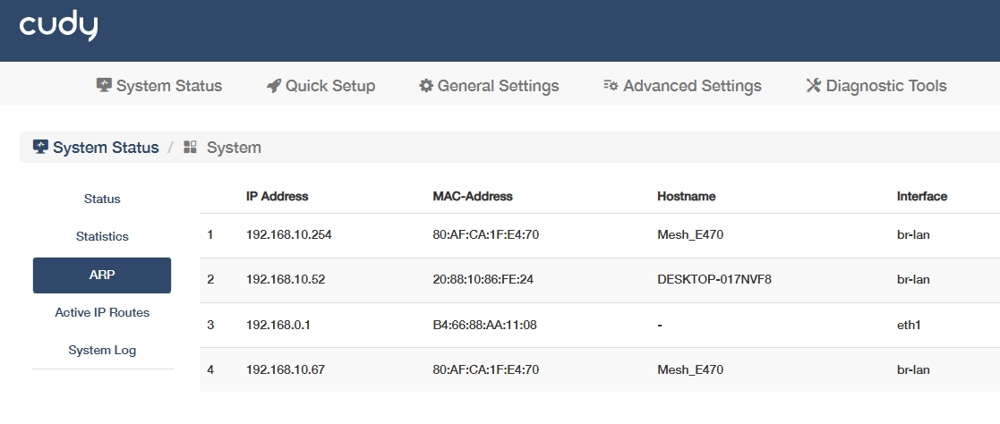
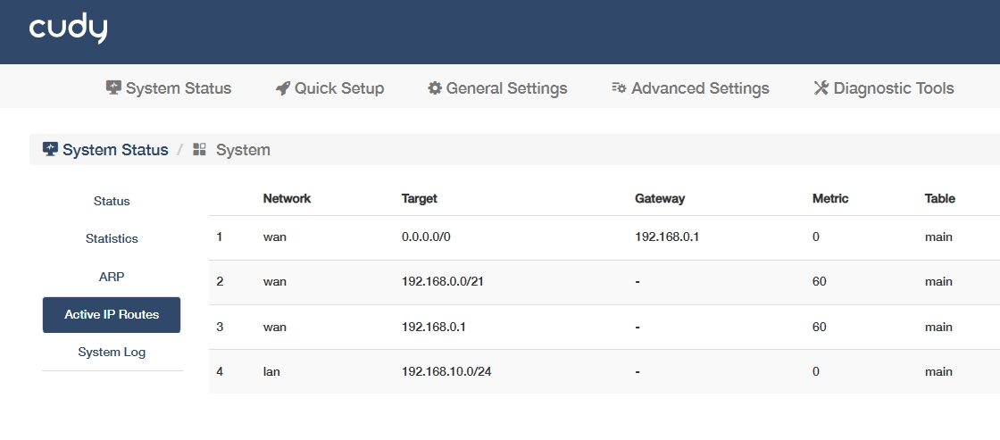
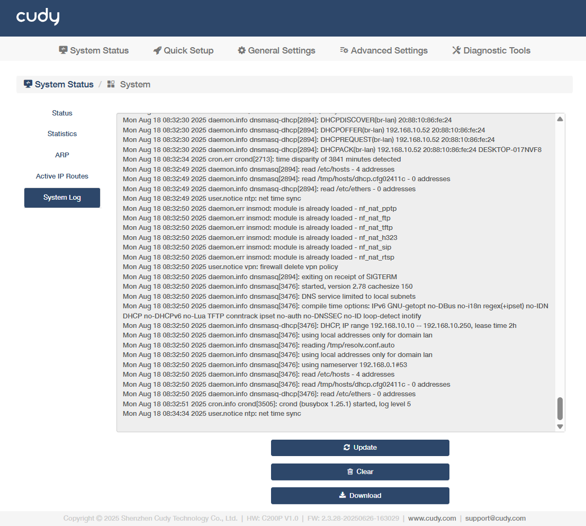

# System Status

Go to *System Status-> System -> More Details* to know more information on the *Status*, *Statistics*, *ARP*, *Active IP Routes* and *System Log*.

## Status
Displays real-time operational states to provide a snapshot of system health and configuration baseline for troubleshooting.

- Firmware Version: Current software version installed on the controller, critical for updates and compatibility.
- Model: Controller's product model, used for identifying hardware specifications.
- Hardware: Physical components/revision, indicating the device's internal build.
- Local Time: Controller's configured time, essential for time-based operations and logs.
- Uptime: Duration since the last reboot, reflecting system stability and reliability.

## Statistics
Tracks network performance metrics per interface (WLAN or LAN) to identify bandwidth bottlenecks, packet loss, or hardware faults.

- Interface: The network port or connection type being monitored.
- Tx Bytes: Total data transmitted.
- Tx Pkts: Number of packets sent.
- Tx Errs: Transmission errors.
- Tx Drop: Packets dropped due to congestion or faults.
- Rx Bytes: Total data received.
- Rx Pkts: Number of packets received.
- Rx Errs: Reception errors.
- Rx Drop: Packets dropped during reception.

## ARP 
Maps IP addresses to MAC addresses for local network communication to detect IP conflicts and monitors connected devices in the LAN.

- IP Address: Network-layer address assigned to a device in the local network.
- MAC-Address: Physical hardware address uniquely identifying a device at the data-link layer.
- Hostname: Device name associated with the IP/MAC address, typically obtained via DNS reverse lookup or local host mapping.
- Interface: Network interface through which the ARP entry is learned or associated.

## Active IP Routes
Shows path selection rules for data forwarding to optimize traffic routing and diagnoses connectivity issues between networks.

- Network/Target: Destination network address that the route applies to.
- Gateway: Next-hop IP address used to reach the target network.
- Metric: A numerical value indicating route priority (lower=preferred), calculated from hop count/bandwidth.
- Table: Routing table type where this route is stored.

## System Log
Tracks all the router behaviors. When the router does not work normally, download the system log and send it to our  [Technical Support](mailto:support@cudy.com) for troubleshooting. 

- Update: Click to refresh the system log.
- Clear: Click to erase all the system log up till now.
- Download: Click to download the system log for technical support.