# System
System is to manage the AP controller's systematic features. It includes System Time, Firmware, Backup/Restore, Administration, Admin Account, Language, Timed Reboot, Reboot, Reset, LED Control, and TR069 (not in Wireless Access Point mode).

- For *Main AP controller and AP Controller* mode
    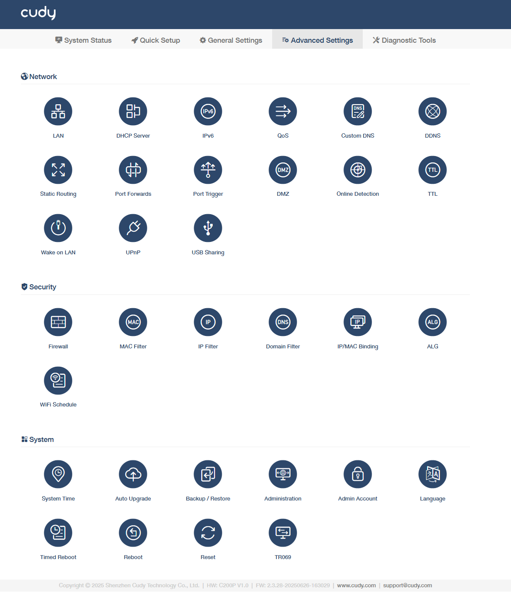
- For *AP Controller* mode
    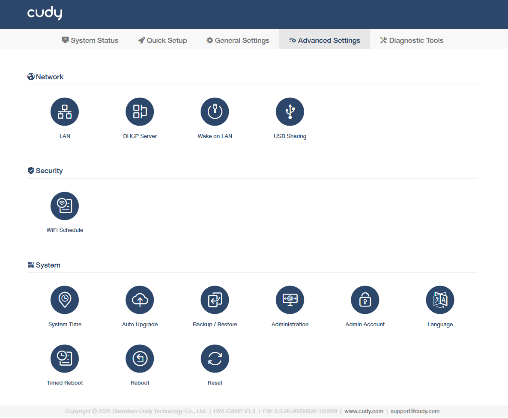

----
## System Time
It is the time displayed while the AP controller is running. The system time you configure here will be used for other time-based functions like WiFi schedule, parental control, etc. 

*To configure the system time, please follow the steps below.*

1. Select your Timezone from the drop-down list.
2. Select a *Set Time* method: Get from Internet, Get from Managing Device, or Manual.
    - Get from the Internet: AP controller will synchronize the time with the Internet of the NTP server, for 	which you've entered its IP address or domain name.
    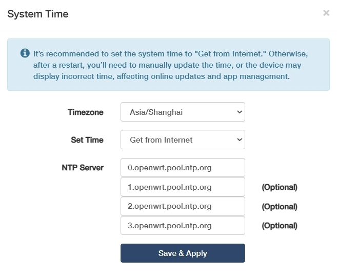
    - Get from Managing Device: AP controller will synchronize the time with your device connected.
    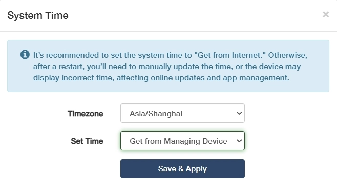
    - Manual: AP controller will display the time you have manually set (YY/MM/DD HH:MM:SS).
    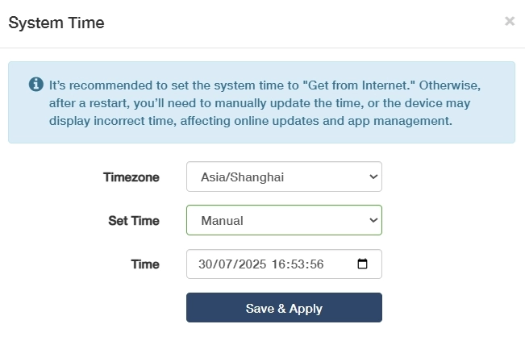

3. Click *Save & Apply*.

---
## Auto Upgrade
It is to automatically download and install the latest firmware for connected APs during scheduled maintenance windows.

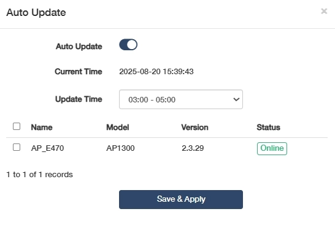

1. Toggle to enable *Auto Update*.
2. Check the *Current Time*.
3. Select an appropriate *Update Time* from the pull-down list.
4. Select the AP(s) you would like to upgrade at the scheduled time.

---
## Backup/Restore
The settings are stored as a configuration file in the AP controller. You can back up the configuration file in your computer for future use, or restore the AP controller to a previous settings from the backup file when needed.

- To back up the configuration file, just click *Generate backup* to download and save a copy of the current settings in your local computer in the form of *.bin* file.
- To restore the backup configuration file later on, click *Browser...* to locate and upload the backup configuration file stored in your computer, and then click *Restore* to restore and reboot. It may take a few minutes. Please do not turn off or reset the AP controller in this process.
    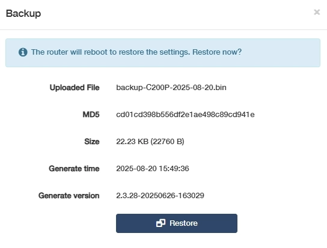

---
## Administration
It allows you to access and manage the AP controller from the local network devices via Local Management, and access and manage the AP controller over the Internet via Remote Management.

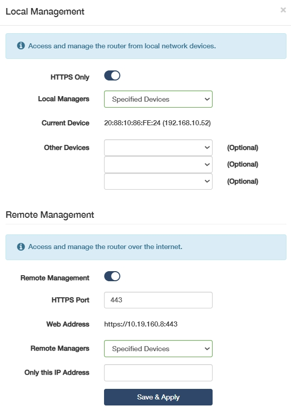

- Local Management
    - HTTPS Only: Enable to force secure HTTPS connections for all management access.
    - Local Managers: Define who can access the controller among the local network devices. 
        - All Devices: Allow all LAN-connected devices to manage the AP controller. 
        - Specified Devices：Specify certain devices to manage the AP controller by enter the custom MAC address in *Other Devices* field.
    - Current Device: Refers to the AP controller itself (not its managed APs), used to configure local system settings like firmware/IP.
- Remote Management
    - HTTPS Port: Specify the secure port for encrypted web management access. Default is 443; change if conflicted.
    - Web Address: Displays custom domain/IP to access the controller's interface.
    - Remote Managers: Define external users/IPs permitted to manage the controller.
    - Only this IP Address: Restricts admin access to a single trusted IP for maximum security.

Click *Save & Apply* to save and activate the settings, and then the devices on the Internet can log in to *https://AP controller's WAN IP address:port number* to manage the AP controller.

 You can find the WAN IP address of the AP controller on *System Status -> WAN*. The AP controller's WAN IP is usually a dynamic IP. Please refer to *Advanced Settings -> Network -> DDNS* if you want to log into the AP controller via a domain name.

---
## Admin Account
To change your login password for the AP controller's web management page.

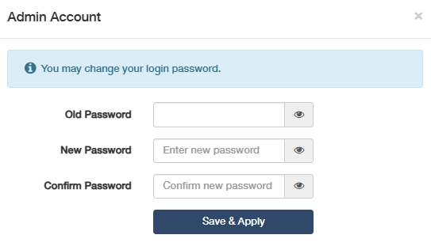

1. Enter the old password.
2. Create a new password and Confirm it. 
3. Click *Save & Apply* for the new password to take effect. 

 The password should be a value between 8 and 64 characters long.

---
## Language
To customize the AP controller's web management language. Otherwise, the AP controller will auto-detect your system language and synchronize it. 

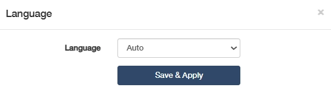

If any change, please click *Save & Apply* for the settings to take effect.

---
## Timed Reboot
It will clean the cache to enhance the running performance of the AP controller as scheduled. 
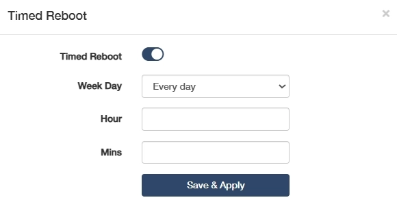

*To set the reboot schedule, please follow the steps below.*

1. Enable Timed Reboot.
2. Select the *Week Day* to specify how often you would like the AP controller to reboot.
3. Set a specific *Hour* and *Minute* when the AP controller should reboot on the specified day.
4. Click *Save & Apply* for the settings to take effect.

----
## Reboot 
Rebooting the AP controller after working for a long periods of time can release some storage space in the RAM and improve system performance, making the operation of the AP controller smoother. Rebooting does not affect any settings of the AP controller.

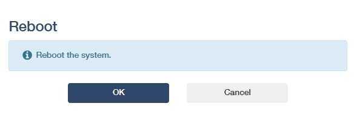

Click *OK* to reboot the system immediately. Wait a few minutes for the system to reboot. 

 You may also reboot the AP controller by turning off its power supply.

---
## Reset
will help you erase all the current settings and restore the AP controller to its factory defaults. Alternatively, you may reset the AP controller via the *RESET* button on the AP controller panel, or on this web management page.

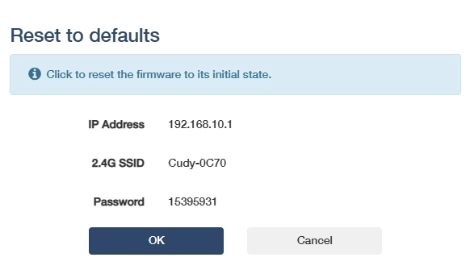

Before clicking *OK* to reset it, please note down the SSID and password (or refer them to the product label) for later reconnection.

Wait a moment for it to reboot and reset. When completed, it will pop up the login page requiring you to create a password again. Create a new login password and reconfigure your AP controller.

 

1. During the rebooting process, do not turn off or reset the AP controller. 
2. It's recommended to [back up](#backuprestore) the current configurations before resetting the AP controller.

---
## TR069

**This is only available in Main AP controller and AP Controller mode.**

TR-069, also known as CWMP (CPE WAN Management), allows Auto-Configuration Server (ACS) to perform auto-configuration, provision, connection, and diagnostics to this device. You may configure this function under your ISP's instructions.

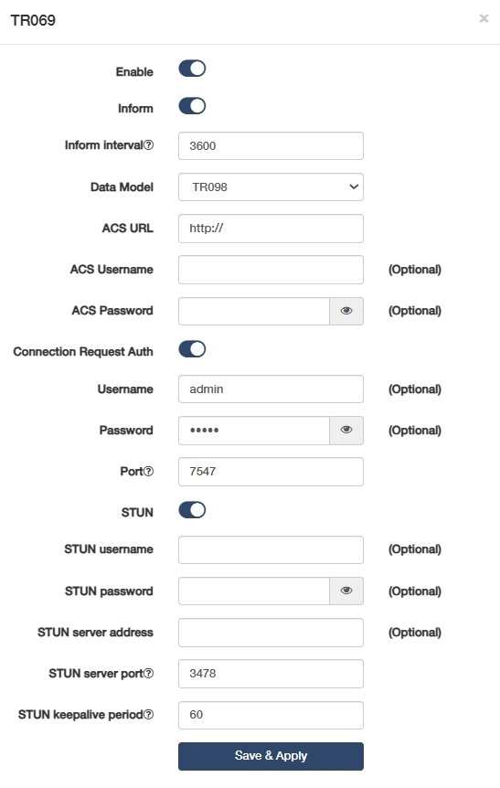

Configure the parameters according to your ISP instructions, and click *Save & Apply*.

- Enable: Click to enable the TR069/CWMP function.
- Inform: Enable to send an inform message to the ACS periodically.
- Inform Interval: Enter the time interval when the inform message will be sent to the ACS.
- Data Model: Select the data model of the inform message sent to the ACS, according to your ISP's 
instructions. 
    - TR-098: Legacy data model for basic home gateways.
    - TR-181: Modern unified CPE standard with hierarchical nodes, supporting IoT/SDN and mandatory for industrial deployments post-2025.
- ACS URL: Enter the web address of the ACS provided by your ISP.
- ACS Username/Password: (Optional) Enter the username/password to log in to the ACS server.
- Connection Request Auth: If enabled, you may optionally enter the *Username* and *Password* for the ACS server to log in to the AP controller; otherwise just ignore it.
- Port: Enter the port (a value from 1024~65535) that connects to the ACS server.
- STUN: If enabled, you need to enter the STUN server port and keepalive period, and optionally the STUN username/password/server address to log in the AP controller.