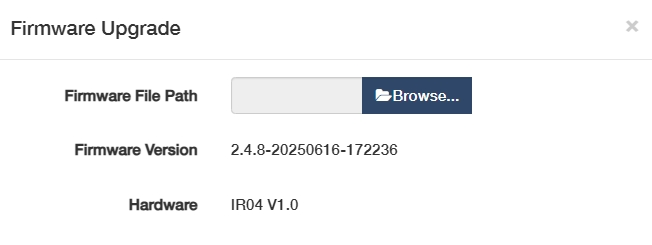
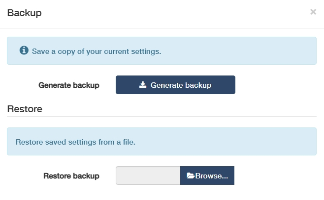
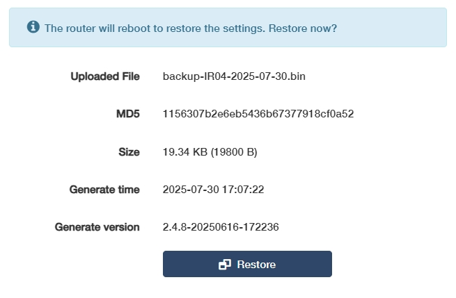
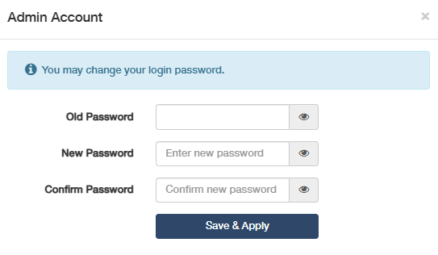

# System
System is to manage the router’s systematic features. It includes System Time, Firmware, Backup/Restore, Administration, Admin Account, Language, Timed Reboot, Reboot, Reset, LED Control, and TR069 (not in Wireless Access Point mode).

## System Time
is the time displayed while the router is running. The system time you configure here will be used for other time-based functions like WiFi schedule, parental control, etc. 

**To configure the system time, please follow the steps below.**

1. Select your Timezone from the drop-down list.

2. Select a *Set Time* method: Get from Internet, Get from Managing Device, or Manual.
    - Get from the Internet: Router will synchronize the time with the Internet of the NTP server, for 	which you’ve entered its IP address or domain name.
    

    - Get from Managing Device: Router will synchronize the time with your device connected.
    

    - Manual: Router will display the time you have manually set (YY/MM/DD HH:MM:SS).
    

3. Click *Save & Apply*.

---
## Firmware
The current firmware version and hardware version will be displayed. Click Browse... to locate and upload the latest firmware file you have already downloaded from www.cudy.com. Wait a few minutes for the update and reboot to complete.

For more about firmware upgrading, please refer to [Advanced Settings-> Firmware](firmware.md)

 If you fail to update the firmware for the router, please contact our technical support [support@cudy.com](mailto:support@cudy.com).

---
## Backup/Restore
The settings are stored as a configuration file in the router. You can back up the configuration file in your computer for future use, or restore the router to a previous settings from the backup file when needed.

- To back up the configuration file, just click **Generate backup** to download and save a copy of the current settings in your local computer in the form of *.bin* file.

- To restore the backup configuration file later on, click **Browser** to locate and upload the backup configuration file stored in your computer, and then click *Restore* to restore and reboot. It may take a few minutes. Please do not turn off or reset the router in this process.

---
## Administration
allows you to access and manage the router from the local network devices via Local Management, and access and manage the router over the Internet via Remote Management.

**Local Management**

- HTTPS Only: If enabled, you can access the router only via HTTPS, otherwise both HTTP and HTTPS are accessible.
- Local Managers: You can select *All Devices* to allow all LAN-connected devices to manage the router. If you want to specify certain devices to manage the router, please select *Specified Devices* and select or customize the device with its MAC address.

**Remote Management**

- Remote Management: If enabled, the remote devices on the Internet can access and manage the router. Otherwise, no remote devices on the Internet can do that.
- HTTPS port: Recommended to keep it as default settings.
- Remote Managers: You can select *All Devices* to allow all the remote devices on the Internet to manage the router. If you want to specify a certain device to manage the router, please select *Specified Devices* and enter the specific IP address in the *Only this IP address* field.

*Save & Apply* the above settings, and then the devices on the Internet can log in to **https://router’s WAN IP address:port number* to manage the router.

 You can find the WAN IP address of the router on *System Status -> WAN*. The router’s WAN IP is usually a dynamic IP. Please refer to *Advanced Settings -> Network -> DDNS* if you want to log into the router via a domain name.

---
## Admin Account
is to change your login password for the router’s web management page.

1. Enter the old password.

2. Create a new password and Confirm it. 

3. Click *Save & Apply* for the new password to take effect. 

 The password should be a value between 8 and 64 characters long.

---
## Language
is to customize the router's web management language. Otherwise, the router will auto-detect your system language and synchronize it. 

If any change, please click *Save & Apply* for the settings to take effect.

---
## Timed Reboot
will clean the cache to enhance the running performance of the router as scheduled. 

To set the reboot schedule, please follow the steps below.

1. Enable Timed Reboot.

2. Select the *Week Day* to specify how often you would like the router to reboot.

3. Set a specific *Hour* and *Minute* when the router should reboot on the specified day.

4. Click *Save & Apply* for the settings to take effect.

----
## Reboot 
Rebooting the router after working for a long periods of time can release some storage space in the RAM and improve system performance, making the operation of the router smoother. Rebooting does not affect any settings of the router.

Click *OK* to reboot the system immediately. Wait a few minutes for the system to reboot. 

 You may also reboot the router by turning off its power supply.

---
## Reset
will help you erase all the current settings and restore the router to its factory defaults. Alternatively, you may reset the router via the *RESET* button on the router panel, or on this web management page.

Before clicking *OK* to reset it, please note down the SSID and password (or refer them to the product label) for later reconnection.

Wait a moment for it to reboot and reset. When completed, it will pop up the login page requiring you to create a password again. Create a new login password and reconfigure your router.

 

1. During the rebooting process, do not turn off or reset the router. 
2. It's recommended to [back up](#backuprestore) the current configurations before resetting the router.

---
## TR069
TR-069, also known as CWMP (CPE WAN Management), allows Auto-Configuration Server (ACS) to perform auto-configuration, provision, connection, and diagnostics to this device. You may configure this function under your ISP’s instructions.

Configure the parameters according to your ISP instructions, and click *Save & Apply*.

- **Enable**: Click to enable the TR069/CWMP function.
- **Inform**: Enable to send an inform message to the ACS periodically.
- **Inform Interval**: Enter the time interval when the inform message will be sent to the ACS.
- **Data Model**: Select the data model of the inform message sent to the ACS, according to your ISP’s 
instructions. 

    ◦  TR-098: Legacy data model for basic home gateways.

    ◦  TR-181: Modern unified CPE standard with hierarchical nodes, supporting IoT/SDN and mandatory for industrial deployments post-2025.

- **ACS URL**: Enter the web address of the ACS provided by your ISP.
- **ACS Username/Password**: (Optional) Enter the username/password to log in to the ACS server.
- **Connection Request Auth**: If enabled, you may optionally enter the *Username* and *Password* for the ACS server to log in to the router; otherwise just ignore it.
- **Port**: Enter the port (a value from 1024~65535) that connects to the ACS server.
- **STUN**: If enabled, you need to enter the STUN server port and keepalive period, and optionally the STUN username / password / server address to log in the router.

----