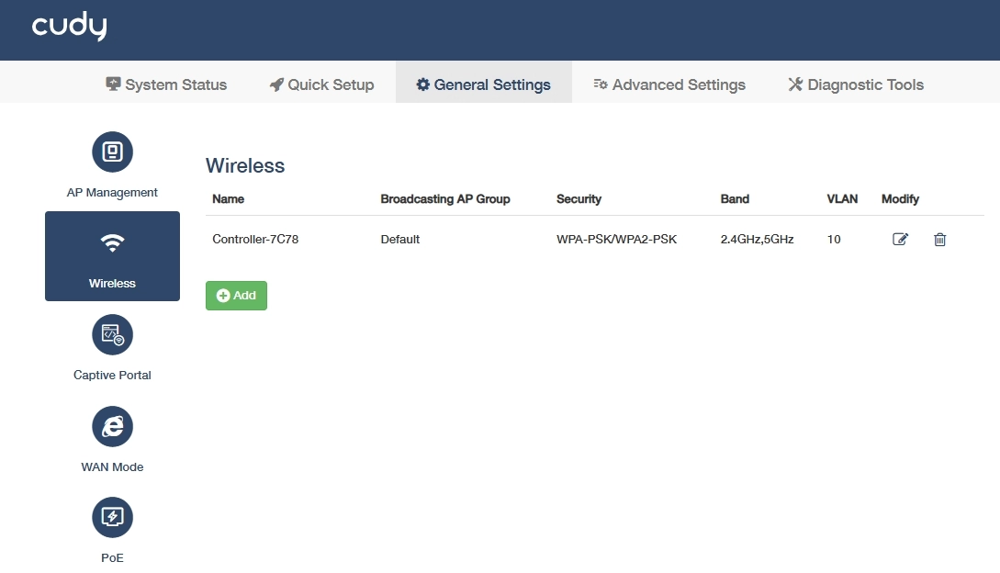
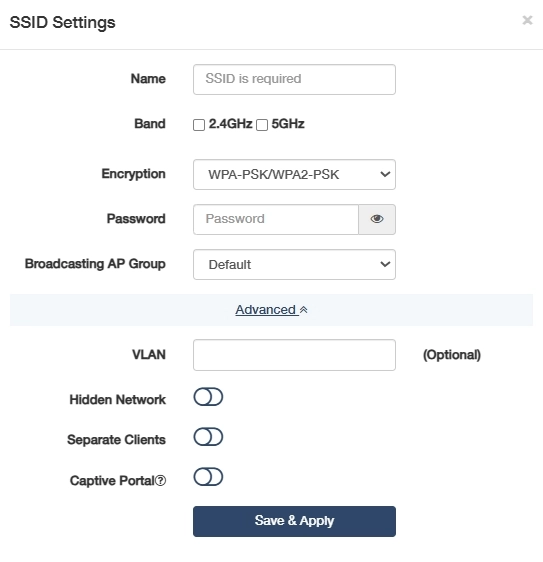

# Wireless

To configure and manage wireless network settings for the controlled APs.

- Name: Displays the wireless network name (SSID) visible to wireless clients.

     APs in the same AP group will share an identical SSID, while different AP groups should have different SSIDs.

- Broadcasting AP Group: Displays the AP Group of access points sharing this wireless configuration.
- Security: Displays the encryption and authentication methods for network protection.
- Band: Displays the frequency range used for wireless transmission.
- VLAN: Displays this AP group's VLAN ID for traffic segregation. Wireless client data frames are encapsulated with the configured 802.1Q VLAN tag upon egress from the AP's LAN interface.
- Modify: Click  to edit the entry or  to delete the entry.

- : Click to add a new entry for an AP group's wireless configuration.

    

    - Name: Modify or customize the wireless network name.
    - Band: Tick or untick 2.4GHz/5GHz to specify the frequency range.
    - Encryption: Select a security protocol to prevent unauthorized access.
        - WPA-PSK: Legacy TKIP encryption, vulnerable to attacks, deprecated.
        - WPA2-PSK: AES-based standard, secure but susceptible to brute-force.
        - WPA-PSK/WPA2-PSK: Mixed mode for backward compatibility, weakest link dictates security.
        - WPA2-PSK/WPA3-SAE: Transitional mode, AES+SAE for future-proofing.
        - WPA3-SAE: Quantum-resistant, SAE protocol, ideal for critical infrastructure.
    - Password: Set a password for the wireless network.
    - Broadcasting AP Group: Select an AP Group for the access points.
    - VLAN: (Optional) Assign a VLAN ID (10-4094) to this AP group/SSID to enable traffic segregation. Then ensure the connected switch port is configured as an 802.1Q trunk with the corresponding VLAN allowed.
    - Hidden Network: Enable to avoid SSID broadcast and hide the network from casual scans but offers minimal security. Use only with WPA3 for industrial IoT.
    - Separate Clients: Enable to isolate connected devices and block their communication, critical for IoT security in shared networks.
    - Captive Portal: Enable a login/authentication gateway to control access. It is editable only when *[General Settings -> Captive Portal](captive_portal.md)* is enabled.

