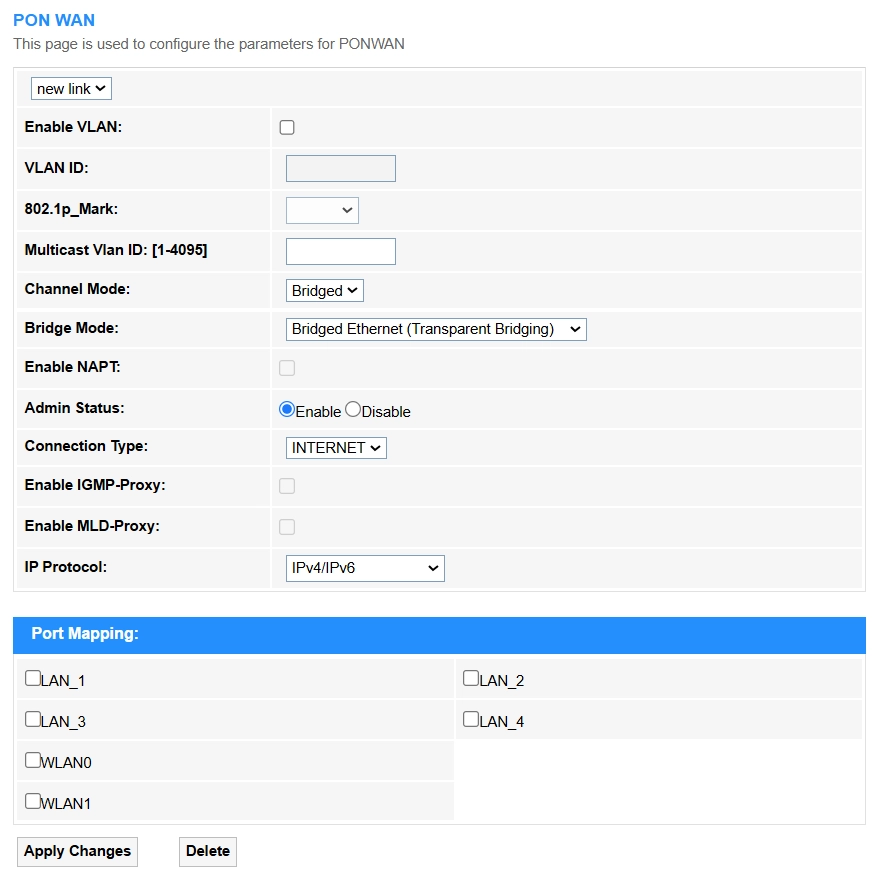

# WAN

- **Enable VLAN**: Tick to enable the virtual LAN segmentation for traffic isolation.
- **VLAN ID**: Unique tag (1-4094) to identify a VLAN group.
- **802.1p Mark**: QoS priority level (0-7) for latency-sensitive traffic.
- **Multicast VLAN ID**: Dedicated VLAN (1-4095) for multicast streams like IPTV.

- **Channel Mode**: Select the channel mode and configure the corresponding parameters.

## Bridged (Mode)
Passes raw traffic transparently (no NAT/auth), pushing all routing tasks to downstream devices.

- Bridge Mode:
    - Bridged Ethernet (Transparent Bridging): It forwards raw Layer 2 frames unchanged, acting as a dumb pipe for downstream devices to handle routing/NAT. Ideal for enterprise networks or ISP passthrough.
    - Bridged PPPoE：First strips PPPoE headers (authentication/encapsulation) and then bridges the remaining Ethernet frames (required when ISPs enforce PPPoE login on customer routers). Common in legacy DSL/GPON networks.
  
## IPoE (Mode)
Automatically assigns IP via DHCP without authentication, ideal for plug-and-play services like IPTV.

- Enable Bridge: Select to enable *Bridge* or not as needed. If select to enable, then you may select either Bridged Ethernet or Bridged PPPoE mode.
- Enable NAPT: Enable *Network Address Port Translation* to have multiple devices share a single public IP by mapping private IPs and ports, essential for home networks (IPv4 conservation) but unnecessary for servers with dedicated IPs.
- WAN IP Settings:
    - Type: Select the connection method. If Fixed IP is selected, please enter the Local IP Address, Gateway, Subnet Mask and Primary/Secondary DNS Server. If DHCP is selected, it will automatically obtain those parameters from the DHCP server.
- IP Unnumbered: Allows sharing an IP with another interface (rare, used to conserve addresses). Disabled by default.
- Request DNS: If enabled, automatically fetches DNS servers from the ISP.

## PPPoE (Mode)
Requires username/password authentication to establish a connection, commonly used for home broadband.

- Enable Bridge: Select to enable Bridge or not as needed. If select to enable, then you may select either *Bridged Ethernet* or *Bridged PPPoE* mode.
- Enable NAPT: Enable *Network Address Port Translation* to have multiple devices share a single public IP by mapping private IPs and ports, essential for home networks (IPv4 conservation) but unnecessary for servers with dedicated IPs.
- PPP Settings:
    - Username/Password: Enter the username and password for PPP authentication provided by your ISP. 
    - Type: Select a proper PPP connection type.
       - Continuous: Maintains a permanent PPP connection (e.g., for always-on services like fiber). (Ideal for stable, high-usage networks.)
       - Connect on Demand: Establishes PPP only when traffic is detected (e.g., idle timeout: 300 sec). Saves bandwidth for intermittent use.- Manual: Requires manual login to initiate PPP (rarely used), for full user control, no auto-reconnect. 
    - Idle Time (sec): Automatically disconnects the PPP session after inactivity (e.g., 0 = no timeout). Saves bandwidth if unused.
    - Authentication Method: Select an encryption protocol for login.
        - AUTO: Automatically negotiates the most secure supported method (PAP/CHAP/MS-CHAPv2).Default for compatibility. 
        - PAP: Sends credentials in plaintext (insecure, used only if required). No encryption, vulnerable to attacks. 
        - CHAP: Uses challenge-response hashing for security. Safer than PAP, but lacks mutual authentication. 
        - MS-CHAP: Microsoft’s extended CHAP (v1), with weak encryption. Deprecated due to vulnerabilities. 
        - MS-CHAPv2: Enhanced version with mutual authentication. Current standard for Windows networks. 
    - AC-Name: Enter an optional Access Concentrator identifier for PPPoE, rarely used. ISP may specify this for routing.
    - Service-Name: Enter an optional PPPoE service tag to distinguish multiple ISP services. Leave blank unless required.

- IPv6 WAN Settings:
    - Address Mode: Select the mode how the IPv6 address is obtained.
    - Stateless DHCPv6 (SLAAC): Automatically assigns IPv6 addresses using router advertisements (RA), while DNS info is obtained via DHCPv6. (Combines SLAAC for addressing with DHCPv6 for configuration.)
    - Static: Manually configured IPv6 address, subnet, gateway, and DNS—ideal for fixed network requirements. No dependency on auto-configuration.
    - Stateful DHCPv6: DHCPv6 server assigns both IPv6 addresses and DNS/other settings (like SLAAC but fully managed). Common in enterprise networks.
    - Auto Detect Mode: Router automatically chooses between SLAAC, DHCPv6, or static based on ISP/network signals. Flexible but less predictable.
    - Request Options: Tick to enable the router to dynamically request an IPv6 network prefix (e.g., /56) from the ISP via DHCPv6-PD, enabling subnet delegation for multiple LAN segments, which is ideal for multi-subnet networks. Untick it if the router operates without prefix delegation, relying only on a single WAN IPv6 address or manual configuration, which is simpler but lacks subnet flexibility.
    - Request DNS: Select *On* to automatically retrieve IPv6 DNS server addresses from the ISP when using DHCPv6/SLAAC; *Off* to manually configure the DNS.
    - Primary/Secondary IPv6 DNS: Manual or ISP-assigned DNS servers for IPv6 resolution. 

- **Admin Status**: Enable or disable port/service availability (Up/Down).
  
- **Connection Type**: INTERNET type of connection is recommended. 
  
- **MTU(1280-1500)**: Maximum packet size (in bytes) allowed on the network, where 1500 is standard for Ethernet and 1280 is the minimum for IPv6 compatibility.
  
- **Enable IGMP-Proxy**: Relays IPv4 multicast traffic (e.g., IPTV) between networks, optimizing bandwidth usage.
  
- **Enable MLD-Proxy**: Performs the same function as IGMP-Proxy but for IPv6 multicast streams (e.g., 4K video over IPv6).
  
- **IP Protocol**: Selects IPv4, IPv6, or dual-stack operation IPv4/IPv6 for network communication.
    - IPv4: WAN IP Settings are required, including Type (Fixed IP or DHCP), Local IP address, Gateway, Subnet Mask, Primary/Secondary DNS Server, as well as the V6inV4 Tunnel settings.
    - IPv6: IPv6 WAN IP Settings are required, including Address mode (Stateless DHCPv6, Static, Stateful DHCPv6, or Auto Detect Mode), Request Options(Request Prefix or not), Request DNS (On or Off), Primary/Secondary IPv6 DNS, 4over6 Type(None or DS-Lite), AFTR address mode (DHCP or Static) and address.
    - IPv4/IPv6: Both WAN IP Settings for IPv4 and IPv6 are required.

- **Port Mapping**: 
Select the port based on your service type (e.g., 80 for HTTP, 443 for HTTPS, or custom ports for apps like 25565 for Minecraft), and ensure the target device’s local IP is static. Verify with tools like canyouseeme.org post-setup.

 To prioritize security, please avoid exposing sensitive ports like RDP/SSH without safeguards.

• Apply Changes: Click to save and activate the settings or changes.

• Delete: Click to delect the selected entries.