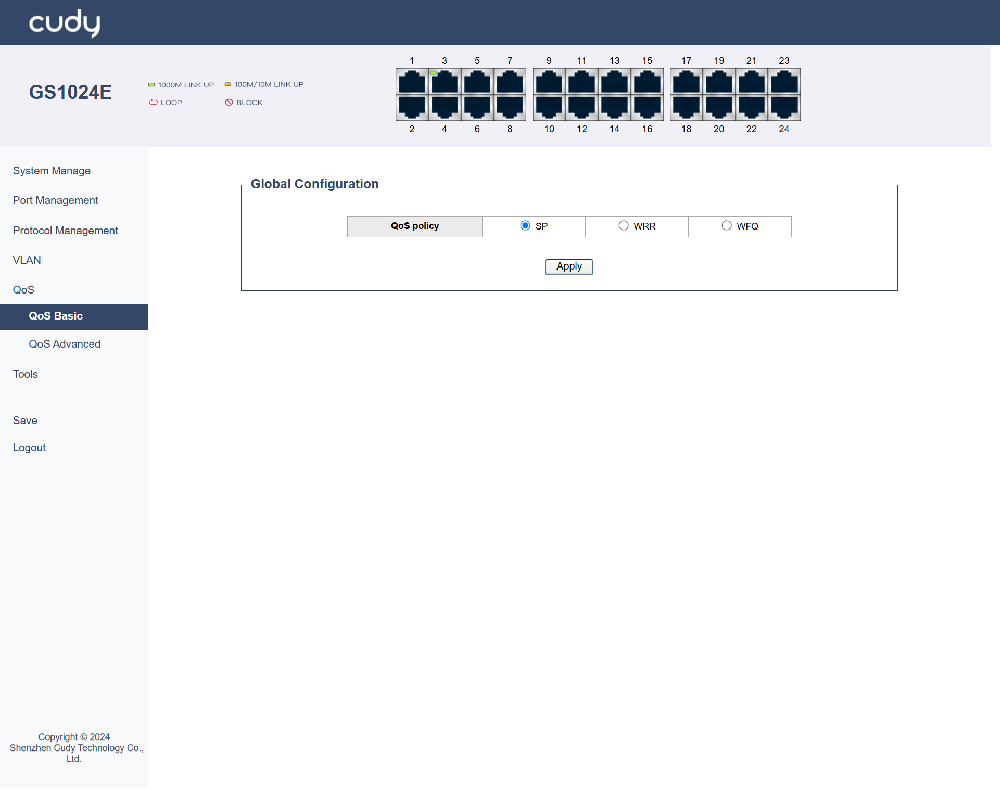
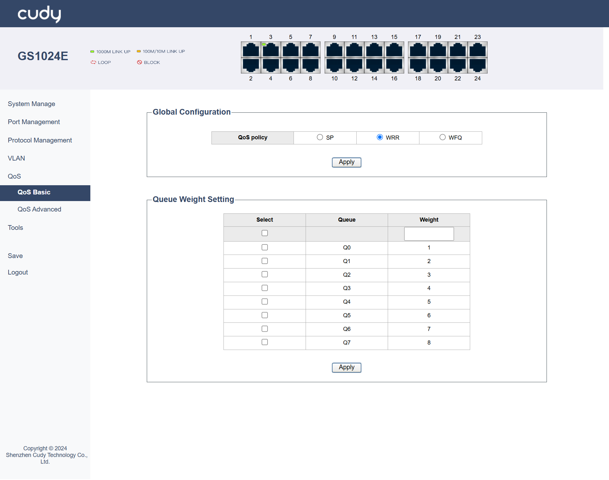
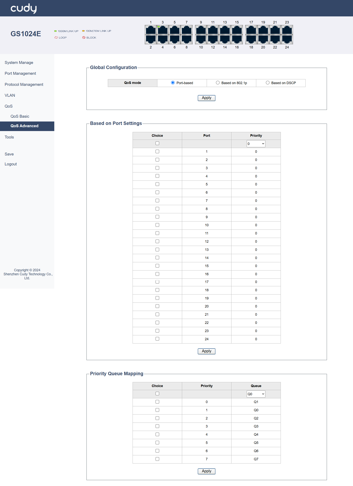
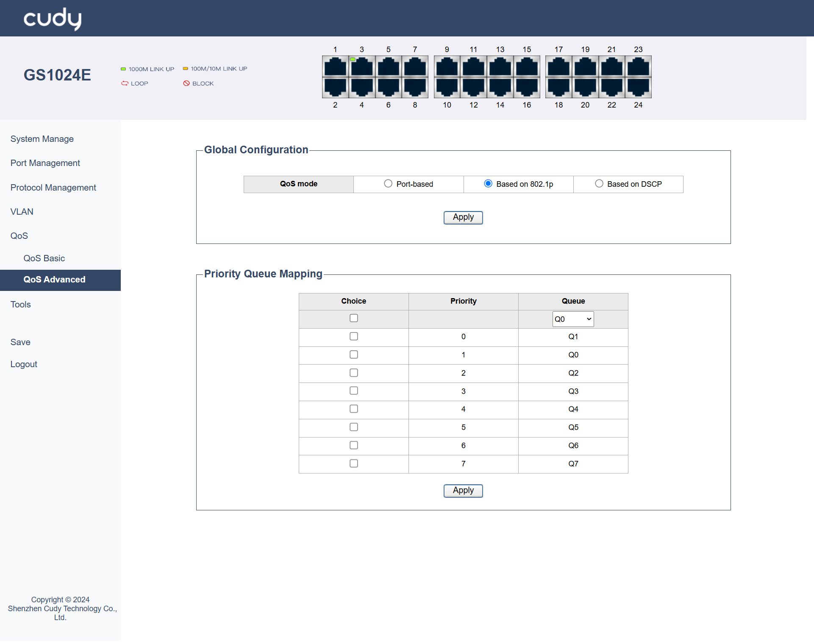
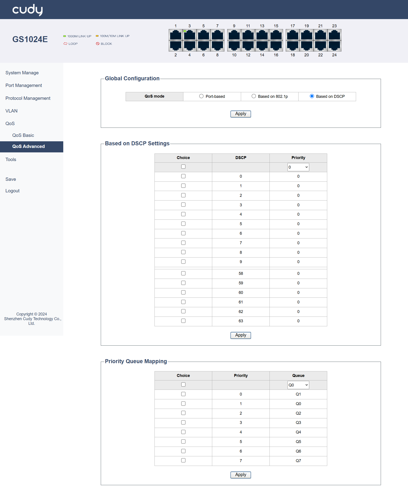

# QoS

## QoS Basic

### SP
SP (Strict Priority) is a queuing method where packets in higher-priority queues are always processed before those in lower-priority queues. It is useful in scenarios where certain types of traffic, like real-time voice or video, need to be prioritized to reduce delay.

No further configuration is required. The switch will process packets strictly based on their priority levels. It will always handle the highest-priority packets first, regardless of the amount of traffic in each queue.

- *Apply*: Click to save and apply your changes or settings.

### WRR
WRR (Weighted Round Robin) is a scheduling algorithm that assigns a weight to each queue and processes packets in a round-robin fashion based on these weights.It is suitable for scenarios where you want to allocate different amounts of bandwidth to different types of traffic in a fair manner.

It is configured by setting the weight for each queue. For example, you can set the weight of queue 1 to 10, queue 2 to 20, and queue 3 to 30, which means queue 2 will get twice the bandwidth of queue 1. 

- Queue: Defines different groups of traffic.
- Weight: Determines the proportion of bandwidth allocated to each queue based on its importance.

- *Apply*: Click to save and apply your changes or settings.

### WFQ

WFQ (Weighted Fair Queuing) is a queuing method that classifies traffic into different flows and allocates bandwidth to each flow based on its weight. It is useful in scenarios where you have multiple types of traffic and want to ensure that each type gets a fair share of bandwidth. 

- Queue: Define different flows of traffic.
- Weight: Allocates bandwidth fairly among these flows based on their importance.

- *Apply*: Click to save and apply your changes or settings.

It is configured by defining traffic classes and assigning weights to them. For example, you can define a class for voice traffic and assign it a higher weight, and a class for data traffic and assign it a lower weight.

---

## QoS Advanced

### Port_based
This mode prioritizes traffic based on the ingress port of the data flow. It is ideal for scenarios where specific ports are dedicated to certain types of traffic, such as VoIP phones or critical servers. For example, in a small office network, you can set a higher priority for the port connected to VoIP phones.

- Port: Select the specific port you want to configure.
- Priority: Assign a priority level to the selected port. Higher numbers typically indicate higher priority.
  
Priority Queue Mapping: Map the assigned priority to a specific transmit queue. This determines which queue the traffic will be placed in for processing.

- Priority: Assign a priority level to the traffic entering the port. Higher priority traffic will be processed before lower priority traffic in the same queue.
- Queue: Choose the transmit queue (e.g., Q0-Q7) where the traffic from the selected port will be placed.

- *Apply*: Click to save and apply your changes or settings.

### Based on 802.1p 
This mode prioritizes traffic based on the 802.1Q Tag's PRI field in the data frame. It is suitable for VLAN environments where different types of traffic are tagged with different VLAN priorities. For example, in a campus network, you can set higher 802.1p priorities for voice VLANs to ensure they get prioritized.

Priority Queue Mapping: Map the 802.1p priority values (0-7) to specific transmit queues. This ensures that traffic with different 802.1p priorities is handled accordingly.

- Priority: Assign a relative priority level to each 802.1p priority value. This helps in determining the order of processing within the same queue.
- Queue: Map each 802.1p priority value (0-7) to a specific transmit queue (e.g., Q0-Q7). This determines which queue will handle traffic with that 802.1p priority.

- *Apply*: Click to save and apply your changes or settings.

### Based on DSCP 
This mode prioritizes traffic based on the DSCP value in the IP packet header. It is useful in networks that use IP-based QoS policies. For example, in a corporate network, you can configure the switch to prioritize VoIP traffic (DSCP 46) and video conferencing traffic (DSCP 34) accordingly.

- DSCP: Identify the DSCP value (0-63) of the traffic you want to prioritize.
- Priority: Assign a priority level to the identified DSCP value.

Priority Queue Mapping: Map the assigned priority to a specific transmit queue. This ensures that traffic with different DSCP values is handled according to their priority levels.

- Priority: Assign a relative priority level to each DSCP value. This helps in determining the order of processing within the same queue.
- Queue: Map each DSCP value (0-63) to a specific transmit queue (e.g., Q0-Q7). This determines which queue will handle traffic with that DSCP value.

- *Apply*: Click to save and apply your changes or settings.