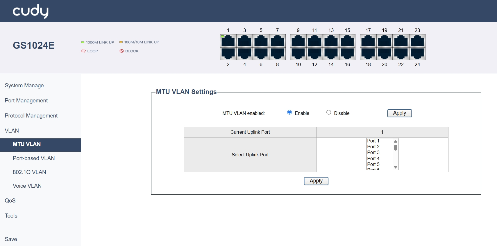
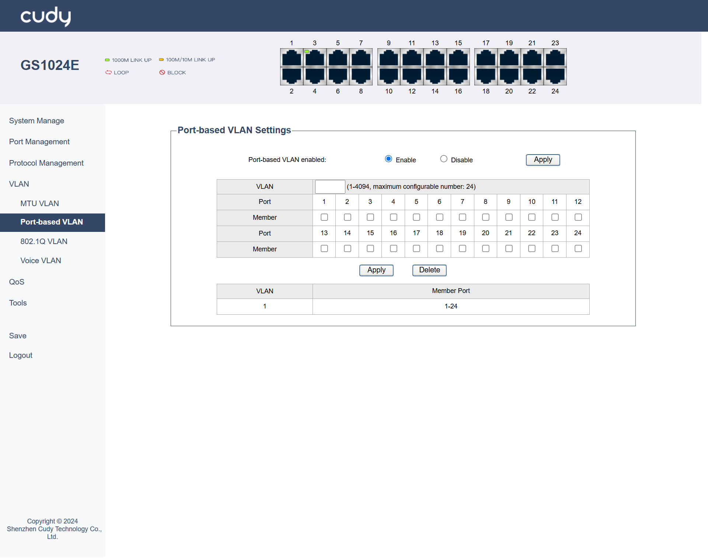
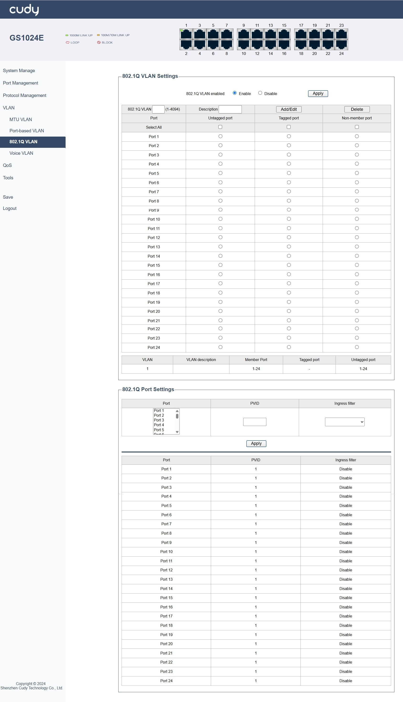
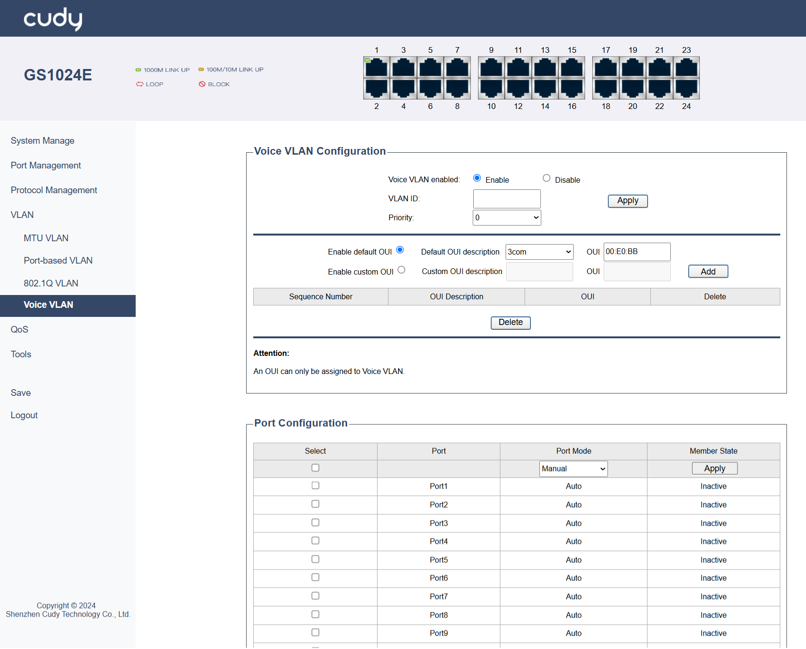

# VLAN
A VLAN (Virtual Local Area Network) logically segments a physical switch network into separate broadcast domains, isolating traffic and enhancing security without requiring physical rewiring. The switch offers 4 types of VLAN: MTU VLAN, Port-based VLAN, 802.1Q VLAN and Voice VLAN. By default, Port-based VLAN is enabled and the others are disabled.

## MTU VLAN
Adjusts the Maximum Transmission Unit (MTU) size (typically to 1496 bytes) on interfaces carrying VLAN-tagged traffic to accommodate the extra 4-byte 802.1Q tag and prevent fragmentation or packet loss. Configured by setting the specific MTU value on relevant switch ports/routers. 

- Current Uplink Port: Displays the port that currently connects to the uplink (e.g., to another switch or router).
- Select Uplink Port: Select to alter the port that connects to the uplink (e.g., to another switch or router).
  
*- Apply:* Click to save and apply the changes or settings.

!!! Note
    MTU VLAN is disabled by default; and when it is enabled, 802.1Q VLAN and Port-based VLAN will be disabled automatically.

---
## Port-based VLAN
Also called Static VLAN, assigns switch ports directly to a specific VLAN; any device plugged into that port belongs to that VLAN. Ideal for simplicity and static device locations. Configured by setting the port mode (Access) and assigning the VLAN ID.

- VLAN: Assign VLAN IDs to specific ports.
- Port: Lists the Port Number.
- Number: Tick to select the numbered ports.

*- Apply:* Click to save and apply the changes or settings.

*- Delete:* Click to delect the selected entries.

!!! Note
    Port-based VLAN is enabled by default; and when it is disabled, 802.1Q VLAN will be enabled automatically.

---
## 802.1Q VLAN
Also called Tagged VLAN/Trunking, uses standard 802.1Q tags within Ethernet frames to identify VLAN membership, allowing a single physical link (trunk) to carry traffic for multiple VLANs between switches or to routers. Configured by setting the port mode (Trunk) and allowing specific VLANs.

**802.1Q VLAN Settings**

- 802.1Q VLAN: Enter a VLAN ID, ranging from 1 to 4094.
- Description: Note a brief description for the VLAN.
- Untagged Port: Tick the ports that send and receive untagged frames.
- Tagged Port: Tick the ports that send and receive tagged frames.
- Non-Number Port: Select the ports that would not be assigned to any VLAN.
- Member Port: Displays the ports that are part of a specific VLAN.

The table below will display the configured entries, including VLAN ID, VLAN Description, Member Port, Tagged Port and Untagged Port.

!!! Note
    802.1Q VLAN is disabled by default; and when it is enabled, MTU VLAN and Port-based VLAN will be disabled automatically.

**802.1Q Port Settings**

- Port: Select the port to be configured.
- PVID: Enter the Port VLAN ID, the default VLAN for untagged frames.
- Ingress Filter: Select to Enable or Disable to filter incoming traffic based on VLAN membership.

The table below will display the port information, including Port Number, PVID and the Ingress Filter state.

*- Apply:* Click to save and apply the changes or settings.

*- Add/Edit:* Click to add or edit the selected entries.

*- Delete:* Click to delect the selected entries.

---
## Voice VLAN
A dedicated VLAN configured specifically for IP phone traffic, often prioritizing it (via QoS) and separating it from data traffic for better quality and security. Typically uses 802.1Q tagging 3. Configured by enabling Voice VLAN on an access port, setting the Voice VLAN ID, and often using LLDP for auto-provisioning phones.

- VLAN ID: Enter a VLAN ID.
- Priority: Select a priority number for the VLAN.
- Enable default OUI/Default OUI description/OUI: Use predefined or default OUIs for device identification.
- Enable custom OUI/Custom OUI description/OUI: Define custom OUIs for specific devices.
- Sequence Number: Displays the order of VLAN configurations.
- Port Mode: Set port mode to be manual or automatic.
- Member State: Set the state of a port in a VLAN to inactive.

*- Apply:* Click to save and apply the changes or settings.

*- Add:* Click to add the selected entries.

*- Delete:* Click to delect the selected entries.

!!! Note
    - Voice VLAN is disabled by default; 802.1Q VLAN needs to be enabled first before Voice VLAN.
    - An OUI can only be assigned to Voice VLAN.