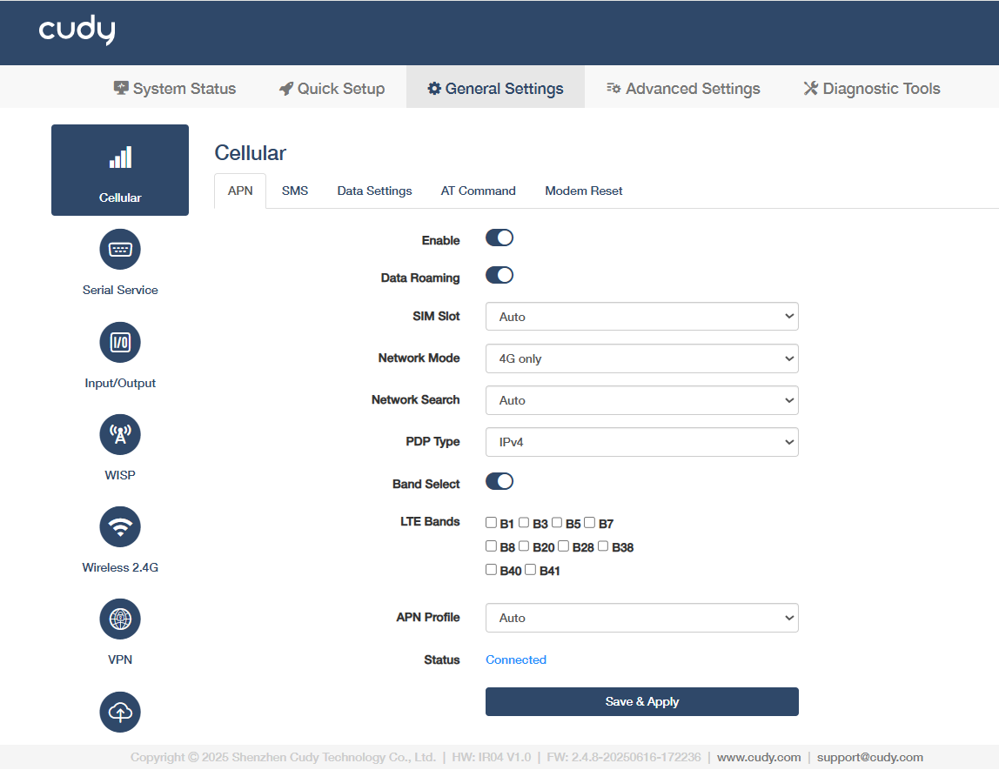
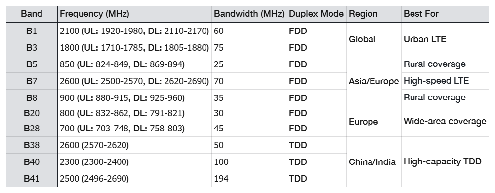
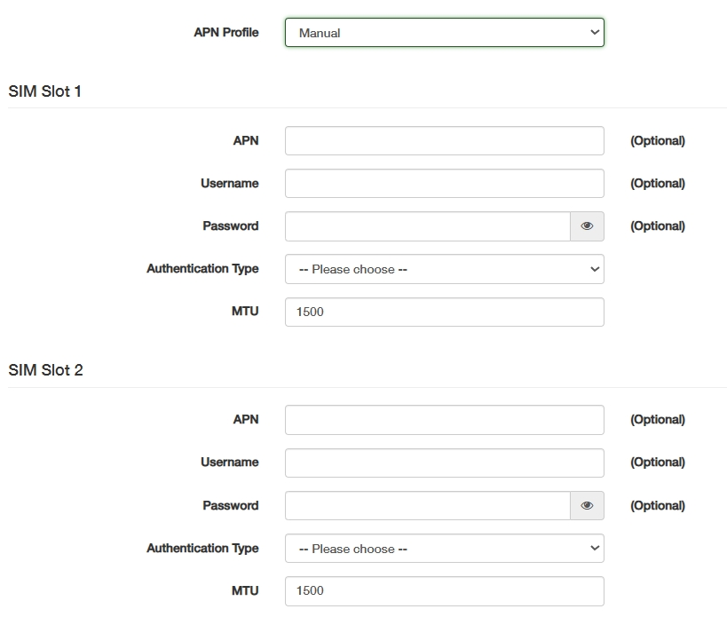
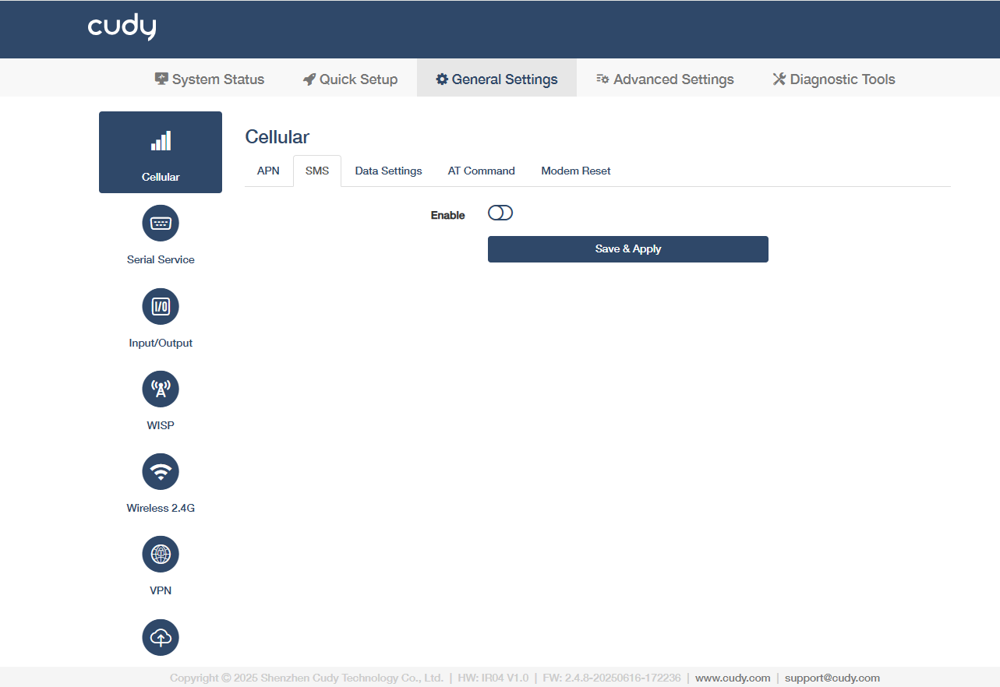
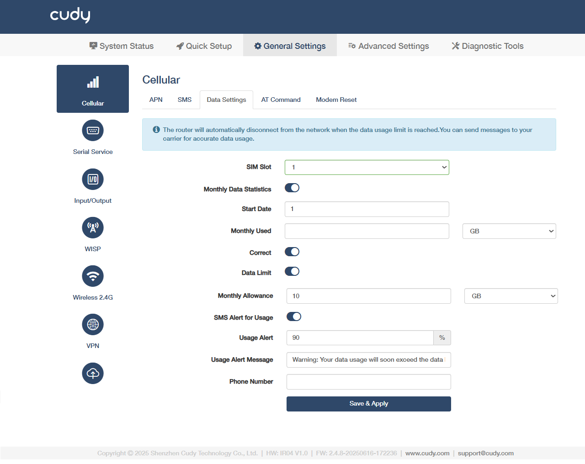
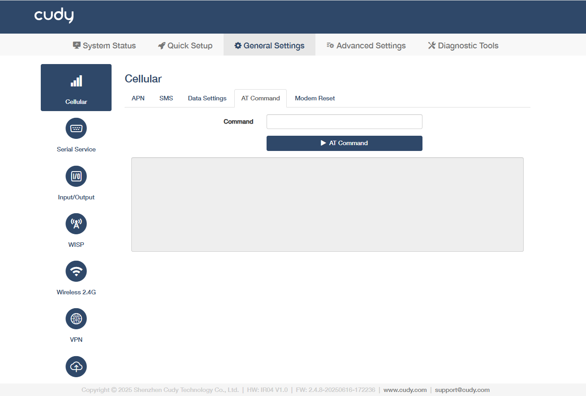
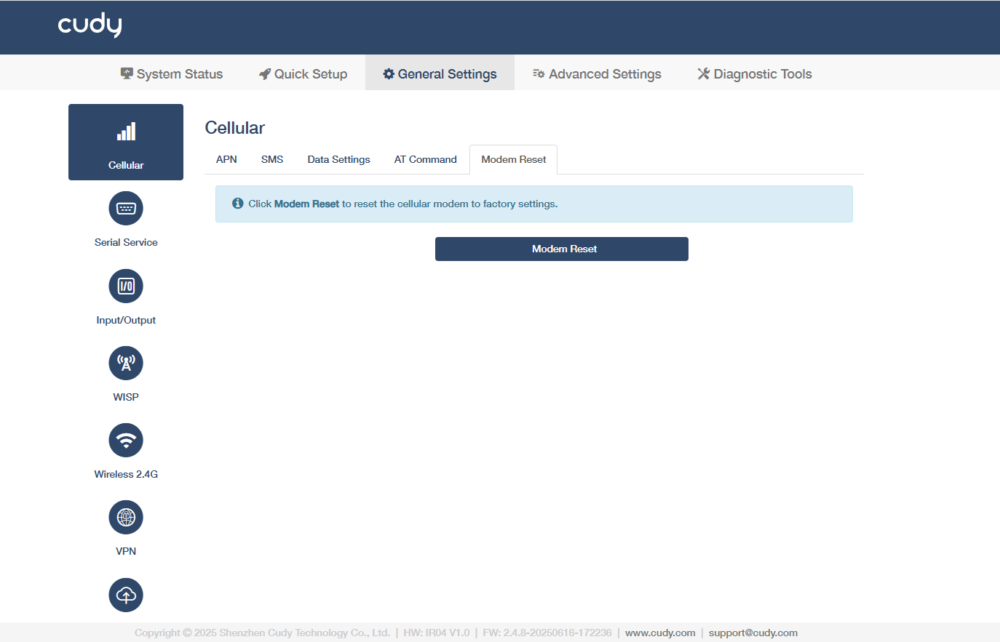

# Cellular

## APN

 
- **Enable**: Enable the APN feature. 
 
- **Data Roaming**: Enable the data roaming, which allows your mobile device to connect to the internet or use cellular data when outside your carrier’s network coverage area, often involving additional charges.  
 
- **SIM Slot**: Select the SIM slot (physical compartment) where the SIM card is inserted, enabling network connectivity. *Auto* is recommended for automatic detection.
 
- **Network Mode**: Select the network mode (type of cellular network) the router connects to. *Auto* is recommended for automatic detection.
 
- **Network Search**: Select the means of network search. *Auto* for automatic scanning and connection; or *Manual* requires a click on *Network Search* and selection of your SIM card carrier and network operator.

- **PDP Type**: Select the Packet Data Protocol Type that defines the protocol used for data transmission in mobile networks (e.g., IPv4 or IPv4/IPv6).  
 
- **Band Select**: Enable to allow manual selection of specific frequency bands for network connectivity, useful for optimizing signal strength or compatibility.  

- **LTE Bands**: Select a specific frequency ranges allocated for LTE (4G) networks, varying by region and carrier.  

 
- **APN Profile**: Select *Auto* or manually configure the APN settings to connect the router to the carrier’s data network. For manual configuration, please consult your carrier for the APN parameters.

    
 
- **Status**: Displays the current state of cellular network connectivity, Connected or Disconnected. 

- Save & Apply: Click to save and activate the new settings or changes.

----
## SMS

Click *Enable* and then *Save & Apply* to manage or monitor the router remotely by sending simple text commands or receiving automated alerts.

----
## Data Settings

- **SIM Slot**: Select SIM Slot 1 or 2 for your settings.
- **Monthly Data Statistics**: Enable to tracks total data usage within the current billing cycle.
- **Start Date**: Set the reset date for monthly data calculation. Enter a positive integer value.
- **Monthly Used**: Display the amount of data consumed in the current cycle.
- **Correct**: If necessary, enable it to manually adjust the inaccurate data usage records.
- **Data Limit**: Enable to set the maximum allowed data per month; triggers actions (e.g., shutdown) when exceeded.
- **Monthly Allowance**: Limit the monthly total data allocated for the billing cycle (e.g., 10GB).
- **SMS Alert for Usage**: Enable to get SMS notifications when data reaches predefined thresholds.
- **Usage Alert**: Set the percentage-based triggers (e.g., 80%, 90%) to activate alerts before reaching the data limit.
- **Usage Alert Message**: Customize SMS content, or keep the default warnings.
- **Phone Number**: Enter the recipient number(s) for receiving usage alerts.
- Save & Apply: Click to save and activate the new settings or changes.

----
## AT Command

AT Commands are standardized text-based instructions (e.g., AT+CSQ) used to configure, diagnose, and control cellular modules (4G/5G) in industrial routers, enabling APN setup, signal checks, and data management.

---
## Modem Reset

Click *Modem Reset* to reset the cellular modules (4G/5G) to factory settings, which may help to restore connectivity during network failures or configuration errors. 