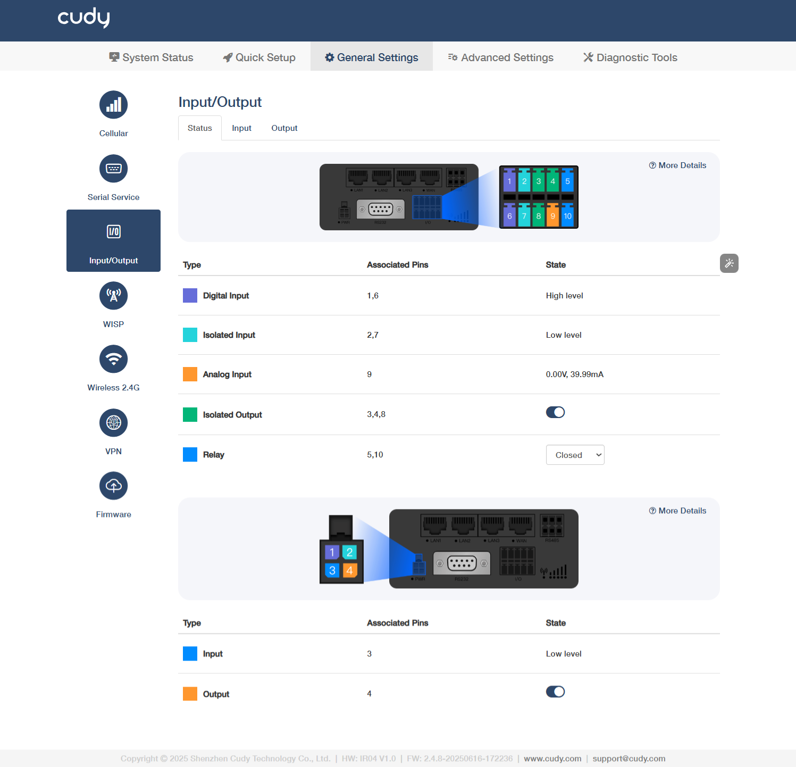
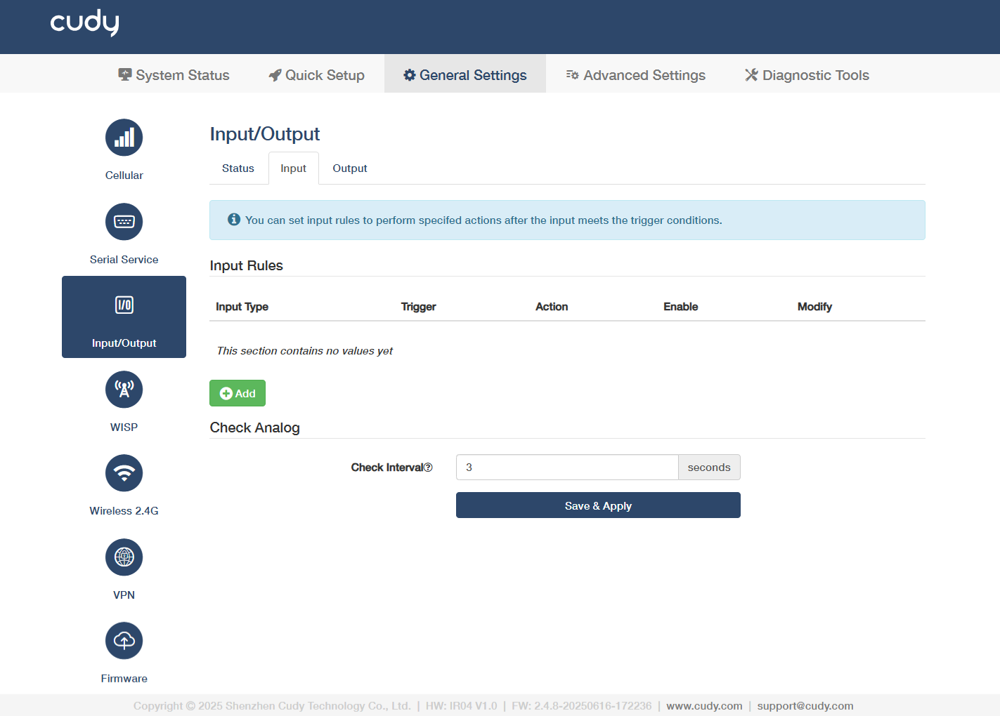
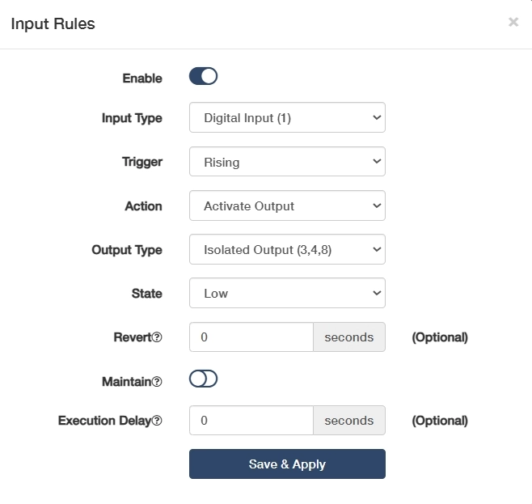
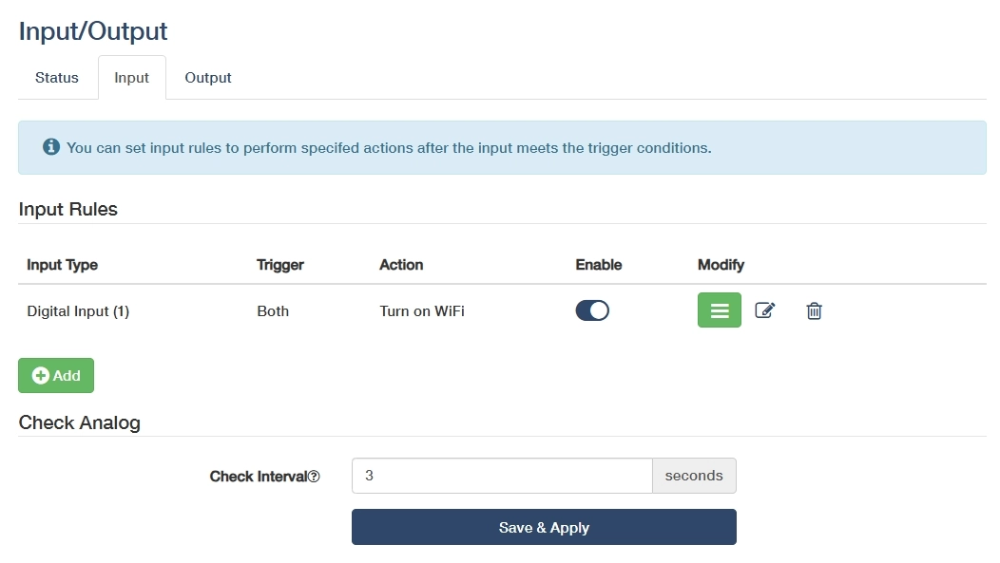
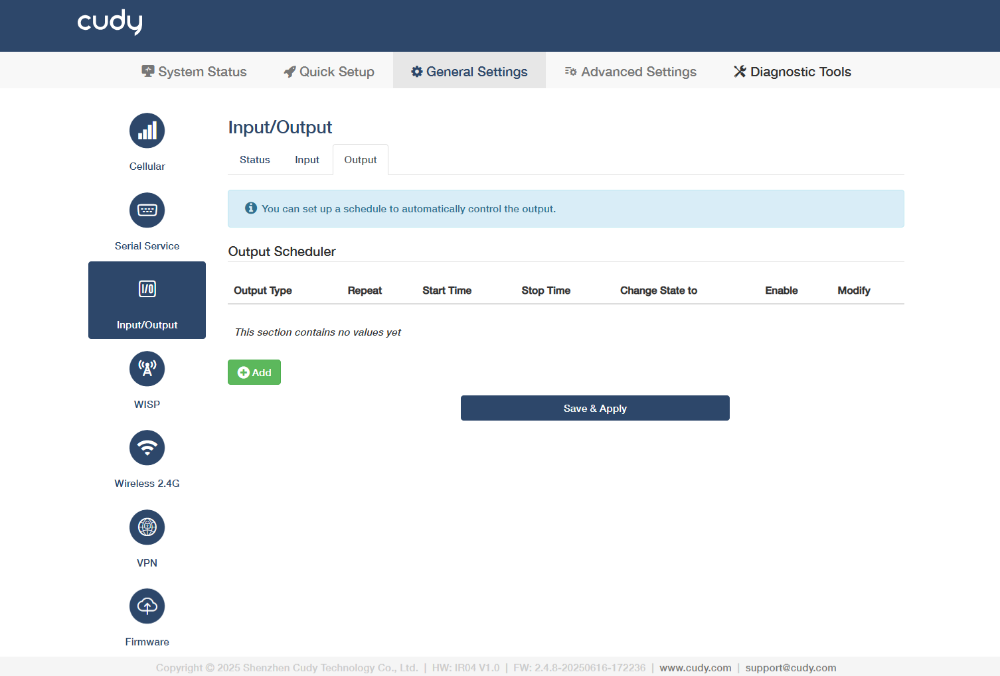
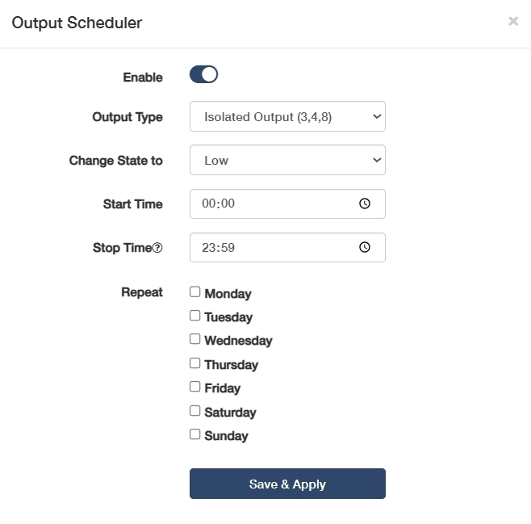
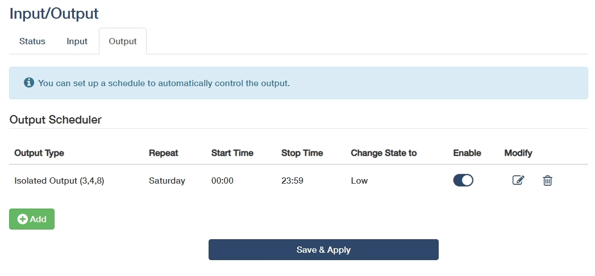

# Input/Output 

## Status 

### I/O
- **Digital Input** (Associated Pin 1/6): Detects high-level signals (e.g., 24V) for equipment status monitoring (limit switches/sensors).

- **Isolated Input** (Associated Pin 2/7): Reads low-level signals (0V) with galvanic isolation (≥1500V) for safety interlock/emergency stops.

- **Analog Input** (Associated Pin 9): Supports 0-10V/4-20mA signals for precision measurement (temperature/pressure transmitters).

- **Isolated Output** (Associated Pin 3/4/8): Transistor outputs (On=0V, Off=high-Z) for driving relays/solenoids (≤0.5A load).

- **Relay** (Associated Pin 5/10): Electrically isolates control circuits from power circuits (e.g., 5V PLC → 240V motor). Select *Closed* (NO) when energized (current flows to load) or *Open* (NC) when de-energized (failsafe/default state).

 Use ferrite beads on analog wires to suppress EMI in noisy environments.

### PWR
- **Input** (Associated Pin 3): Receives external power to activate the device. 

    ◦  High Level (Typ. 24V±10%): Normal power reception, device operational

    ◦  Low Level (<1V): Power loss/undervoltage (check wiring/supply voltage)

    ◦  Floating: Open circuit (verify terminal connection integrity)

- **Output** (Associated Pin 4): Supplies regulated power to connected peripherals.

    ◦  On: Actively supplying power to peripherals (e.g., 24V/5V output enabled)

    ◦  Off: Output disabled (manual shutdown or protection triggered)

----
## Input 

- **Add**: Click to configure input rules to perform specified actions after the input meets the trigger conditions. 

- **Enable**: Enable this entry of input rule.
- **Input Type**: Select to define the signal category (e.g., digital/analog/pulse).

    ◦  Digital Input(1): Standard binary input for detecting 24V signals.

    ◦  Isolated Input(2,7): Galvanically separated input for safety-critical signal.

    ◦  Digital Input(Power Socket 3): Power-monitoring input, detecting mains voltage presence via socket status.

    ◦  Analog Input(6,9): Reads 0-10V/4-20mA signals for precision measurement.

- **Trigger**: Select a condition to activate the rule.

    ◦  For Digital/Isolated Input: *Rising* triggers when signal transitions from low to high, ideal for power-on events; *Falling* triggers when signal transitions from high to low, used for emergency stop detection; *Both* responds to any voltage change, perfect for pulse counting or state monitoring.

    ◦  For Analog Input: *Inside Range* triggers when the signal stays between Min/Max values; *Outside Range* triggers when the signal exceeds Min/Max thresholds.

- **Analog Type** (for Analog Input): Select to match your sensor's output signal type. *Current (mA)* is used for 4-20mA/0-20mA industrial sensors (like pressure transmitters) as it’s resistant to signal degradation over long distances; *Voltage (V)* is used for 0-10V/±10V signals (like position sensors) with simpler wiring but shorter effective range due to voltage drop.
- **Minimum (V) / Maximum (V)** (for Analog Input): Set voltage thresholds to define the valid range for voltage-based triggers.
- **Minimum (mA) / Maximum (mA)** (for Analog Input): Configure current limits for current-loop device monitoring.

- **Action**: Operation to execute when the rule is triggered.

    ◦  Activate Output: Triggers a designated output port. Then select a target **Output Type** and current input **State**, enter a **Revert** interval to determine auto-reset after trigger ends; enable or disable **Maintain** to decide lock state until manual reset.

    ◦  Send SMS: Send alert messages via cellular module, which requires configured GSM/GPRS parameters. Edit the **SMS Text** as needed, add the **Phone number** to send your SMS.

    ◦  SIM Switch: Automatically fails over to the selected backup SIM card when primary cellular signal is lost. Recommended to keep it *Auto*.

    ◦  Turn on WiFi: Enables the router's WiFi for wireless client connections.

    ◦  Turn off WiFi: Disables WiFi to conserve power or enhance security.

    ◦  Reboot: Restart the system to apply configurations or recover from faults.

- **Execution Delay**:(Optional) Enter the time when will the action be executed after the rule being triggered.

- **Modify**: Click on  to edit the entry, or  to delete the entry.

- **Check Interval**: Enter an interval in seconds to check analog input value. 

- Save & Apply: Click to save and activate the new settings or changes.

----
## Output 

- **Add**: Click to configure output scheduler to perform specified actions after the input meets the trigger conditions. 

- **Enable**: Enable this entry of output scheduler.
- **Output Type** & **Change State to**: Select to define the target output and state.

    ◦  Isolated Output (3,4,8): Galvanically separated outputs for sensitive equipment, preventing ground loops in PLC/SCADA systems. Then select **Change State to** *High* for activating the optocoupler/solid-state relay to send the preset voltage to the connected device, or *Low* for cutting off output voltage to create an open circuit.

    ◦  Relay (5,10): Electromechanical contacts for switching high-power loads. Then select **Change State to** *Closed* for physically connecting the relay’s internal contacts to allow current flow, or *Open* for breaking the contact to stop current flow.

    ◦  Output (Power Socket 4): Direct mains power control for appliances, with built-in overload protection. Then select **Change State to** *High* for enabling mains power output, or *Low* for disconnecting mains power (safety cutoff).

- **Start Time**: Set an exact activation time for a-new-day shift start.
- **Stop Time**: Set a deactivation time for end-of-day shutdown.
- **Repeat**: Select specific weekdays for cyclical automation of the output schedule.
    
    ◦  Weekdays (Mon-Fri): Ideal for factory equipment schedules (e.g., conveyor activation at 08:00-17:00).

    ◦  Weekends (Sat-Sun): Used for non-routine operations (e.g., backup system tests).

    ◦  7-Day Cycle: For 24/7 critical systems (e.g., server room cooling).

- **Modify**: Click on  to edit the entry, or  to delete the entry.

- Save & Apply: Click to save and activate the new settings or changes.