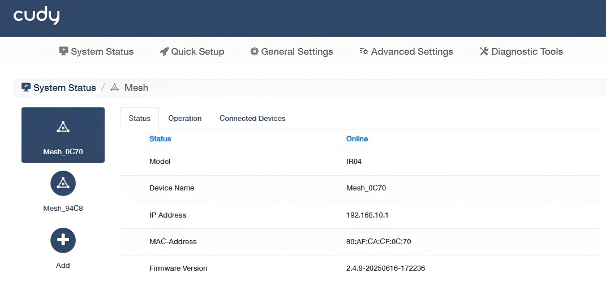
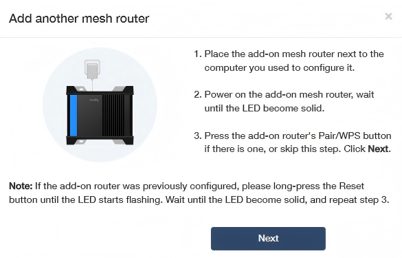
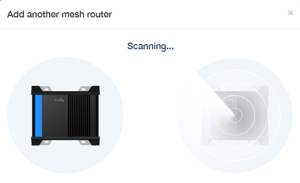
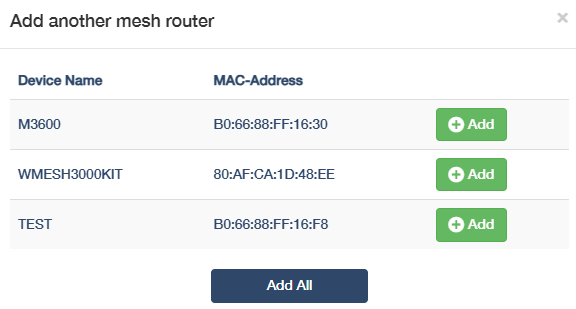
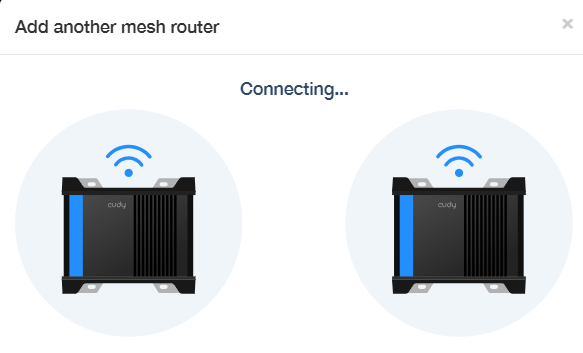
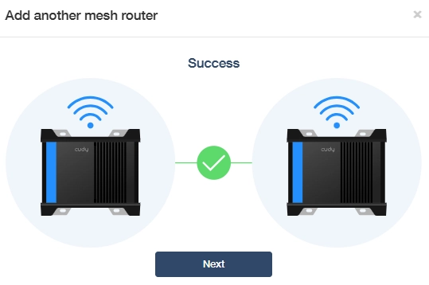
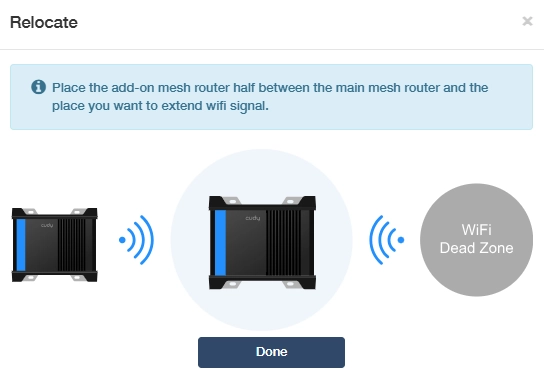
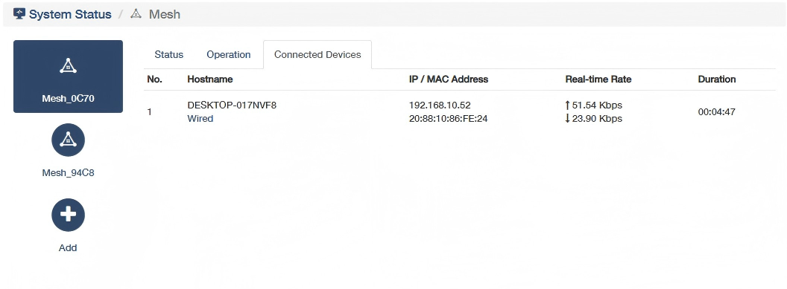

# Mesh

Manage the Mesh features via *System Status -> Mesh -> More details*.

## Add a Mesh Unit
**Follow the steps below to add a new mesh unit into the system.**

1. Click  on the left to add new mesh unit.

2. Read the instructions and click *Next*.
    

3. Wait a few moments for scanning.
    

4. Select the unit you want to add and click .
    

5. Wait a few moments for connecting.
    

6. Click *Next* upon success. 
    

7. Relocate the add-on mesh unit as instructed. Then click *Done* to complete.
    

----
## Status

It displays information about the mesh units, including Status, Model, Device Name, IP Address, MAC-Address, Firmware Version, and two more for add-on mesh units Backhaul and 2.4G Pre-Hop.

- Backhaul: Main link between mesh nodes for fast and stable data transfer. Could be Wired, 2.4G WiFi or 5G WiFi.
- 2.4G Pre-Hop: Backup 2.4GHz path used when stronger signals fail, prioritizing coverage over speed.

## Operation

- **Management**: (only for add-on mesh units) Toggle to disconnect the add-on mesh unit. 
- **Device Name**: Customize the device name of the mesh unit.
- **Firmware**: Check the current firmware version or upgrade it to the latest version that has been downloaded and stored in the local file.
- **Reboot**: Reboot the system to refresh and improve performance or have new settings take effect.
- **Reset**: Restore the mesh unit to its factory defaults.
- **LED Control**: (only for add-on mesh units) Toggle to turn off the LEDs when necessary, and then the LEDs will not light up unless manually turned on or triggered by a special event.

## Connected Devices

It displays information about the devices connected to the mesh unit, including hostname and its connection method, IP and MAC address, realtime rate and the connection duration.