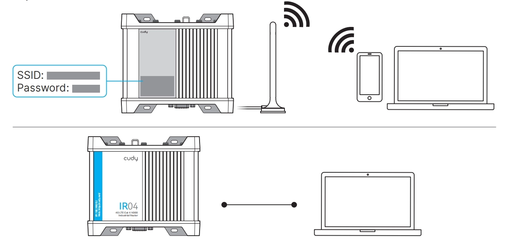
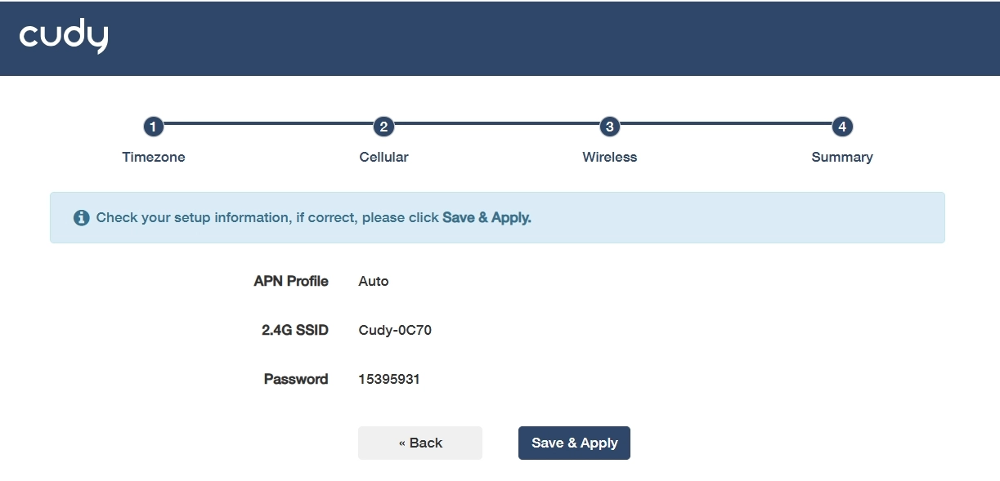
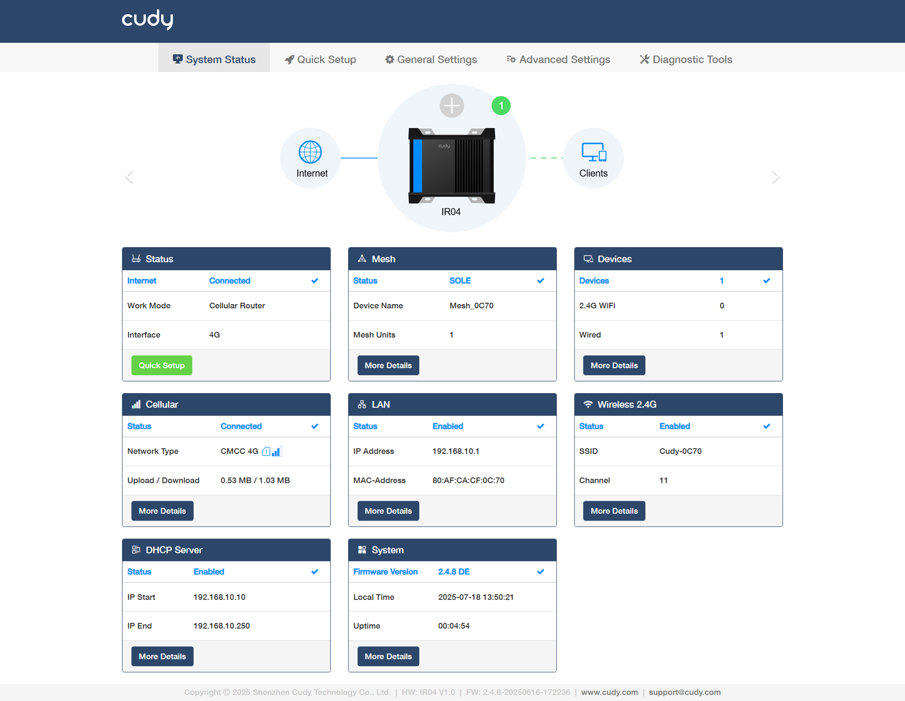
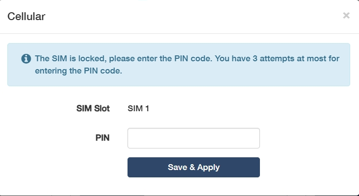

# Quick Setup

1. Connect the management device to the router via an Etherne cable or Wi-Fi (default SSID and Password are printed on the prodcut label).

2. Launch a browser, enter *cudy.net* (or *192.168.10.1*) in the address bar, and create a password to log in. Then follow the step-by-step instructions to complete the Quick Setup.

 If the window as below shows up, please input your SIM PIN or contact your carrier for help. 

