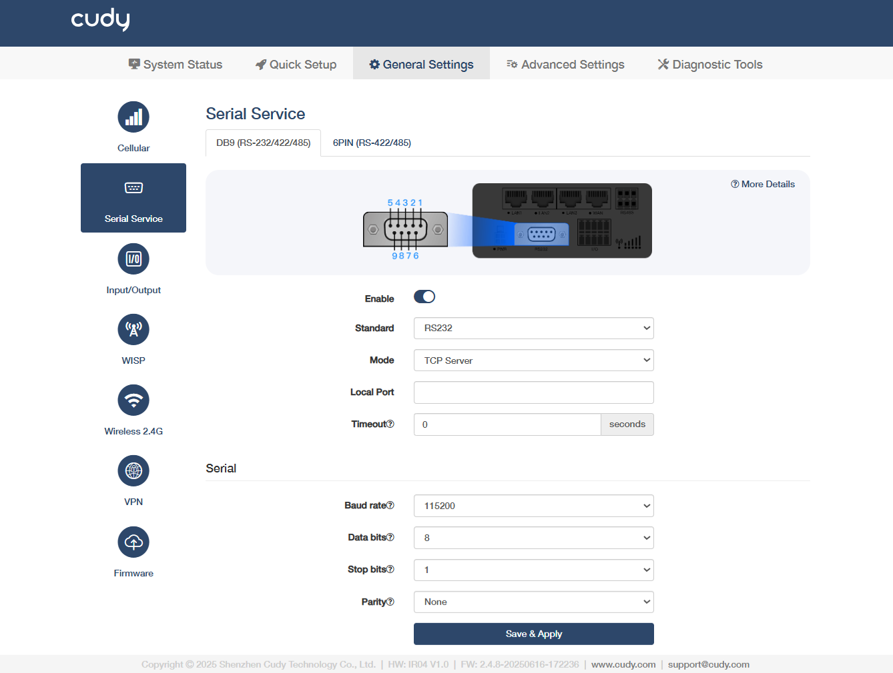
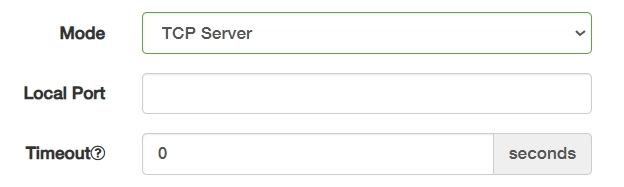
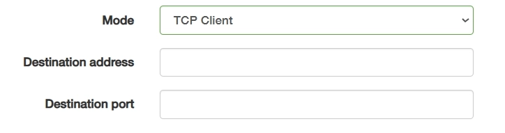
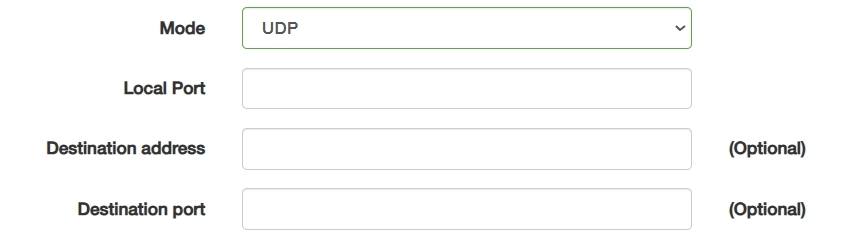
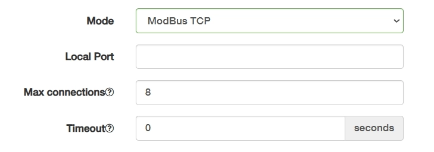
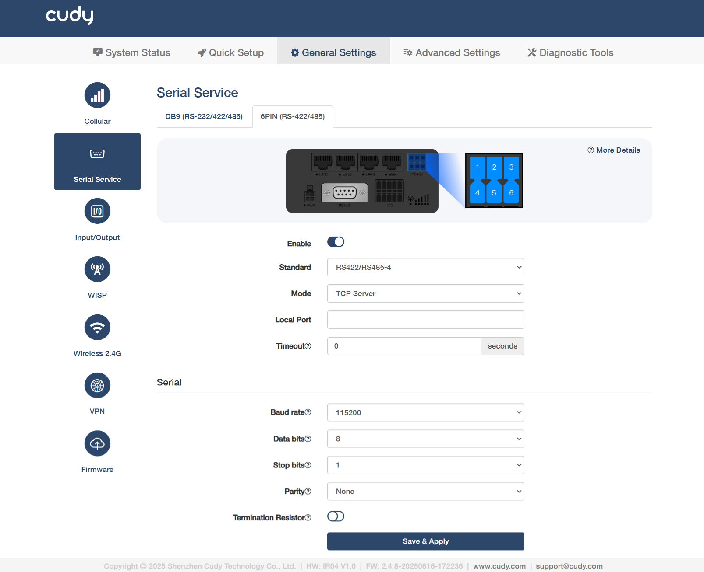

# Serial Service

## DB9(RS-232/422/485)

- **Enable**: Activate the serial interface for communication.
- **Standard**: Select a specific protocol type for electrical signaling.

    - RS232 uses single-ended signaling (point-to-point, <15m). 
    - RS422 employs differential signaling (1 driver → 10 receivers, 1200m). 
    - RS485-4 supports 4-wire full-duplex with dedicated TX/RX pairs.
    - RS485-2 uses 2-wire half-duplex for multi-drop networks (32+ devices).

- **Mode**: Select the mode accordingly.

    ① *TCP Server* is a passive endpoint that listens for incoming TCP connections.

    

    - **Local Port**: Enter the listening port (e.g., 5020) for accepting incoming TCP connections. Configurable, but avoid well-known ports like 80.
    - **Timeout**: Specify a duration in seconds (0-1000) before a connection is closed due to inactivity. 0 means no timeout.

    ② *TCP Client* initiates active TCP connections to servers.

    

    - **Destination address**: Enter a fixed target IP/domain (e.g., 192.168.1.100) for reliable endpoint connection. 
    - **Destination port**: Enter a predefined service port requiring handshake.

    ③ *UDP* is a connectionless protocol for low-latency broadcast/multicast.

    

    - **Local Port**: Enter a dynamic/static port bound for sending/receiving datagrams (e.g., 1234 for sensor broadcasts).
    - **Destination address** (Optional): Enter a dynamic/broadcast IP (e.g., 255.255.255.255). 
    - **Destination port** (Optional): Enter a flexible port binding without verification (e.g., 1234 for sensor broadcasts).

    ④ *ModBus TCP* is an industrial protocol (Layer 7) using TCP/IP for device control.

    

    - **Local Port**: Fixed to 502 by default for protocol compliance. Non-standard ports may break interoperability.
    - **Max connections**: Enter a number (1-128) to limit clients  that can connect at the same time.
    - **Timeout**: Enter the maximum wait time for slave device responses. 

- **Baud rate**: Select to define the speed of data transmission for serial communication, measured in bits per second (bps).
- **Data bits**: Select to define the number of bits (typically 5-8) used to represent each character in serial communication.
- **Stop bits**: Specify how many stop bits are used to mark the end of each byte in serial communication.
- **Parity**: Set how the system checks for errors in data transmission by adding an extra bit to each data frame.

    - *None* disables parity checking.
    - *Even* makes the total 1s count even (including parity bit).
    - *Odd* enables single-bit-error detection just like Even parity, but it demands an extra signal transition. Industrial systems often prefer *Odd* for better noise immunity.

- **Termination Resistor**: Enable to activate the 120Ω termination resistor. Recommended for use at the bus end of RS422/RS485 to reduce signal reflections.

----
## 6PIN(RS-422/485)

- **Enable**: Activate the serial interface for communication.
- **Standard**: Select a specific protocol type for electrical signaling.
    
    - RS422: Differential signaling (1 driver → 10 receivers, up to 1200m).
    - RS485-4: 4-wire full-duplex with dedicated TX/RX pairs.
    - RS485-2: 2-wire half-duplex for multi-drop networks (32+ devices).

- **Mode**: Select the mode accordingly.

    ① *TCP Server* is a passive endpoint that listens for incoming TCP connections.

    

    - **Local Port**: Enter the listening port (e.g., 5020) for accepting incoming TCP connections. Configurable, but avoid well-known ports like 80.
    - **Timeout**: Specify a duration in seconds (0-1000) before a connection is closed due to inactivity. 0 means no timeout.

    ② *TCP Client* initiates active TCP connections to servers.

    

    - **Destination address**: Enter a fixed target IP/domain (e.g., 192.168.1.100) for reliable endpoint connection. 
    - **Destination port**: Enter a remote service port.

    ③ *UDP* is a connectionless protocol for low-latency broadcast/multicast.

    

    - **Local Port**: Enter a dynamic/static port bound for sending/receiving datagrams (e.g., 1234 for sensor broadcasts).
    - **Destination address** (Optional): Enter a dynamic/broadcast IP (e.g., 255.255.255.255). 
    - **Destination port** (Optional): Enter a flexible port binding without verification (e.g., 1234 for sensor broadcasts).

    ④ *ModBus TCP* is an industrial protocol (Layer 7) using TCP/IP for device control.

    

    - **Local Port**: Enter a port fixed to 502 by default for protocol compliance. 
    - **Max connections**: Enter a number (1-128) to limit clients  that can connect at the same time.
    - **Timeout**: Enter the maximum wait time for slave device responses. 

- **Baud rate**: Select to define the speed of data transmission for serial communication, measured in bits per second (bps).
- **Data bits**: Select to define the number of bits (typically 5-8) used to represent each character in serial communication.
- **Stop bits**: Specify how many stop bits are used to mark the end of each byte in serial communication.
- **Parity**: Set how the system checks for errors in data transmission by adding an extra bit to each data frame.

    - *None* disables parity checking.
    - *Even* makes the total 1s count even (including parity bit).
    - *Odd* enables single-bit-error detection just like Even parity, but it demands an extra signal transition. Industrial systems often prefer *Odd* for better noise immunity.

- **Termination Resistor**: Enable to activate the 120Ω termination resistor. Recommended for use at the bus end of RS422/RS485 to reduce signal reflections.