# VPN

VPN (Virtual Private Network) helps you access Internet resources remotely, securely, and privately through tunneling technology. When you access the Internet, VPN encrypts your personal information and hides your IP address from the public. For VPN users, it looks like the devices are directly connected. Cudy router supports 6 types of VPN connections: PPTP, L2TP, OpenVPN, WireGuard, ZeroTier, IPSec (site-to-site). Please choose an appropriate VPN according to your needs and circumstances.

 Before you Enable *VPN* Server, it is recommended to configure Dynamic DNS Service or assign a Static IP Address for router’s WAN port and synchronize your System Time with Internet. 

---
## PPTP VPN
is used to create a PPTP VPN connection for remote devices to access your home network. Fast connection/disconnection and simple configuration satisfy the needs for users who is apt to frequently switch VPN environments. Please follow the steps below to set up a PPTP VPN connection.

*STEP 1. Configure the PPTP Server on router A:*
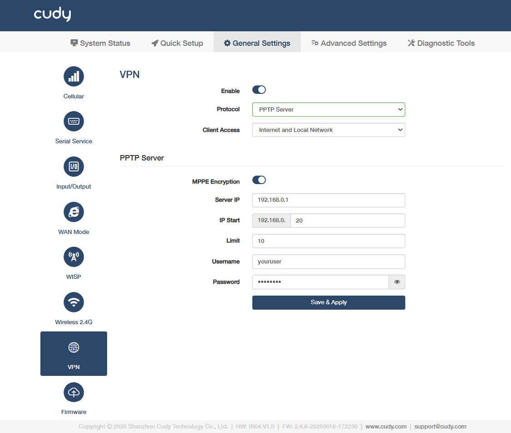

1. Log into the router A’s management web page [https://cudy.net](https://cudy.net) (or 192.168.10.1). 

2. Go to *General Settings -> VPN*. Enable *VPN*, and select *PPTP Server* as Protocol. 

3. Select a type of *Client Access* .
    - Internet and Local Network: Allows VPN clients to access both WAN (Internet) and LAN resources, e.g.,remote access to PLCs + web browsing.
    - Internet: Restricts clients to WAN access only - blocks LAN devices, ideal for public hotspot security.
    - Local Network: Limits clients to LAN resources, e.g., secure SCADA access without Internet exposure.

4. Configure the *PPTP Server*.
    - MPPE Encryption: Enable to encrypt the data transmitted via PPTP VPN, thus improve the communication security.
    - Server IP/IP Start/Limit: Set to assign IP address for the VPN Clients.
    - Username/Password: Set for the VPN client to access the VPN Server.

5. Click *Save & Apply*.	

*STEP 2. Configure PPTP Client on router B:*
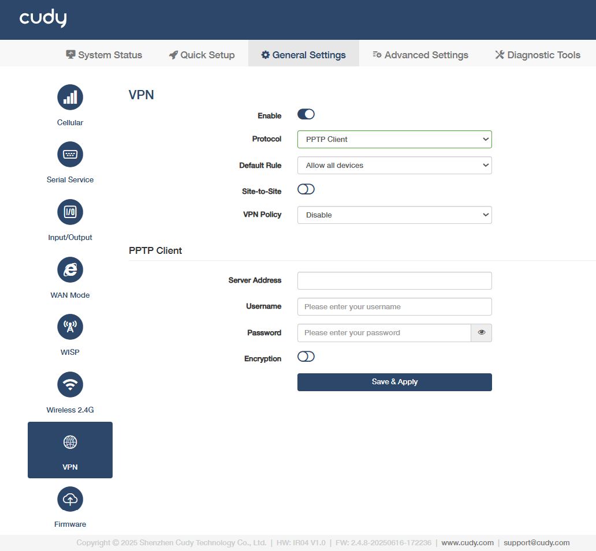

1. Log into the router A’s management web page  [https://cudy.net](https://cudy.net) (or 192.168.10.1). 

2. Go to *General Settings -> VPN*. Enable *VPN*, and select *PPTP Client* as Protocol. 

3. Select *Allow all devices* or *Ban all devices* as *Default Rule*.

4. Enable *Site-to-Site* to allow communication between VPN server and Clients.

5. Select a *VPN Policy*. 
    - Disable: VPN Policy is disabled. No restriction.
    - VPN kill switch: Internet access will be disconnected upon VPN disconnection. It is recommended for users who transmit data all through VPN. Preferred DNS and (optional) Alternate DNS are required. 
    - Domain: Select and configure to allow specified domain(s) to transmit data through VPN or not. Domain setting is required.
    - Remote Subnet: Select and configure to allow devices with the specified subnet to transmit data through VPN. Remote Subnet setting is required.

6. Configure the *PPTP Client*:
    - Server Address/ Username/Password: Enter the parameters provided by the PPTP Server.
    - Encryption: Enable to ensure the data security for the PPTP clients.	

7. Click *Save & Apply*.

---
## L2TP VPN 
*L2TP VPN Server* is used to create a L2TP VPN connection for remote devices to access your home network. Compared with PPTP, L2TP supports multi-tunnel with authentication between two endpoints, thus users can set up different tunnels with various service quality. Please follow the steps below to set up a L2TP VPN connection.

*STEP 1. Configure the L2TP Server on router A:*
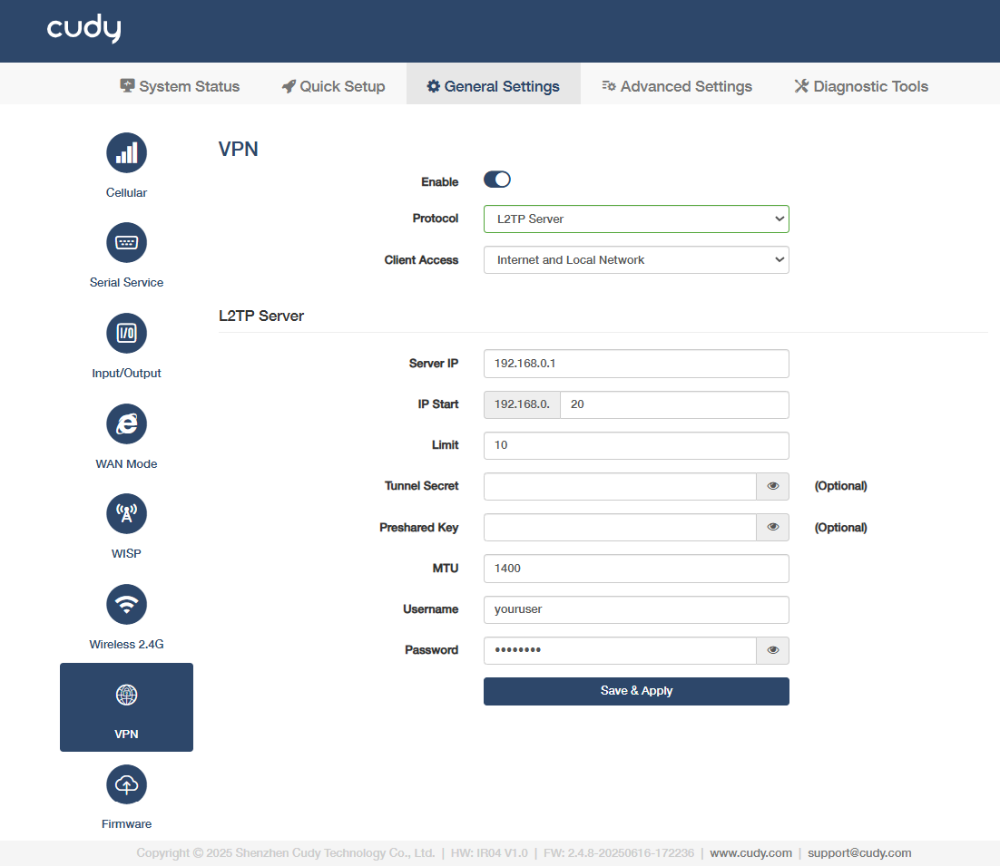

1. Log into the router A’s management web page [https://cudy.net](https://cudy.net) (or 192.168.10.1). 

2. Go to *General Settings -> VPN*. Enable *VPN*, and select *L2TP Server* as Protocol. 

3. Select a type of *Client Access* .
    - Internet and Local Network: Allows VPN clients to access both WAN (Internet) and LAN resources, e.g.,remote access to PLCs + web browsing.
    - Internet: Restricts clients to WAN access only - blocks LAN devices, ideal for public hotspot security.
    - Local Network: Limits clients to LAN resources, e.g., secure SCADA access without Internet exposure.

4. Configure the L2TP Server.
    - Server IP/IP Start/Limit: Set to assign IP address for the VPN Clients.
    - Tunnel Secret (Optional): To set a L2TP VPN encryption as needed.
    - Preshared Key (Optional): To set a IPSec encrytion as needed.
    - MTU: Maximum Transmission Unit is 1400 by default. You may change it if necessary.
    - Username/Password: Set to authenticate the VPN clients to access the VPN Server.

5. Click *Save & Apply*.

*STEP 2. Configure L2TP Client on router B:*
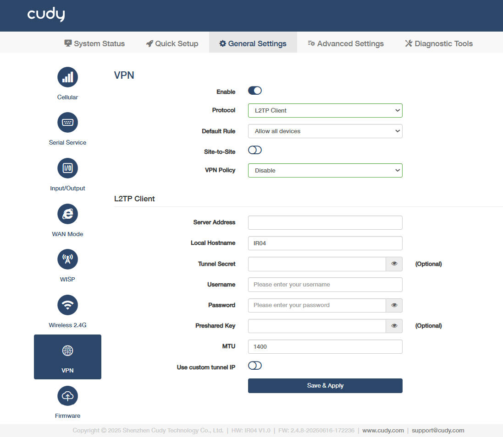

1. Log into the router A’s management web page [https://cudy.net](https://cudy.net) (or 192.168.10.1). 

2. Go to *General Settings -> VPN*. Enable *VPN*, and select L2TP Client as Protocol. 

3. Select *Allow all devices* or *Ban all devices* as *Default Rule*.

4. Enable *Site-to-Site* to allow communication between VPN server and Clients.

5. Select VPN Policy:
    - Disable: VPN Policy is disabled. No restriction.
    - VPN kill switch: Internet access will be disconnected upon VPN disconnection. It is recommended for users who transmit data all through VPN. Preferred DNS and (optional) Alternate DNS are required. 
    - Domain: Select and configure to allow specified domain(s) to transmit data through VPN or not. Domain setting is required.
    - Remote Subnet: Select and configure to allow devices with the specified subnet to transmit data through VPN. Remote Subnet setting is required.

6. Configure the L2TP Client:
    - Server Address/ Username/Password: Enter the parameters provided by the PPTP Server.
    - Local Hostname: Customize or keep it as default.
    - Tunnel Secret / Preshared Key: Enter the encryption if the L2TP Server has set it.
    - MTU: Maximum Transmission Unit is 1400 by default, you may change it if necessary.
    - Use custom tunnel IP: Enable and enter it if the L2TP Server provides a tunnel IP bound with the account.

7. Click *Save & Apply*.

---
## OpenVPN
*OpenVPN Server* is used to create an OpenVPN connection for remote devices to access your home network. OpenVPN server requires a public IP. You can confirm whether the router has a public IP on the router management page System Status -> WAN -> More details -> Status. If the public IP displayed is consistent with the IP address of the router's WAN port, it means that the router has a public IP. Please follow the steps below to set up an OpenVPN connection.

*STEP 1. Configure the OpenVPN Server on router A:*
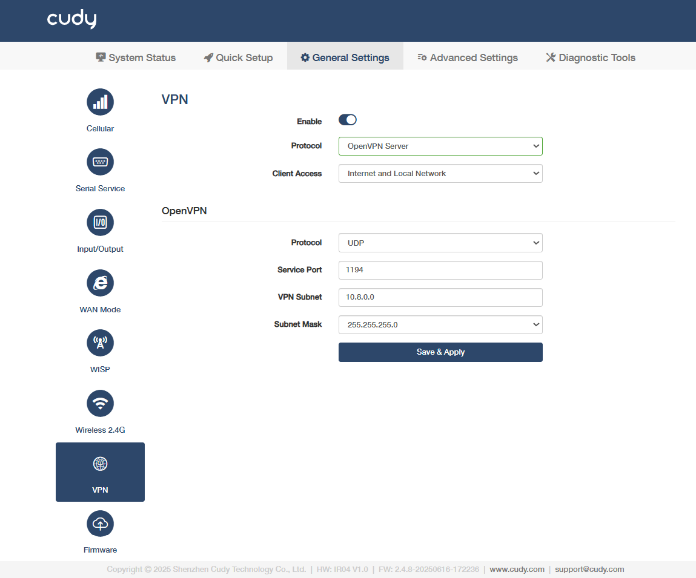

1. Log into the router A’s management web page [https://cudy.net](https://cudy.net) (or 192.168.10.1). 

2. Go to *General Settings -> VPN*. Enable *VPN*, and select OpenVPN Server as Protocol. 

3. Select a type of *Client Access* .
    - Internet and Local Network: Allows VPN clients to access both WAN (Internet) and LAN resources, e.g.,remote access to PLCs + web browsing.
    - Internet: Restricts clients to WAN access only - blocks LAN devices, ideal for public hotspot security.
    - Local Network: Limits clients to LAN resources, e.g., secure SCADA access without Internet exposure.

4. Configure the *OpenVPN Server*.
    - Protocol: Select UDP or TCP as desired.

        ◦ UDP: Faster but unreliable, ideal for real-time industrial protocols like PROFINET IO.

        ◦ TCP: Slower but error-corrected, used for critical data transfers where packet loss is unacceptable.
    
    - Service Port: 1194 by defalut, keep it or change it as needed.
    - VPN Subnet: Set up a VPN subnet segment.
    - Subnet Mask: Select or customize as needed.

5. Click *Save & Apply*.

6. Click *EXPORT* to export the configuration file which is to upload on the OpenVPN Client.

*STEP 2. Configure OpenVPN Client on router B:*
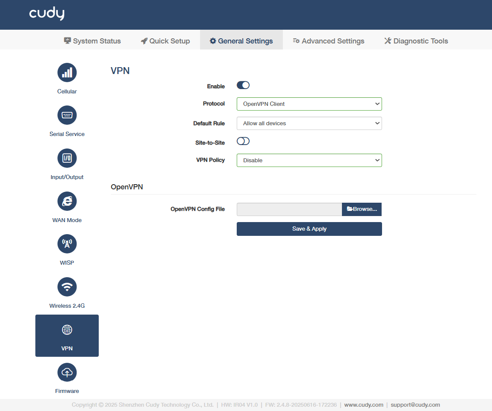

1. Log into the router A’s management web page [https://cudy.net](https://cudy.net) (or 192.168.10.1). 

2. Go to *General Settings -> VPN*. Enable *VPN*, and select *OpenVPN Client* as Protocol. 

3. Select *Allow all devices* or *Ban all devices* as *Default Rule*.

4. Enable *Site-to-Site* to allow communication between VPN server and Clients.

5. Select VPN Policy:
    - Disable: VPN Policy is disabled. No restriction.
    - VPN kill switch: Internet access will be disconnected upon VPN disconnection. It is recommended for users who transmit data all through VPN. Preferred DNS and (optional) Alternate DNS are required. 
    - Domain: Select and configure to allow specified domain(s) to transmit data through VPN or not. Domain setting is required.
    - Remote Subnet: Select and configure to allow devices with the specified subnet to transmit data through VPN. Remote Subnet setting is required.

6. Click *Browse...* to locate the configuration file (client.ovpn) you exported previously from the OpenVPN Server. The uploaded configuration file will be automatically read and the Server IP will be displayed.  

7. Click *Save & Apply*.

---
## WireGuard VPN
*WireGuard VPN Server* is used to create a Wire Guard VPN connection for remote devices to access your home network. WireGuard VPN server requires a public IP. You can confirm whether the router has a public IP on the router management page System Status -> WAN -> More details -> Status. If the public IP displayed is consistent with the IP address of the router's WAN port, it means that the router has a public IP. Please follow the steps below to set up a WireGuard VPN connection.

*STEP 1. Configure the WireGuard Server on router A:*
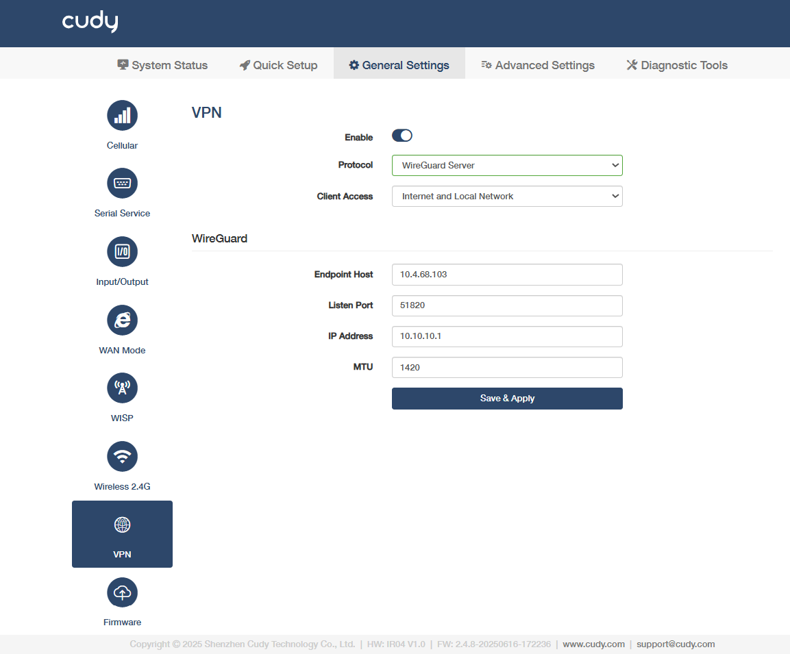

1. Log into the router A’s management web page [https://cudy.net](https://cudy.net) (or 192.168.10.1).

2. Go to *General Settings -> VPN*. Enable *VPN*, and select *WireGuard Server* as Protocol. 

3. Select a type of *Client Access* .
    - Internet and Local Network: Allows VPN clients to access both WAN (Internet) and LAN resources, e.g.,remote access to PLCs + web browsing.
    - Internet: Restricts clients to WAN access only - blocks LAN devices, ideal for public hotspot security.
    - Local Network: Limits clients to LAN resources, e.g., secure SCADA access without Internet exposure.

4. Configure the WireGuard Server:
    - Endpoint Host: Enter The public IP/Domain and port that clients connect to.
    - Listen Port: 51820 by default. You may change it if necessary.
    - IP Address: 10.10.10.1 by default. You may change it if necessary.
    - MTU: Maximum Transmission Unit is 1420 by default. You may change it if necessary.

5. Click *Save & Apply*. 
6. Click *Edit Item* for Clients. Configure the Client parameters.
    

    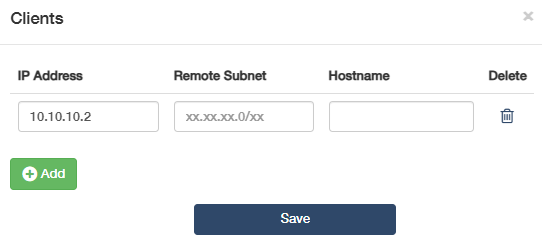

7. Click to export the configuration file, and then upload it on the client for VPN connection.
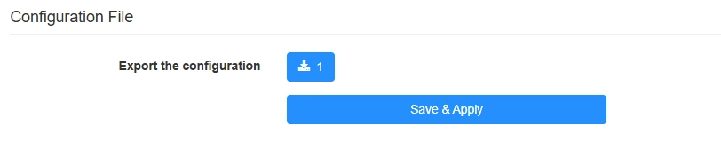

*STEP 2. Configure WireGuard Client on router B:*
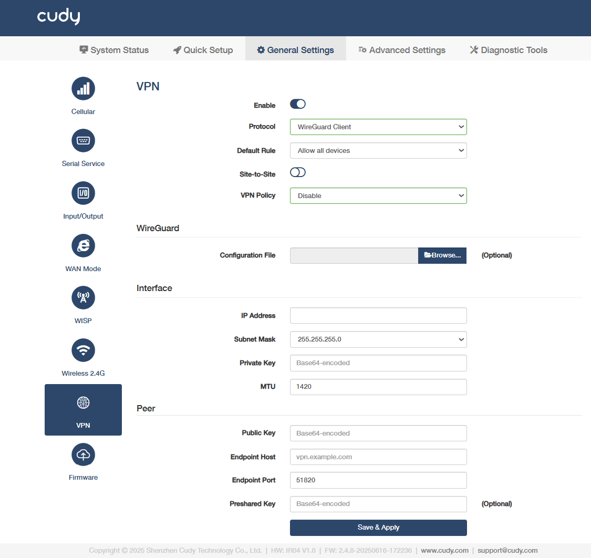

1. Log into the router A’s management web page [https://cudy.net](https://cudy.net) (or 192.168.10.1).

2. Go to *General Settings -> VPN*. Enable *VPN*, and select *WireGuard Client* as Protocol. 

3. Select *Allow all devices* or *Ban all devices* as *Default Rule*.

4. Enable *Site-to-Site* to allow communication between VPN server and Clients.

5. Select VPN Policy:
    - Disable: VPN Policy is disabled. No restriction.
    - VPN kill switch: Internet access will be disconnected upon VPN disconnection. It is recommended for users who transmit data all through VPN. Preferred DNS and (optional) Alternate DNS are required. 
    - Domain: Select and configure to allow specified domain(s) to transmit data through VPN or not. Domain setting is required.
    - Remote Subnet: Select and configure to allow devices with the specified subnet to transmit data through VPN. Remote Subnet setting is required.

6. Click *Browse...* to locate the configuration file (wg-client-.conf) you exported previously from the WireGuard Server. Then the Interface and Peer parameters will be automatically uploaded and displayed.

    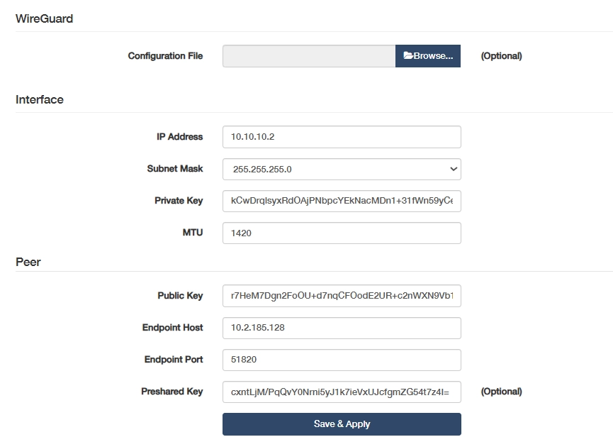

7. Confirm the parameters and then click *Save & Apply*.

---
## ZeroTier VPN
*Zerotier* is a third-party cloud platform for VPN connections. It can establish a VPN connection without any public IP address node to achieve secure and remote access. It is free for use with less than 50 nodes. It is simple and convenient to set up. Please follow the steps below to set up a ZeroTier VPN connection.

*STEP 1. Register for a ZeroTier Account and Obtain a Network ID.*

1. Visit Zerotier website [http://my.zerotier.com/](http://my.zerotier.com/), sign up for an account and log in.
    

2. Click *Networks - > Create A Network*. 
    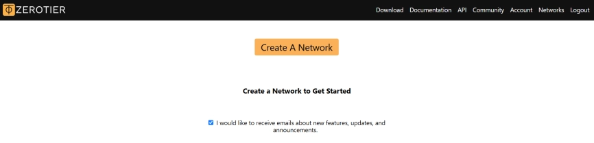

3. Zerotier will create a new network and assign a NETWORK ID for you. Then click on the assigned NETWORK ID, and its setting page will display.
    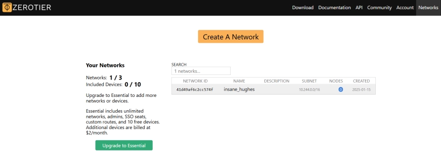

4. Select the *Access Control* accordingly. Note down the Network ID.
    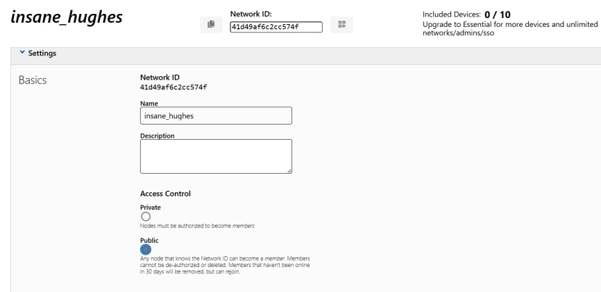
    - *Public* Access Control allows for a direct the network access with authentication rather than authorization. 
    - *Private* Access Control requires authorization for the terminal or router to access the network, which is more secure but inconvenient. 

*STEP 2. Configure ZeroTier Master on router A.*
    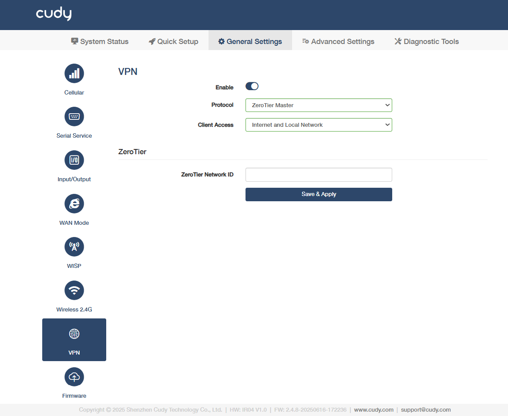

1. Log into the router A’s management web page [https://cudy.net](https://cudy.net) (or 192.168.10.1). 

2. Go to *General Settings -> VPN*. Enable *VPN*, and select *ZeroTier Master* as Protocol. 

3. Select a type of *Client Access* .
    - Internet and Local Network: Allows VPN clients to access both WAN (Internet) and LAN resources, e.g.,remote access to PLCs + web browsing.
    - Internet: Restricts clients to WAN access only - blocks LAN devices, ideal for public hotspot security.
    - Local Network: Limits clients to LAN resources, e.g., secure SCADA access without Internet exposure.

4. Enter the ZeroTier Network ID noted down previously.

5. Click *Save & Apply*. Then it will display the Device ID.

6. Back to the ZeroTier web page, you will see One device has joined this network.
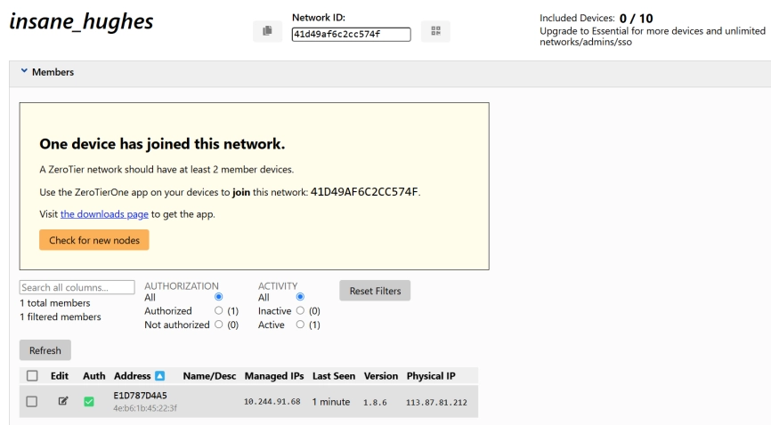

*STEP 3. Join ZeroTier Network on your device.*

1. Download and Install ZeroTier Software from [https://www.zerotier.com/download/](https://www.zerotier.com/download/).
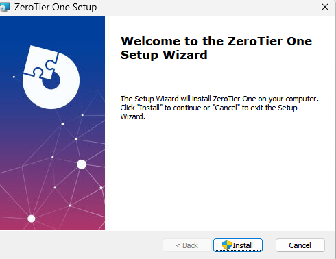

2. Click the ZeroTier icon at taskbar and then *Join New Network...*, enter the *Network ID* and click *Join*.
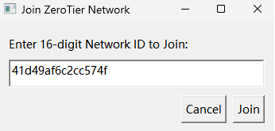

3. Back to the ZeroTier web page, you will see this new device and its *Managed IP*.
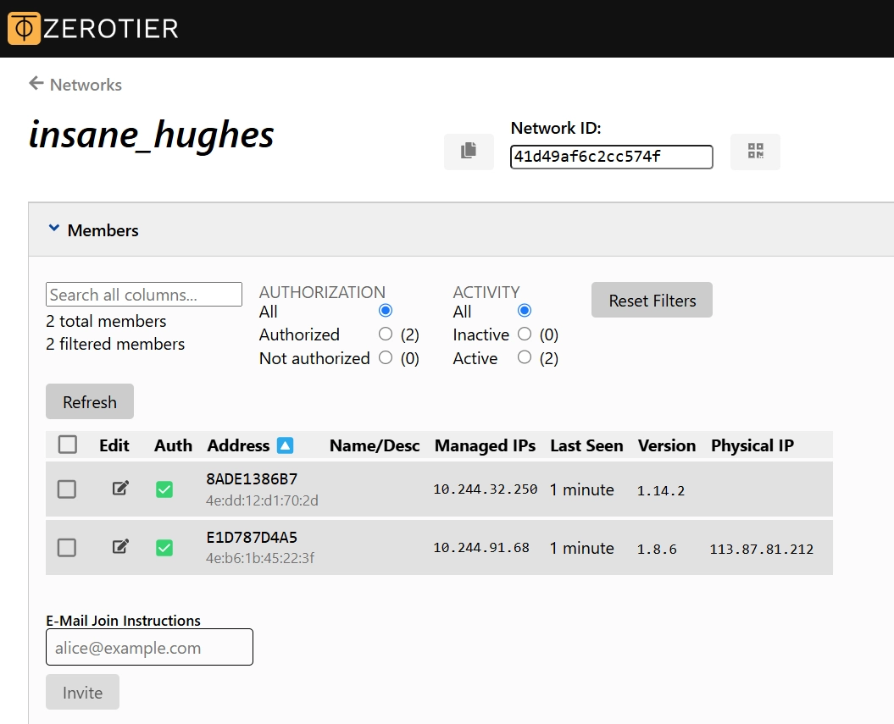

*STEP 4. Configure the Static Route.*

Go to *Settings -> Advanced -> Managed Routes* on the ZeroTier web page. Under *Add Routes*, enter router’s LAN IP segment 192.168.10.0/24 in *Destination* field and its Managed IP in *Via* field, and then click *Submit*.

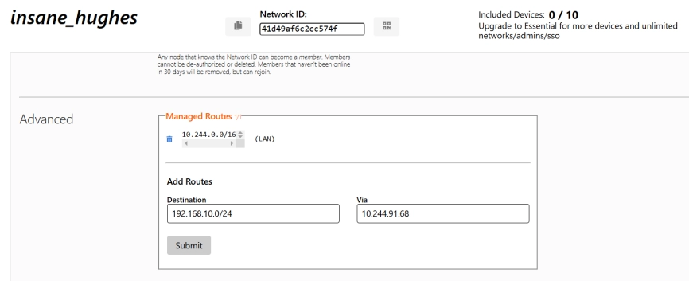

Now your client devices can directly access the router's management web page via 192.168.10.1, and access the server via its IP address.

---
## IPSec (site-to-site) VPN
*IPSec (site-to-site) VPN* is a secure tunneling protocol used to connect two different networks, typically a corporate network and a remote branch office network, over the Internet. It allows multiple users at the remote site to access resources on the main office network as if they were directly connected to it. Please follow the steps below to set up an IPSec (site-to-site) VPN connection.

*STEP 1. Get both routers in the Headquarter and Branch Office ready.*

1. Make sure both routers are connected to the Internet, but two network can not be in the same LAN segment. 
For example, if the headquarter is in the LAN segment 192.168.10.0/24, then the branches 	should be in a different LAN segment, say, 192.168.20.0/24.

2. Check and note down the WAN and LAN IP addresses of the Headquarter router and Branch Office router on their Status page. WAN IP of the headquarters router is the remote gateway of the branch offices, and its LAN IP is the remote subnet of the branch offices; and vice versa.

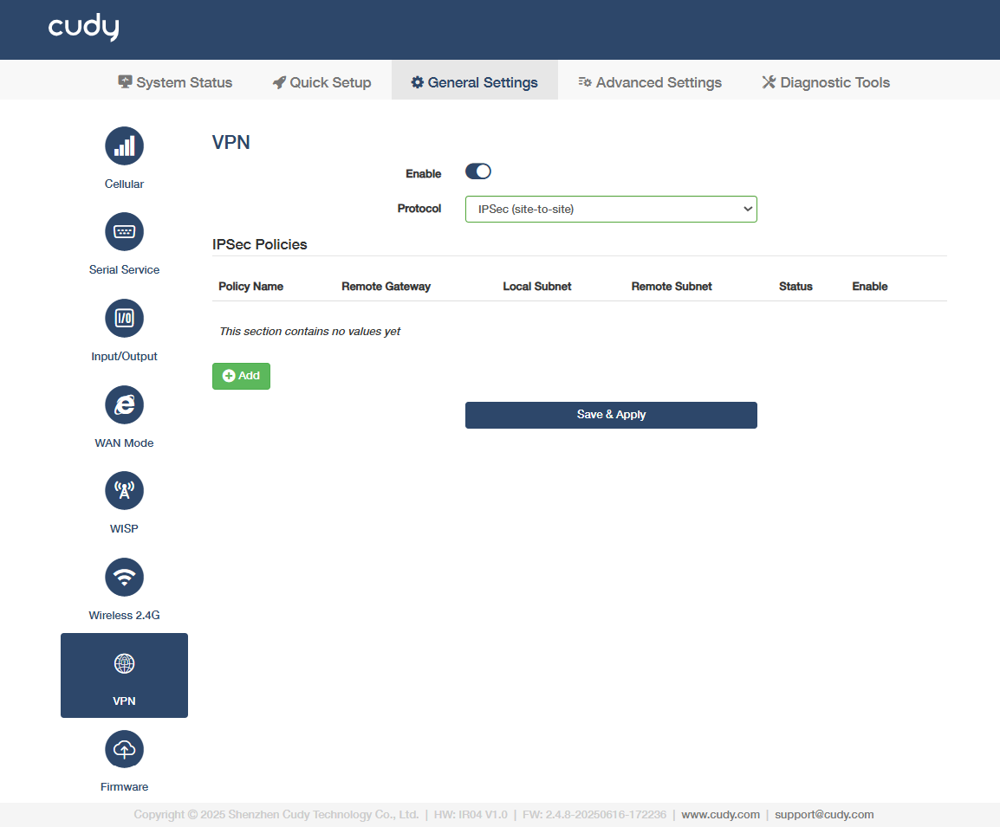

*STEP 2: Configure the IPSec VPN on the router in the Headquarter.*
1. Log into the router A’s management web page [https://cudy.net](https://cudy.net) (or 192.168.10.1). 

2. Go to *General Settings -> VPN*. Enable *VPN*, and select *IPSec (site-to-site)* as Protocol. 

3. Click *Add* to add IPSec Policies.
    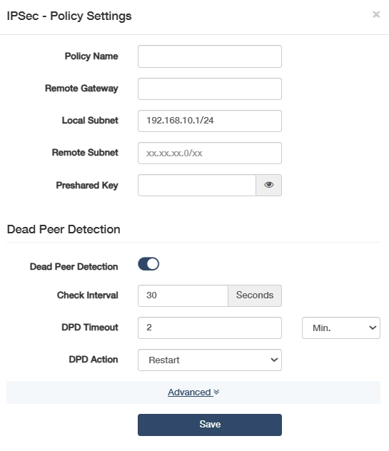

    **IPSec-Policy Settings**

    - Policy Name: Name the policy as desired. 
    - Remote Gateway: Enter the WAN IP of the router in branch office.
    - Local Subnet: Auto-filled the LAN segment of the local router.
    - Remote Subnet: Enter the LAN segment of the router in branch office.
    - Preshared key: Set an encryption key as desired.

    **Dead Peer Detection**

    - Dead Peer Detection: Enable to detect whether the peer end is alive or not;
    - Check Interval: Keep 30 seconds as default or change as needed;
    - DPD Timeout: Set when to perform PDP checking again. Keep 2 Minutes as default or change it as needed.
    - DPD Action: Decide what to do after DPD detection failure, Restart, Hold or Clear. It is recommended to keep Restart as default.

4. Click *Save & Apply*. 

*STEP 3: Configure the IPSec VPN on the router in the Branch Office.*
1. Log into the router A’s management web page [https://cudy.net](https://cudy.net) (or 192.168.10.1). 

2. Go to *General Settings -> VPN*. Enable *VPN*, and select *IPSec (site-to-site)* as Protocol. 

3. Click *Add* to add IPSec Policies.
    

    **IPSec-Policy Settings**

    - Policy Name: Name the policy as desired. 
    - Remote Gateway: Enter the WAN IP of the router in the Headquarter.
    - Local Subnet: Auto-filled the LAN segment of the local router.
    - Remote Subnet: Enter the LAN segment of the router in the Headquarter.
    - Preshared key: Enter the encryption key set on the headquarter router.

    **Dead Peer Detection**

    - Dead Peer Detection/Check Interval/DPD Timeout/DPD Action: Set the same parameters as the Headquarter router.

4. Click *Save & Apply*. 

Then, you can go confirm the connection between Headquarter router and Branch router.

 If one of the routers (for instance, the Branch router) does not have a public IP address, but the Headquarter router has a public IP address, you can: 

- Set Branch router in the Initiator Mode and change the Headquarter router from Initiator Mode to Responder Mode.
- Change the remote gateway on the Headquarter router to be 0.0.0.0.
