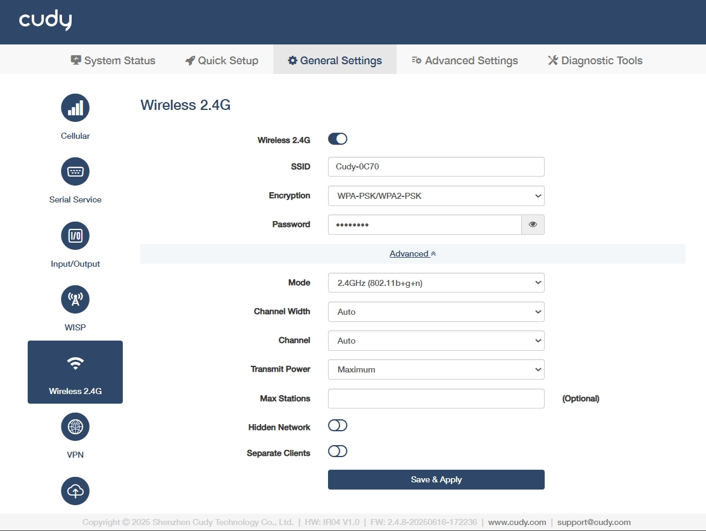

# Wireless 2.4G

- **SSID**: Customize a visible name for your 2.4GHz Wi-Fi network, or keep it as default.
- **Encryption**: Select a security protocol to prevent unauthorized access.

    ◦  WPA-PSK: Legacy TKIP encryption, vulnerable to attacks, deprecated.

    ◦  WPA2-PSK: AES-based standard, secure but susceptible to brute-force.

    ◦  WPA-PSK/WPA2-PSK: Mixed mode for backward compatibility, weakest link dictates security.

    ◦  WPA2-PSK/WPA3-SAE: Transitional mode, AES+SAE for future-proofing.

    ◦  WPA3-SAE: Quantum-resistant, SAE protocol, ideal for critical infrastructure.

- **Password**: Set a pre-shared key (with 8-63 characters or 64 hexadecimal number) for network authentication.
- **Mode**: Select a Wi-Fi standard 802.11n balances range/speed.

    ◦  802.11b+g+n: Combines legacy (b/g) with modern (n) for maximum compatibility and speed up to 300Mbps.

    ◦  802.11b+g: Legacy mode for older devices, limited to 54Mbps which avoids in high-density areas.

    ◦  802.11b: Obsolete 11Mbps, only for vintage equipment. Not recommended.

- **Transmit Power**: Select a signal strength control.

    ◦  Maximum: 100% power extends coverage to long-range outdoor areas but may increase interference.Suitable for large facilities with sparse device density.

    ◦  Middle: ~50-70% power balances coverage and interference for indoor industrial spaces. Suitable for Medium-sized factories with metal obstructions.

    ◦  Minimum: ≤30% power limits range to small, controlled zones. Suitable for high-density IoT deployments or EMI-sensitive areas.

- **Max Stations**: (Optional) Set device connection limit based on router capacity.

- **Hidden Network**: Enable to avoid SSID broadcast and hide the network from casual scans but offers minimal security. Use only with WPA3 for industrial IoT.

- **Separate Clients**: Enable to isolate connected devices and block their communication, critical for IoT security in shared networks.  