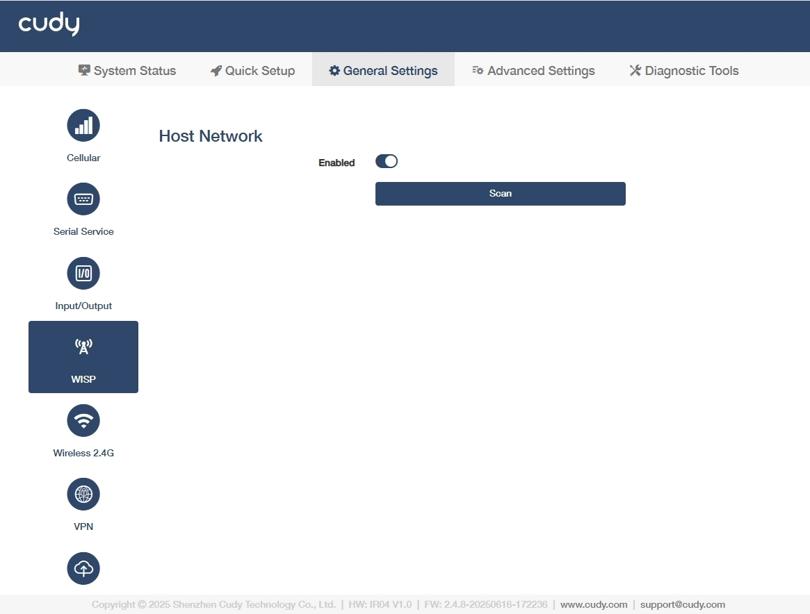
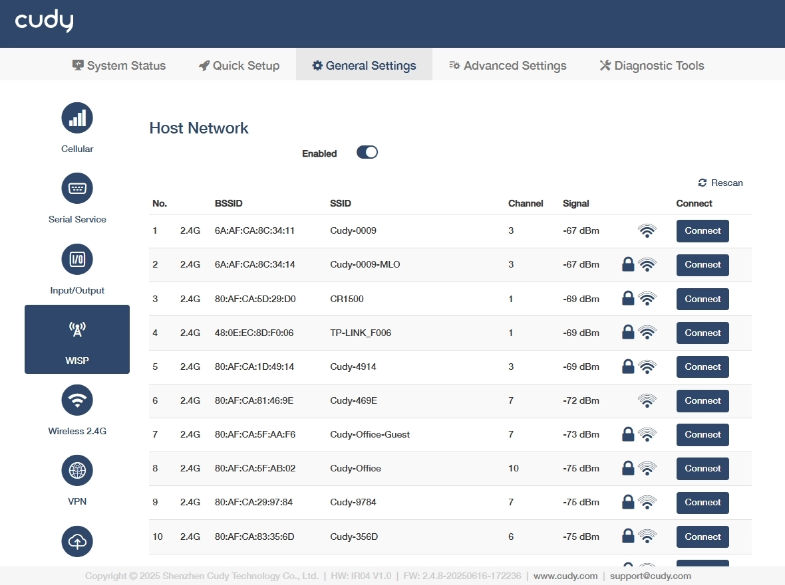
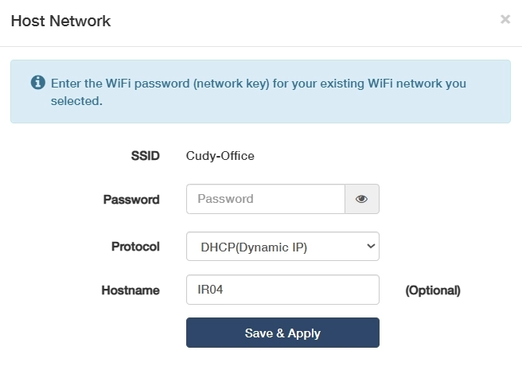

# WISP
Enables the router to wirelessly connect to a distant Wi-Fi network and share that connection locally via Ethernet/Wi-Fi, acting as a client bridge.

- **Enabled**: Enable the WISP function.
- **Scan**: Click to search for available Wi-Fi networks to connect to.

- **Rescan**：Click to re-search or update the host network list.
- **BSSID**: Displays the MAC address of the host network.
- **SSID**: Displays the visible name of the host Wi-Fi network.
- **Channel**: Displays the frequency band the host network uses.
- **Signal**: Displays the host network's signal strength.
- **Connect**: Click to connect to the target host network. There will pop up the connection page, where to enter the password if required, customize the host name as desired and click *Save&Apply*.

