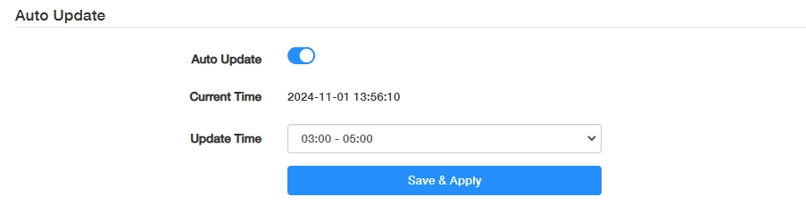
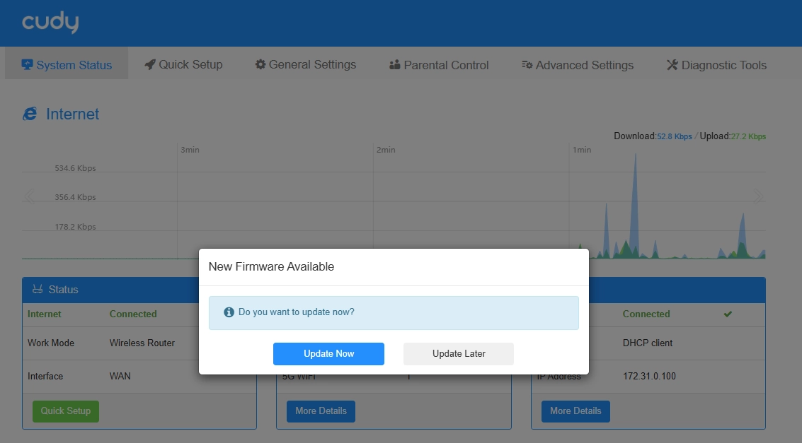
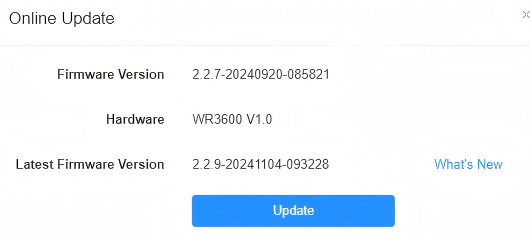
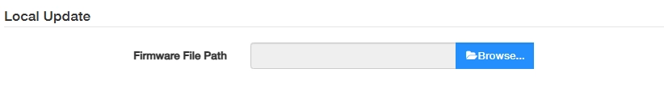

# Firmware

Router’s latest firmware will be released at the Cudy official website <a href="http://www.cudy.com">www.cudy.com</a>, and you can download it from <a href="http://www.cudy.com/download">www.cudy.com/download</a>. Please choose an appropriate update method and follow the instructions.

## Auto Update

The Router will automatically update firmware to the latest version at the specified time.

1) Enable Auto Update.

2) Specify the Update Time. 

3) Click Save & Apply.

!!! Note
    - Backup your Router’s configurations before firmware update.
    - Do NOT turn off the Router during the firmware update.

## Online Update

If there is a new firmware available for the Router, a prompt will appear upon your login to the Router web management page. Click <i>Update Now</i> and then <i>Update</i> to upgrade the firmware to the latest version.

If you miss the prompt, please go to General Settings -> Firmware to Check for update. If there is one, click Update and wait a few minutes for the update and reboot to complete. 

## Local Update

Click *Browse...* to locate and upload the latest firmware file you’ve downloaded from <a href="http://www.cudy.com">www.cudy.com</a>. Wait a few minutes for the update and reboot to complete.

!!! Note
    If you fail to update the firmware for the Router, please contact our <a href="mailto:support@cudy.com">technical support</a>.