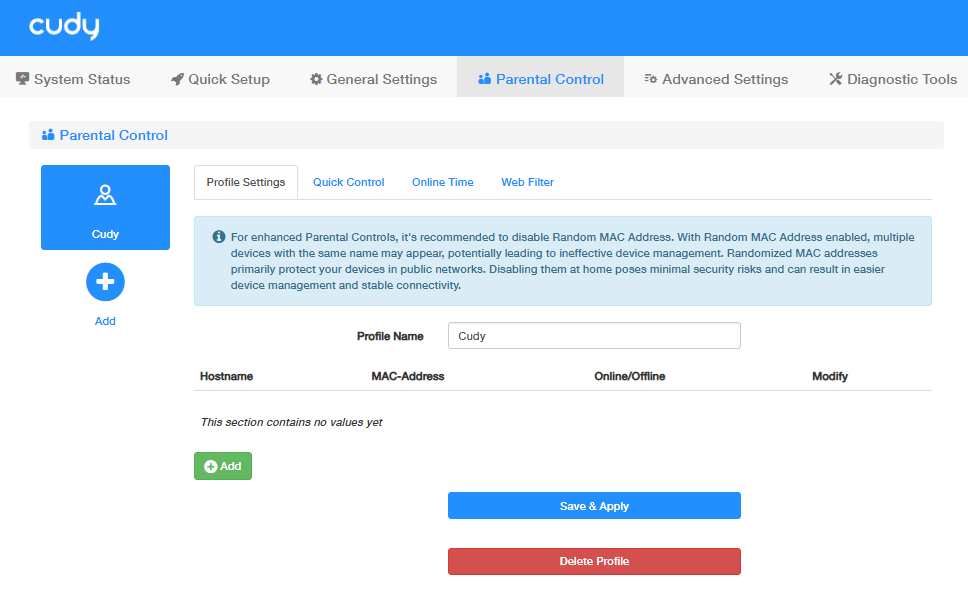
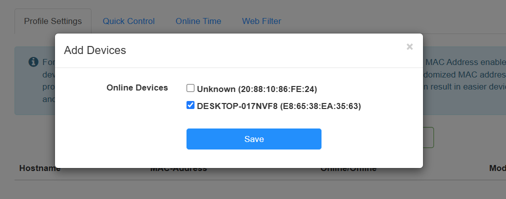
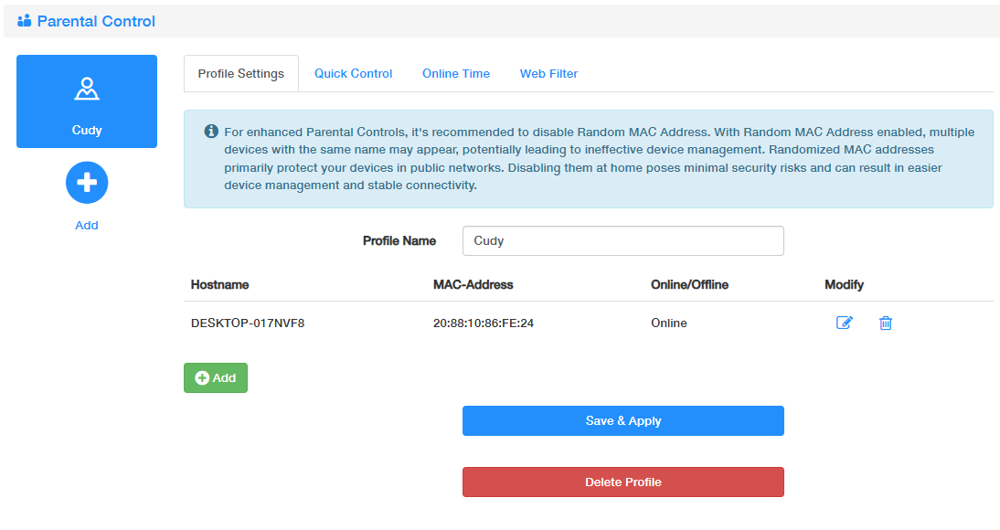
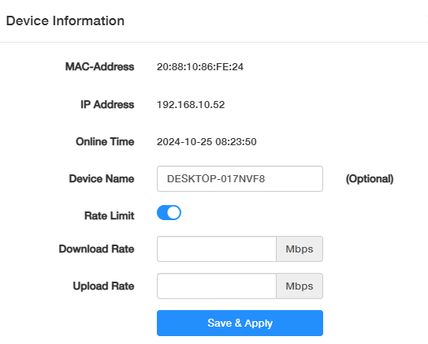
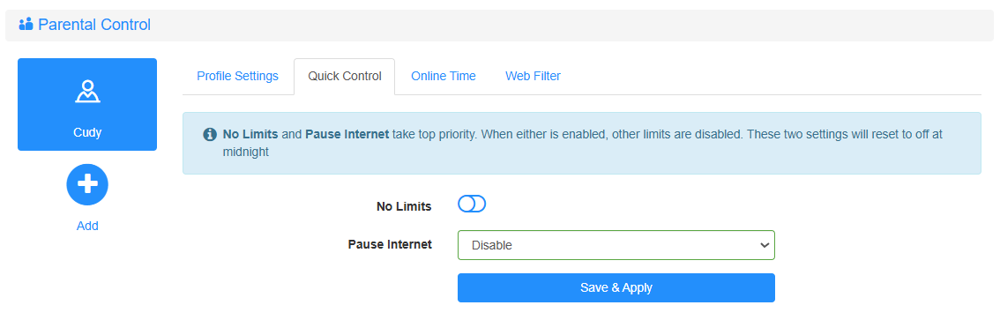
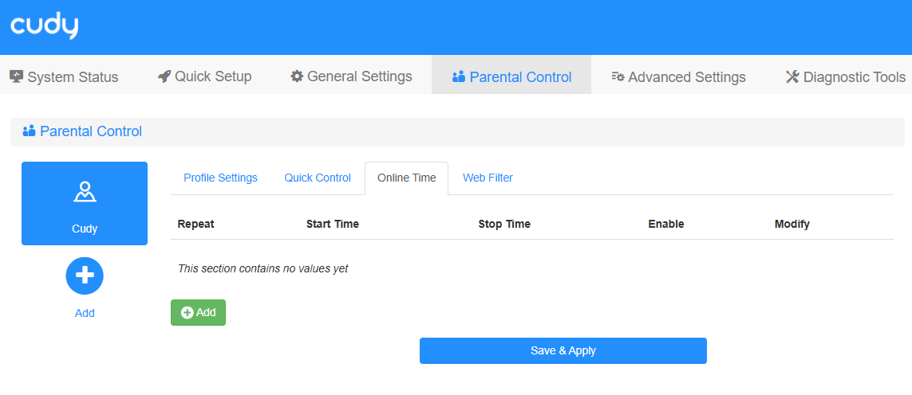
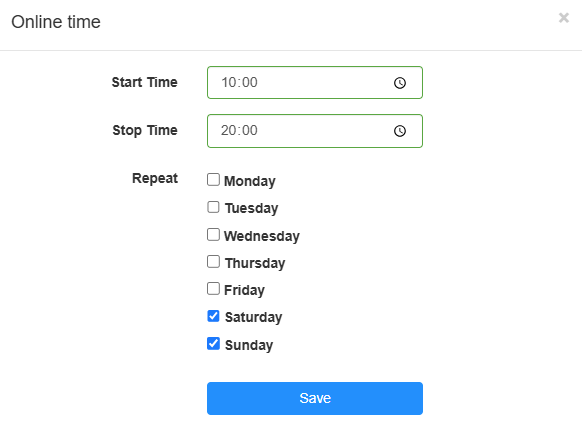
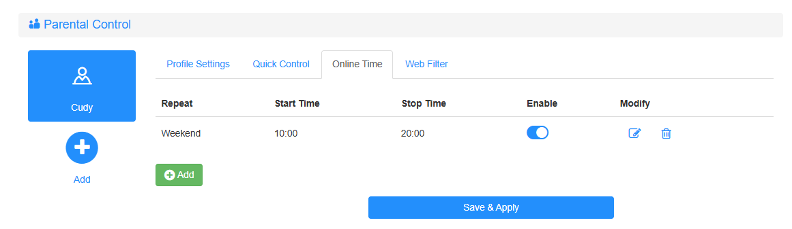
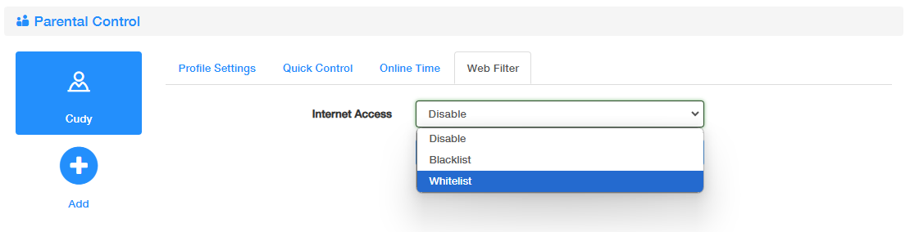
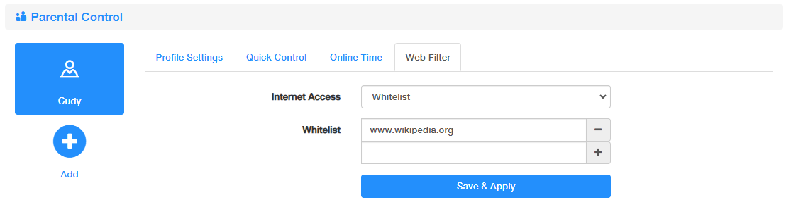

# Parental Control
It helps to set up unique restrictions on Internet access for each member of your family via Parental Control feature. You can block inappropriate content, set daily limits for the total time spent online and restrict Internet access to certain time of the day, etc. 

**Note:** This feature only works in Wireless Router mode.

**To set up a parental control on the Router, please follow the steps below.**

1. Log in to [http://cudy.net](http://cudy.net) with the password you’ve set for the Cudy Router.
2. Click the upper menu *Parental Control* and land the page.
3. Click *Add*, set a profile name, click *Save & Apply* to create a profile for a family member.
4. In the profile, you can make more specific settings as desired.

---
## Add Devices
In a specified profile, you may add several devices to follow the same parental control rules.

**To add devices in the profile, please follow the steps below.**

1. Click *Add* in the profile.
2. Select your target device from the auto-detected Online devices connected to the Router. Then click *Save*.

3. You can *Modify* or *Delete* the devices. On the modifying page, you can customize your device name and set the rate limit for the device.

---
## Quick Control
For Quick Control, No Limits and Pause Internet are disabled by default. When either is enabled, other limits will be disabled. These two settings take top priority among Parental Control, but they will reset to be disabled at midnight.

- No Limits: Click to quickly disable all the other limits for this profile. 
- Pause Internet: Select the time when you want to disconnect the Internet for this profile.

---
## Online Time
Online Time is to set certain regular Internet access time for this profile. 

**To configure the online time, please follow the steps below.**

1. Click *Add* to add a new entry.

2. Enter the *Start Time* and *Stop Time*, or click to select the time.
3. Select the *Repeat Day*. 
4. Click *Save*.

You may *Enable / Modify / Delect* the online time entry any time.

---
## Web Filter
Web Filter is to restrict the Internet Access for this profile. 

- Disable: No website will be excluded.  
- Blacklist: Only the websites in the list will be prohibited. 
- Whitelist: Only the websites in the list can be accessed. 

