# Quick Setup
## Web Quick Setup
With a web-based utility, it is easy to configure and manage the router. The web-based utility can be used on any Windows, Mac OS or UNIX OS with a web browser, such as Microsoft Internet Explorer, Mozilla Firefox or Apple Safari. Follow the steps below to log in to your router.

1. Connect your device to the router, either via Wi-Fi or Ethernet Cable.
2. Launch a browser and enter [http://cudy.net](http://cudy.net) in the address bar.

3. Create an administrator password to log in the management web page.
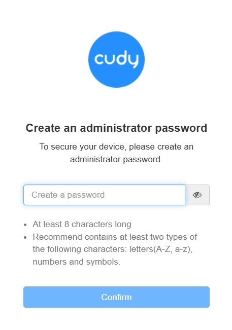

4. Quick Setup page will pop up, otherwise you may click *Quick Setup* tab.

5. Select your *Operation Mode* accordingly.  
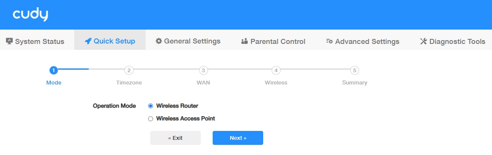

6. Select your *Timezone* from the drop-down list and enable *Auto Update*.
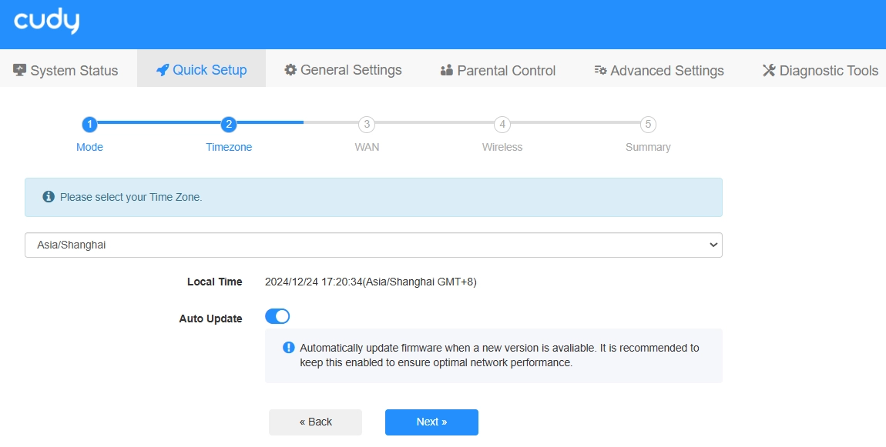

7. WAN Mode will be auto-detected (or you may select from the Protocol list accordingly), and then enter the corresponding parameters.
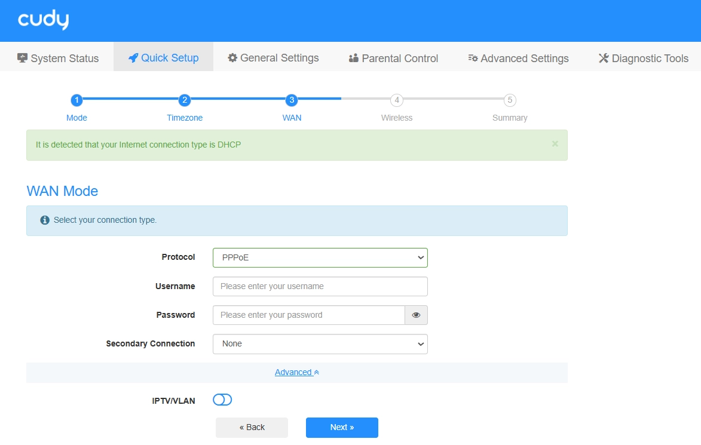

8. Customize your 2.4G/5G wireless network name (SSID) and password. 
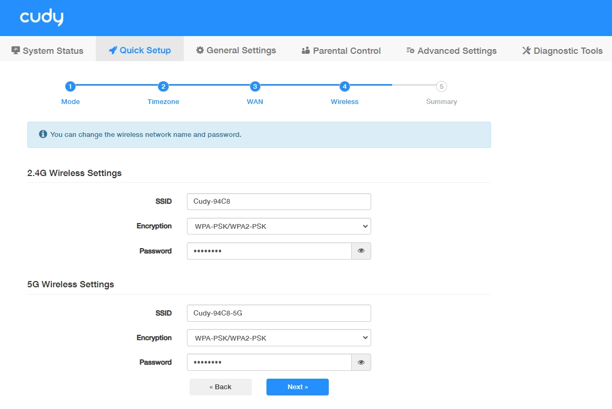

9. Confirm your settings or click *Back* to make adjustments. Then click *Save and Apply*.
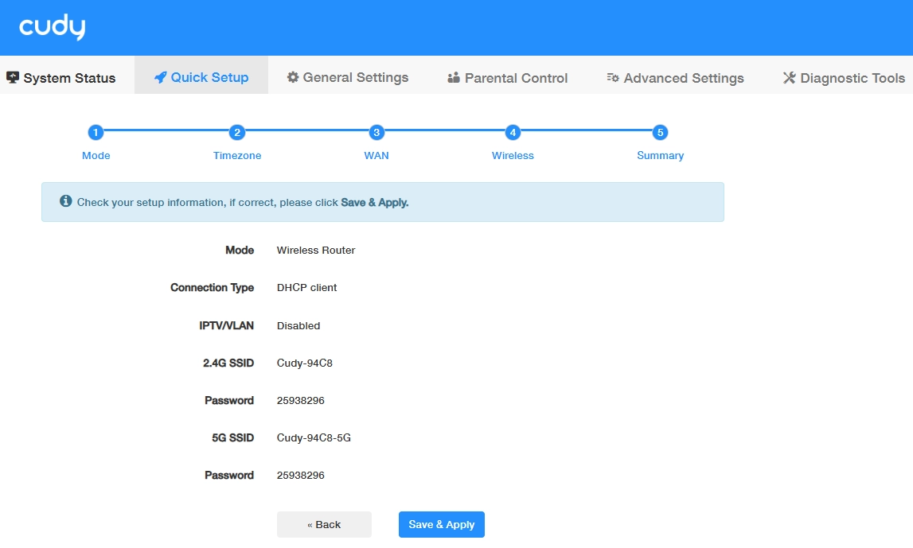

!!! Note
    - If the login window does not appear, please refer to the FAQ or contact [support@cudy.com](mailto:support@cudy.com).
    - For more details about different WAN mode settings, refer to [General Settings -> WAN Mode](wan.md).
    - It may take a few minutes for the router to successfully connect to the Internet.

## Cudy App Setup
Cudy App runs on iOS and Android devices, such as smart phones and tablets.

1. Scan the QR code on the product box or Quick Installation Guide, or search *Cudy* in the Apple App Store or Google Play store to download the *Cudy App*.

2. Connect your device to the router’s default wireless network. (Default 2.4G/5G SSID and password are printed on the product label.)
3. Launch the Cudy App. Click the router you have connected to. Create a management password to log in. Then You will see the management interface. 
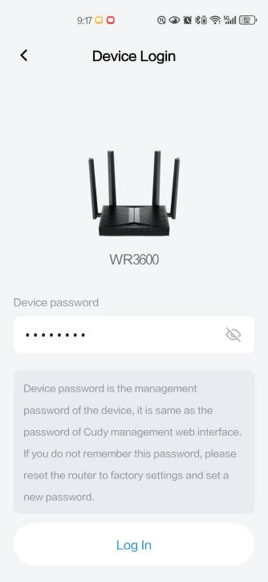

4. Click *Quick Setup* right below the router image.
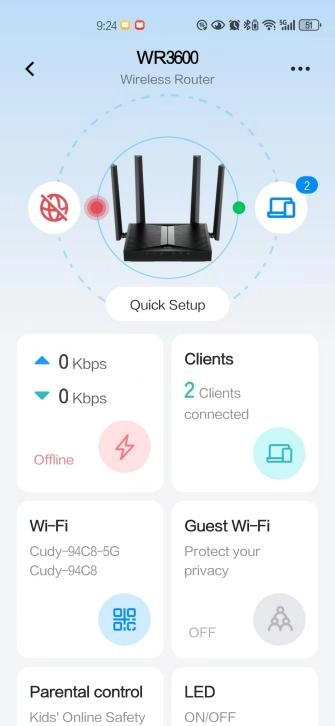

5. Select your *Operation Mode* accordingly.
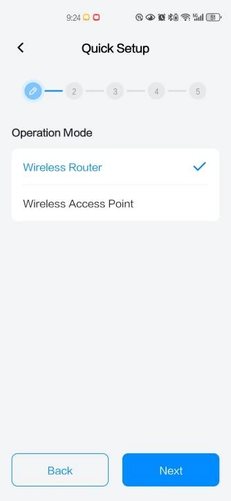

6. Select your *Time Zone*.
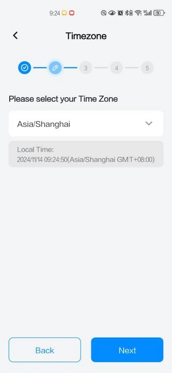

7. Select your connection type and enter the required parameters provided by your ISP.
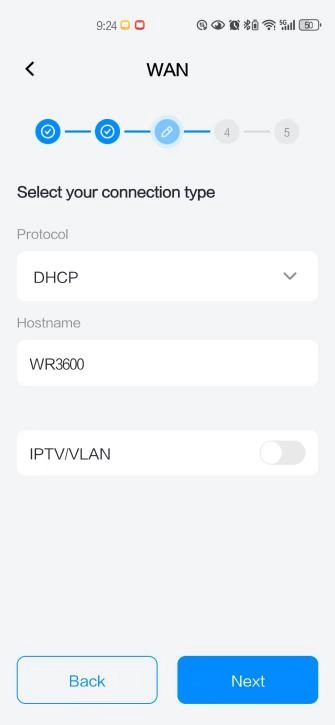

8. Customize your wireless network name (SSID) and Password, or keep it default.
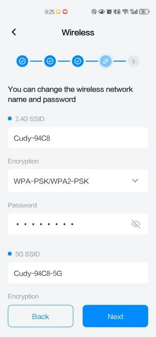

9. Confirm your settings and click *Apply*. Or click *Back* to modify it.
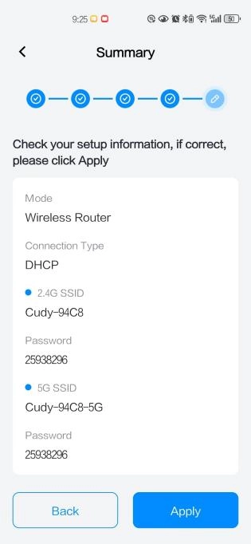

10. Click *Yes* to confirm. 
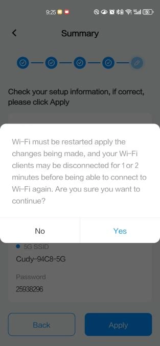

11. A few moments later, Setting Success! Click *OK* to complete it.
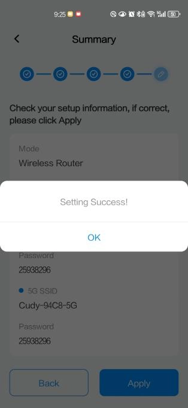

!!! Note
    It may take a few minutes for the router to successfully connect to the Internet.